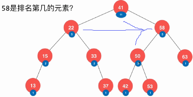
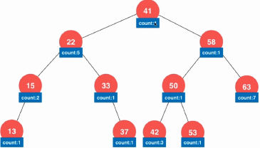
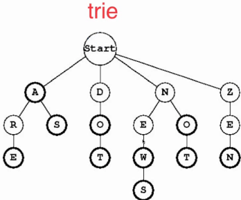

### 二分搜索树

可以高效查找、插入、删除数据。方便min,max,floor,ceil,rank,select

性质：

1. 左孩子节点　< 节点 <　右孩子节点(**中序遍历会得到有序数组**)
2. 不一定是完全二叉树，所以不能用数组。　堆为完全二叉树，可以用数组存储。
3. 元素的顺序性


局限性：同一数据，因为构造的顺序不同，造成结构的不同。

1. 二分搜索树可能退化成链表。log(n) -> n

改善：平衡二叉树，让二叉树一直保持log(n)的高度。

平衡二叉树实现：红黑树、2-3 tree， AVL tree, Splay tree

平衡二叉树和堆的结合：Treap 保持二叉树的性质和堆的优先级的性质。

trie:字典树(末尾)

树形问题：**天然的递归特性**进行树型搜索。

归并排序、快速排序、搜索问题(8皇后)。

其余树：KD树，区间树，哈弗曼树


```java
public class BST{
  private class Node {
    private int key;
    private int value;
    private Node left, right;
    public Node(int key, int value){
      this.key = key;
      this.value = value;
      left = right = null;
    }
    public Node(Node node){ //copy一个
      this.key = node.key;
      this.value = node.value;
      this.left = node.left;
      this.right = node.right;
    }
    private Node root;//根节点
    private int count;//节点个数
    // 构造函数, 默认构造一棵空二分搜索树
    public BST(){
      root = null;
      count = 0;
    }
    public int size() {// 返回二分搜索树的节点个数
        return count;
    }
    // 返回二分搜索树是否为空
    public boolean isEmpty() {
        return count == 0;
    }
    // 1.向二分搜索树中插入一个新的(key, value)数据对
    public void insert(int key, int value){
        root = insert(root, key, value);
    }
    // 1.1
    private Node insert(Node node, int key, int value){
      if( null == node ){
        count++;
        return new Node(key, value);
      }
      if( key == node.key ) //如果已经存在，则进行更新
        node.value = value;
      else if ( key < node.key ) // 在左边插入
        node.left = insert( node.left, key, value );
      else // 在右边插入
        node.right = insert( node.right, key, value );
      return node;
    }
    // 2. 判断是否存在key
    public boolean contain(int key){
      return contain(root, key);
    }
    // 2.1
    private boolean contain(Node node, int key){
      if( null == node )
        	return false;
      if( key == node.key )
        	return true;
      if( key < node.key )
        return contain(node.left, key);
      else
        return contain(node.right, key);
    }
    // 3.搜索
    public int search(int key){
      return search(root, key);
    }
    
    //3.1
    private int search(Node node, int key){
      if( null == node )
        return -1;
      if( key == node.key )
        return node.value;
      else if( key < node.key )
        return search( node.left, key );
      else
        return search( node.right, key );
    }
    // 4.递归遍历
    // 二分搜索树的前序遍历
    public void preOrder(){
        preOrder(root);
    }
    // 二分搜索树的中序遍历
    public void inOrder(){
        inOrder(root);
    }
    // 二分搜索树的后序遍历。(释放空间的时候用的方法)
    public void postOrder(){
        postOrder(root);
    }
    // 4.1 对以node为根的二叉搜索树进行前序遍历, 递归算法
    private void preOrder(Node node){
        if( node != null ){
            System.out.println(node.key);
            preOrder(node.left);
            preOrder(node.right);
        }
    }
    // 对以node为根的二叉搜索树进行中序遍历, 递归算法
    private void inOrder(Node node){

        if( node != null ){
            inOrder(node.left);
            System.out.println(node.key);
            inOrder(node.right);
        }
    }
    // 对以node为根的二叉搜索树进行后序遍历, 递归算法
    private void postOrder(Node node){

        if( node != null ){
            postOrder(node.left);
            postOrder(node.right);
            System.out.println(node.key);
        }
    }
    // 5.释放空间
    public void destory(){
      destory(root);
    }
    // 5.1
    private void destroy(Node node){
      if( null != node ){
        destory(node.left);
        destory(node.right);
        node = null;
        count---;
      }
    }  
    
    // 6.层序遍历
    public void levelOrder(){
      if( null == root ) return;
      Queue<Node> q = new LinkedList<Node>();
      q.offer(root);
      while( !q.isEmpty() ){
        Node node = q.poll();
        System.out.println(node.key);
        if( node.left != null )
            q.offer( node.left );
        if( node.right != null )
            q.offer( node.right );
      }
    }
    //7 寻找二分搜索树的最小的键值
    public int minimum(){
        Node minNode = minimum( root ); //assert count != 0;
        return minNode.key;
    }
		//7.1 返回以node为根的二分搜索树的最小键值所在的节点
    private Node minimum(Node node){
        if( node.left == null ) return node;
        return minimum(node.left);
    }
    //8 寻找二分搜索树的最大的键值
    public int maximum(){
        Node maxNode = maximum(root); //assert count != 0;
        return maxNode.key;
    }
		//8.1 返回以node为根的二分搜索树的最大键值所在的节点
    private Node maximum(Node node){
        if( node.right == null ) return node;
        return maximum(node.right);
    }
    //9 从二分搜索树中删除最小值所在节点
    public void removeMin(){
        if( root != null )
            root = removeMin( root );
    }
    //9.1 删除掉以node为根的二分搜索树中的最小节点，该节点一定没有左孩子。
    // 返回删除节点后新的二分搜索树的根
    // 1.如果最小节点没有右孩子，则直接将null赋值给其父节点的左孩子
    // 2.由于最小节点有右孩子， 所以将其右孩子赋值给其父节点的左变
    private Node removeMin(Node node){
        if( node.left == null ){         //找到了该节点
            Node rightNode = node.right; // 合二为一
            node.right = null;　         //删除右孩子
            count --;
            return rightNode;
        }
        node.left = removeMin(node.left);　//注意这一句
        return node;
    }
    //10 从二分搜索树中删除最大值所在节点
    public void removeMax(){
        if( root != null )
            root = removeMax( root );
    }
    //10.1 删除掉以node为根的二分搜索树中的最大节点。该节点一定没有右孩子。
    // 返回删除节点后新的二分搜索树的根
    private Node removeMax(Node node){
        if( node.right == null ){
            Node leftNode = node.left;
            node.left = null;
            count --;
            return leftNode;
        }
        node.right = removeMax(node.right);
        return node;
    }
    
    // 删除只有左孩子的节点，类似removeMax
    // 删除只有右孩子的节点，类似removeMin
		// 删除有左右孩子的节点。 左边 < 删除点cur < 右边
    // 左边最大值代替？　右边最小值代替？
    //　所以需要在右边选出最小值点s来代替当前删除点cur，然后删除s(s为右边最小值，没有左孩子)
    // 从二分搜索树中删除键值为key的节点
    // 11
    public void remove(int key){
        root = remove(root, key);
    }
    // 11.1 删除掉以node为根的二分搜索树中键值为key的节点, 递归算法
    // 返回删除节点后新的二分搜索树的根
    Node = remove(Node node, int key){
      if(null == node)
        return null;
      //如果key在左边，则在左边删
      if(key < node.key){
        node.left = remove(node.left, key);
        return node;
      }
      //如果key在右边，则在右边删
      else if(node.key < key){
        node.right = remove(node.rihgt, key);
        return node;
      }
      // key == node->key
      else{ 
        // 待删除节点左子树为空的情况(或者左右都为空)
        if( null == node.left ){
          Node rightNode = node.right;
          node.right = null;
          count--;
          return rightNode;
        }
        
        // 待删除节点右子树为空的情况
        if( null == node.right ){
          Node leftNode = node.left;
          node.left = null;
          count--;
          return leftNode;
        }
        // 待删除节点左右子树均不为空的情况
        // 找到比待删除节点大的最小节点, 即待删除节点右子树的最小节点
        // 用这个节点顶替待删除节点的位置
        Node successor = new Node(minimum(node.right));
        count++;
        successor.right = removeMin(node.right);
        successor.left = node.left;
        node.left = node.right = null;
        count--;
        return successor;
      }
    }
  }
}
```

思考：

０、求节点前驱和后继

１、实现floor和ceil:


２、rank/select: 记录每个节点下有多少个元素。（排名第10的元素是谁？）

例如：　58的排名＝58左子树元素个数　＋　58父节点　＋　58父节点左子树个数



３、如果有大量重复元素：

1. 将<改为<=
2. 记录每个节点有多少个重复值



４、局限性：


５、字典树：



在二分搜索树中查找离target最近的值（lintcode 900）：

```java
public int closestValue(TreeNode root, double target) {
    if( null == root ) return -1;
    TreeNode node = root;
    int closest = node.val;
    double min = Double.MAX_VALUE;
    while( null != node ){
        if( Math.abs( node.val - target ) < min ){
            closest = node.val;
            min = Math.abs( node.val - target );
        }
        if( target < node.val )      //１．在左边找
            node = node.left;
        else if( node.val < target )　//2.在右边找
            node = node.right;
        else                         //３．即不在左边，也不在右边，直接返回
            return closest;
    }
    return closest;
}
```


