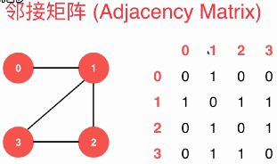

##　图论

表示：

邻接矩阵：（适合稠密图，即边多）(完全图，每个节点都会相互连接)

　

邻接表：（适合稀疏图，即边少）

　

```java
// 稠密图 - 邻接矩阵
public class DenseGraph {

    private int n;  // 节点数
    private int m;  // 边数
    private boolean directed;   // 是否为有向图
    private boolean[][] g;      // 图的具体数据

    // 构造函数
    public DenseGraph( int n , boolean directed ){
        assert n >= 0;
        this.n = n;
        this.m = 0;    // 初始化没有任何边
        this.directed = directed;
        // g初始化为n*n的布尔矩阵, 每一个g[i][j]均为false, 表示没有任和边
        // false为boolean型变量的默认值
        g = new boolean[n][n];
    }

    public int V(){ return n;} // 返回节点个数
    public int E(){ return m;} // 返回边的个数

    // 向图中添加一个边
    public void addEdge( int v , int w ){

        assert v >= 0 && v < n ;
        assert w >= 0 && w < n ;

        if( hasEdge( v , w ) )
            return;

        g[v][w] = true;
        if( !directed )
            g[w][v] = true;

        m ++;
    }

    // 验证图中是否有从v到w的边
    boolean hasEdge( int v , int w ){
        assert v >= 0 && v < n ;
        assert w >= 0 && w < n ;
        return g[v][w];
    }
}
```


```java
// 稀疏图 - 邻接表
public class SparseGraph {

    private int n;  // 节点数
    private int m;  // 边数
    private boolean directed;    // 是否为有向图
    private Vector<Integer>[] g; // 图的具体数据

    // 构造函数
    public SparseGraph( int n , boolean directed ){
        assert n >= 0;
        this.n = n;
        this.m = 0;    // 初始化没有任何边
        this.directed = directed;
        // g初始化为n个空的vector, 表示每一个g[i]都为空, 即没有任和边
        g = (Vector<Integer>[])new Vector[n];
        for(int i = 0 ; i < n ; i ++)
            g[i] = new Vector<Integer>();
    }

    public int V(){ return n;} // 返回节点个数
    public int E(){ return m;} // 返回边的个数

    // 向图中添加一个边
    public void addEdge( int v, int w ){

        assert v >= 0 && v < n ;
        assert w >= 0 && w < n ;

        g[v].add(w);
        if( v != w && !directed ) //v!=w，避免做个自环边
            g[w].add(v);

        m ++;
    }

    // 验证图中是否有从v到w的边,
  	// 最差的复杂度为O(n),避免　平行边
    boolean hasEdge( int v , int w ){

        assert v >= 0 && v < n ;
        assert w >= 0 && w < n ;

        for( int i = 0 ; i < g[v].size() ; i ++ )
            if( g[v].elementAt(i) == w )
                return true;
        return false;
    }
}
```

**遍历**：邻接矩阵每次都要遍历完，此时邻接表就有优势


