基本数据结构之排序

## 1.选择排序

思路：从前开始往后，在后面的元素中选择最小的与当前i的位置进行交换。

时间：O(n^2)


```c++
void selectionSort(int arr[], int n){
    for(int i = 0 ; i < n ; i ++){
        // 寻找[i, n)区间里的最小值,其索引为miinIndex
        int minIndex = i; 
        for( int j = i + 1 ; j < n ; j ++ )
            if( arr[j] < arr[minIndex] )
                minIndex = j;
        swap( arr[i] , arr[minIndex] );
    }
}
```

## 2.插入排序

思路：从前开始往后，将当前第i个元素插入前面已拍好序的正确位置中；从i-1开始往前依次比较与[i]的值，如果[i]小，则进行交换。

时间：O(n^2)

注意：如果要交换的话，一直往前交换，直到正确位置，此时已在正确位置，**可提前跳出循环**。**交换很耗时**。

　　　　　

```c++
void insertionSort(T arr[], int n){
    for( int i = 1 ; i < n ; i ++ ) {
        // 寻找元素arr[i]合适的插入位置
        // 写法1
        for( int j = i ; j > 0 ; j-- )
            if( arr[j] < arr[j-1] )
                swap( arr[j] , arr[j-1] );
            else
                break;
        // 写法2
 //       for( int j = i ; j > 0 && arr[j] < arr[j-1] ; j -- )
 //           swap( arr[j] , arr[j-1] );
    }
    return;
}
```

**优化**：交换很耗时，所以减少交换次数。赋值操作(一次)　取代　交换操作（三次 ）

思路：将[i]复制一份，如果前面的元素比[i]大，就将前面的元素依次右移。

　　　

1. 循环
   1. 保存[i]的副本e
   2. 如果前面比e大，就前移
   3. 找到正确位置，并赋值

```c++
void insertionSort(T arr[], int n){
    for( int i = 1 ; i < n ; i ++ ) {
        // 寻找元素arr[i]合适的插入位置
        // 写法3
        T e = arr[i];
        int j; // j保存元素e应该插入的位置
        for (j = i; j > 0 && arr[j-1] > e; j--) 
            arr[j] = arr[j-1];
        arr[j] = e;
    }
    return;
}
```

**优点**：插入排序可以提前终止循环，对于几乎有序的数组，插入排序的效率很高，时间复杂度降到O(n)


## 3.希尔排序

插入排序的延伸。时间复杂度比(n^2)低。利用了插入排序，同时又克服了插入排序一次只交换相邻两个元素的缺点。

思想：在数组中采用跳跃式分组的策略，通过某个增量将数组元素划分为若干组，然后分组进行插入排序，随后逐步缩小增量，继续**按组进行插入排序**操作，直至增量为1。希尔排序通过这种策略使得整个数组在初始阶段达到从宏观上看基本有序，小的基本在前，大的基本在后。然后缩小增量，到增量为1时，其实多数情况下只需微调即可，不会涉及过多的数据移动。


特点：交换相隔比较远的元素，使得一次交换能消除一个以上的逆序。（希尔、快排、堆排都是交换比较远的元素）。每次间隔减小后，都保持了原来间隔之间的有序性。


```c++
void shellSort(T arr[], int n){
  for( int h = n/2; h>0; h/=2 ){ // 增量序列 h
    for( int i=h; i < n; i ++ ){ // 插入排序,[h...n-1]，同一间隔中，每组数轮流着计算。
      T e = arr[i];
      int j;
      for( j = i; j >= h && e < arr[j-h]; j -= h )
        arr[j] = arr[j-h];
      arr[j] = e;
    }
  }
}
```

最坏情况：O(n^2)。增量元素不互质，则小增量可能根本不起作用。

Hibbard 增量序列：$D_k=2^k-1$，保证相邻元素互质，最坏情况为：$O(N^{3/2})$ 平均：$O(N^{5/4})$（猜想）

Sedgewick增量序列：${1,5,19,41,109...} 9*4^i-9*2^i+1$ 猜想：$T_{avg}=O(N^{7/6})$　最差4/3

```c++
void shellSort(T arr[], int n){
    // 计算 increment sequence: 1, 4, 13, 40, 121, 364, 1093...
    int h = 1;
    while( h < n/3 )
        h = 3 * h + 1;
    while( h >= 1 ){
        // h-sort the array
        for( int i = h ; i < n ; i ++ ){
            // 对 arr[i], arr[i-h], arr[i-2*h], arr[i-3*h]... 使用插入排序
            T e = arr[i];
            int j;
            for( j = i ; j >= h && e < arr[j-h] ; j -= h )
                arr[j] = arr[j-h];
            arr[j] = e;
        }
        h /= 3;
    }
}
```

## 4.冒泡排序

整体没有插入排序。

思路：每次将最大的数放到最后；下次只需要考虑前面的数即可。

```c++
void bubbleSort(T arr[], int n){
  bool swapped;
  for( int i = 0; i < n-1; i++ ){
    swapped = false;
    for( int j = 0; j < n-i-1; j++ )
      if( arr[j] > arr[j+1] ){
        swapped(arr[j], arr[j+1]);
        swapped = true;
      }
    if(!swapped)
      break;
  }
}
```


```c++
void bubbleSort( T arr[] , int n){
    bool swapped;
    do{
        swapped = false;
        for( int i = 1 ; i < n ; i ++ )
            if( arr[i-1] > arr[i] ){
                swap( arr[i-1] , arr[i] );
                swapped = true;
            }
        // 优化, 每一趟Bubble Sort都将最大的元素放在了最后的位置
        // 所以下一次排序, 最后的元素可以不再考虑
        n --;
    }while(swapped);
}

```

**优化思路**：用一个变量记录下最后一个发生交换的位置，后面没有发生交换的已经有序。所以可以用这个值来作为下一次比较结束的位置。

```c++
void bubbleSort2( T arr[] , int n){
    int newn; // 使用newn进行优化
    do{
        newn = 0;
        for( int i = 1 ; i < n ; i ++ )
            if( arr[i-1] > arr[i] ){
                swap( arr[i-1] , arr[i] );
                //记录最后一次的交换位置(交换的后面的那个数),在此之后的元素在下一轮扫描中均不考虑
                newn = i;
            }
        n = newn;
    }while(newn > 0);
}
```


## 5.归并排序

思想：不考虑数组内容，先将数据分组，直到每组只有1个数，然后在归并的时候进行有序归并。

归并过程：使用三个索引位置。　时间：O(nlogn) 　空间：O(n)

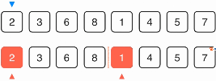　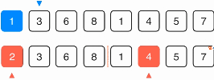

i,j为当前被选元素的位置，k为待放入的位置。归并过程中维护这个定义。[l..r]，m为第一个排好序的最后一个位置。

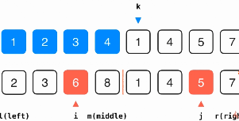

```c++
// 将arr[l...mid]和arr[mid+1...r]两部分进行归并
template<typename  T>
void __merge(T arr[], int l, int mid, int r){
    //* VS不支持动态长度数组, 即不能使用 T aux[r-l+1]的方式申请aux的空间
    //* 使用VS的同学, 请使用new的方式申请aux空间
    //* 使用new申请空间, 不要忘了在__merge函数的最后, delete掉申请的空间:)
    T aux[r-l+1]; //辅助数组
    //T *aux = new T[r-l+1];
    for( int i = l ; i <= r; i ++ )
        aux[i-l] = arr[i];
    // 初始化，i指向左半部分的起始索引位置l；j指向右半部分起始索引位置mid+1
    int i = l, j = mid+1;
    for( int k = l ; k <= r; k ++ ){
        if( i > mid ){  // 如果左半部分元素已经全部处理完毕
            arr[k] = aux[j-l]; j ++;
        }
        else if( j > r ){  // 如果右半部分元素已经全部处理完毕
            arr[k] = aux[i-l]; i ++;
        }
        else if( aux[i-l] < aux[j-l] ) {  // 左半部分所指元素 < 右半部分所指元素
            arr[k] = aux[i-l]; i ++;
        }
        else{  // 左半部分所指元素 >= 右半部分所指元素
            arr[k] = aux[j-l]; j ++;
        }
    }
    //delete[] aux;
}
// 递归使用归并排序,对arr[l...r]的范围进行排序
template<typename T>
void __mergeSort(T arr[], int l, int r){

    if( l >= r ) //当只有一个数的时候就返回
        return;
    int mid = (l+r)/2; //l+r可能会溢出
    __mergeSort(arr, l, mid);
    __mergeSort(arr, mid+1, r);
    __merge(arr, l, mid, r); //归并操作
}
```

优化：

```c++
void __mergeSort2(T arr[], int l, int r){
    // 优化2: 对于小规模数组, 使用插入排序
    if( r - l <= 15 ){
        insertionSort(arr, l, r);
        return;
    }
    int mid = (l+r)/2;
    __mergeSort2(arr, l, mid);
    __mergeSort2(arr, mid+1, r);
    // 优化1: 对于arr[mid] <= arr[mid+1]的情况,不进行merge
    // 对于近乎有序的数组非常有效,但是对于一般情况,有一定的性能损失,因为加入了判断
    if( arr[mid] > arr[mid+1] )
        __merge(arr, l, mid, r);
}

```

**自底向上**：用循坏代替递归。这中方法并没有使用数组随机访问的特性，所以可以对链表进行排序O(nlogn)?

注意：这里虽然有两层循环，但依然是O(nlogn)

```c++
void mergeSortBU(T arr[], int n){

//    Merge Sort Bottom Up 无优化版本
    for( int sz = 1; sz < n ; sz += sz ) // 1轮：1个元素，　2轮：2个元素， ３轮：４个元素...
        for( int i = 0 ; i < n - sz ; i += sz+sz )//对长度为2*sz的两组元素进行归并　
            // 对 arr[i...i+sz-1] 和 arr[i+sz...i+2*sz-1] 进行归并
            __merge(arr, i, i+sz-1, min(i+sz+sz-1,n-1) );
						//归并的两个数组总长度范围为：[0,2sz-1], [2sz,4sz-1],[4sz,6sz-1]
  					//　i<n-sz: 因为要保证合并的是两部分,[n-sz...n-1]为后面的部分
  					// min(i+sz+sz-1,n-1):保证后面数组不越界
}
```


加上优化：

```c++
void mergeSortBU(T arr[], int n){
    // 对于小数组, 使用插入排序优化　Merge Sort Bottom Up 优化
    for( int i = 0 ; i < n ; i += 16 )
        insertionSort(arr,i,min(i+15,n-1));
    for( int sz = 16; sz < n ; sz += sz )
        for( int i = 0 ; i < n - sz ; i += sz+sz )
            // 对于arr[mid] <= arr[mid+1]的情况,不进行merge
            if( arr[i+sz-1] > arr[i+sz] )
                __merge(arr, i, i+sz-1, min(i+sz+sz-1,n-1) );
}   // Merge Sort BU 也是一个O(nlogn)复杂度的算法，虽然只使用两重for循环
    // 所以，Merge Sort BU也可以在1秒之内轻松处理100万数量级的数据
    // 注意：不要轻易根据循环层数来判断算法的复杂度，Merge Sort BU就是一个反例
```

## 6.快速排序

思路：将当前元素放在它排好序该放的位置，左边元素都要小，右边元素都要大。


- e>v,则i++
- e\<v,则将e与>v中最小元素换位置，j++,i++


最后，只需要将[l]与[j]交换即可。

```c++
// 对arr[l...r]部分进行partition操作
// 返回p, 使得arr[l...p-1] < arr[p] ; arr[p+1...r] > arr[p]
int __partition(T arr[], int l, int r){
//  优化2,随机在arr[l...r]的范围中, 选择一个数值作为标定点pivot
//  swap( arr[l] , arr[rand()%(r-l+1)+l] );
    T v = arr[l];
    int j = l; 
		// arr[l+1...j] < v ; arr[j+1...i) > v
    for( int i = l + 1 ; i <= r ; i ++ ) //初始时刻，两个数组都为空
        if( arr[i] < v ){
            j ++;
            swap( arr[j] , arr[i] );
        }
    swap( arr[l] , arr[j]);
    return j;
}
// 对arr[l...r]部分进行快速排序
template <typename T>
void __quickSort(T arr[], int l, int r){
    if( l >= r )
        return;
// 优化1，在数据量特别小的时候，采用插入排序  
//  if( r-l <=15){  
//  	insertionSort( arr, l, r );
//		return;
//	}
    int p = __partition(arr, l, r);
    __quickSort(arr, l, p-1 );
    __quickSort(arr, p+1, r);
}

template <typename T>
void quickSort(T arr[], int n){
//  srand(time(NULL));
    __quickSort(arr, 0, n-1);
}
```

缺点：对于几乎有序的数组，退化为O(n^2)的算法，此时要比归并排序差。

　　

优化２：随机选择一个作为中间元素。其时间复杂度的期望为O(nlogn)

如果元素中包含大量重复的元素，则会导致分区几度不平衡。即：

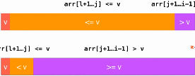


优化3：将重复的元素尽量均分在两个区域。

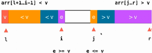 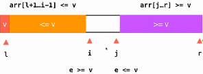

- i往右移，直到e>=v; j往左移,直到e<=v
- 当i,j都停住时，交换i,j的值，然后继续，直到i==j.

```c++
// 双路快速排序的partition
// 返回p, 使得arr[l...p-1] < arr[p] ; arr[p+1...r] > arr[p]
template <typename T>
int _partition2(T arr[], int l, int r){
    // 随机在arr[l...r]的范围中, 选择一个数值作为标定点pivot
    swap( arr[l] , arr[rand()%(r-l+1)+l] );
    T v = arr[l];
    // arr[l+1...i) <= v; arr(j...r] >= v
    int i = l+1, j = r;
    while( true ){
        // 注意这里的边界, arr[i] < v, 不能是arr[i] <= v
        // 思考一下为什么?
        while( i <= r && arr[i] < v )
            i ++;
        // 注意这里的边界, arr[j] > v, 不能是arr[j] >= v
        // 思考一下为什么?
        while( j >= l+1 && arr[j] > v )
            j --;
        //两个边界的设定,可以参考: http://coding.imooc.com/learn/questiondetail/4920.html
        if( i > j )
            break;
        swap( arr[i] , arr[j] );
        i ++;
        j --;
    }

    swap( arr[l] , arr[j]);// 此时j跑到左边区域了，跟[l]属于同一个区域

    return j;
}


```

优化4：三路快排

3路快排在大量重复元素时，效果好于二路快拍；如果没有大量重复元素，则稍微稍微慢于二路快排。

 

- e==v: i++

- e<v: swap([i],[lt+1]),lt++,i++

- e>v: swap([i],[gt-1]),gt-- 

- 最后，i==gt时，整个操作完成，swap([l],[lt])

  

  ```c++
  void __quickSort3Ways(T arr[], int l, int r){　// 递归的三路快速排序算法
      if( r - l <= 15 ){　　　　// 对于小规模数组, 使用插入排序进行优化
          insertionSort(arr,l,r);
          return;
      }
      // 随机在arr[l...r]的范围中, 选择一个数值作为标定点pivot
      swap( arr[l], arr[rand()%(r-l+1)+l ] );
      T v = arr[l];
      int lt = l;     // arr[l+1...lt] < v
      int gt = r + 1; // arr[gt...r] > v
      int i = l+1;    // arr[lt+1...i) == v i为正在考察的元素
      while( i < gt ){
          if( arr[i] < v ){
              swap( arr[i], arr[lt+1]);
              i ++;
              lt ++;
          }
          else if( arr[i] > v ){
              swap( arr[i], arr[gt-1]);
              gt --;
          }
          else // arr[i] == v
              i ++;
      }
      swap( arr[l] , arr[lt] );
      __quickSort3Ways(arr, l, lt-1);
      __quickSort3Ways(arr, gt, r);
  }
  void quickSort3Ways(T arr[], int n){
      srand(time(NULL));
      __quickSort3Ways( arr, 0, n-1);
  }
  ```


### 归并和快排的衍生(逆序对、第k大)

归并和快排都使用了分治算法。归并在于如何合并，快排在于如何分。

逆序对：衡量一个数组的有序程度。

暴力：考察每一个数对，算法复杂度O(n^2)

归并思路：O(nlogn)　归并过程中，左边和右边比较，就可以得出一部分逆序、顺序对　

```c++
// 计算逆序数对的结果以long long返回
// 对于一个大小为N的数组, 其最大的逆序数对个数为 N*(N-1)/2, 非常容易产生整型溢出

// merge函数求出在arr[l...mid]和arr[mid+1...r]有序的基础上, arr[l...r]的逆序数对个数
long long __merge( int arr[], int l, int mid, int r){

    int *aux = new int[r-l+1];
    for( int i = l ; i <= r ; i ++ )
        aux[i-l] = arr[i];

    // 初始化逆序数对个数 res = 0
    long long res = 0;
    // 初始化，i指向左半部分的起始索引位置l；j指向右半部分起始索引位置mid+1
    int j = l, k = mid + 1;
    for( int i = l ; i <= r ; i ++ ){
        if( j > mid ){ // 如果左半部分元素已经全部处理完毕
            arr[i] = aux[k-l];
            k ++;
        }
        else if( k > r ){ // 如果右半部分元素已经全部处理完毕
            arr[i] = aux[j-l];
            j ++;
        }
        else if( aux[j-l] <= aux[k-l] ){ // 左半部分所指元素 <= 右半部分所指元素
            arr[i] = aux[j-l];
            j ++;
        }
        else{ // 右半部分所指元素 < 左半部分所指元素
            arr[i] = aux[k-l];
            k ++;
            // 此时, 因为右半部分k所指的元素小
            // 这个元素和左半部分的所有未处理的元素都构成了逆序数对
            // 左半部分此时未处理的元素个数为 mid - j + 1
            res += (long long)(mid - j + 1);
        }
    }

    delete[] aux;

    return res;
}

// 求arr[l..r]范围的逆序数对个数
// 思考: 归并排序的优化可否用于求逆序数对的算法? :)
long long __inversionCount(int arr[], int l, int r){

    if( l >= r )
        return 0;

    int mid = l + (r-l)/2;

    // 求出 arr[l...mid] 范围的逆序数
    long long res1 = __inversionCount( arr, l, mid);
    // 求出 arr[mid+1...r] 范围的逆序数
    long long res2 = __inversionCount( arr, mid+1, r);

    return res1 + res2 + __merge( arr, l, mid, r);
}

// 递归求arr的逆序数对个数
long long inversionCount(int arr[], int n){

    return __inversionCount(arr, 0, n-1);
}
```


取数组中第n大的元素。

快速排序思路：O(n), 每个数都是放在排好序的位置（第几个）

算法复杂度= n + n/2 + n/4 + n/8 + ... + 1 = O(2n) 

```c++
// partition 过程, 和快排的partition一样
// 思考: 双路快排和三路快排的思想能不能用在selection算法中? :)
template <typename T>
int __partition( T arr[], int l, int r ){

    int p = rand()%(r-l+1) + l;
    swap( arr[l] , arr[p] );

    int j = l; //[l+1...j] < p ; [lt+1..i) > p
    for( int i = l + 1 ; i <= r ; i ++ )
        if( arr[i] < arr[l] )
            swap(arr[i], arr[++j]);

    swap(arr[l], arr[j]);

    return j;
}


// 求出arr[l...r]范围里第k小的数
int __selection( T arr[], int l, int r, int k ){

    if( l == r )
        return arr[l];

    // partition之后, arr[p]的正确位置就在索引p上
    int p = __partition( arr, l, r );

    if( k == p )    // 如果 k == p, 直接返回arr[p]
        return arr[p];
    else if( k < p )    // 如果 k < p, 只需要在arr[l...p-1]中找第k小元素即可
        return __selection( arr, l, p-1, k);
    else // 如果 k > p, 则需要在arr[p+1...r]中找第k-p-1小元素
         // 注意: 由于我们传入__selection的依然是arr, 而不是arr[p+1...r],
         //       所以传入的最后一个参数依然是k, 而不是k-p-1
        return __selection( arr, p+1, r, k );
}

// 寻找arr数组中第k小的元素
// 注意: 在我们的算法中, k是从0开始索引的, 即最小的元素是第0小元素, 以此类推
// 如果希望我们的算法中k的语意是从1开始的, 只需要在整个逻辑开始进行k--即可, 可以参考selection2
template <typename T>
int selection(T arr[], int n, int k) {

    assert( k >= 0 && k < n );

    srand(time(NULL));
    return __selection(arr, 0, n - 1, k);
}

// 寻找arr数组中第k小的元素, k从1开始索引, 即最小元素是第1小元素, 以此类推
template <typename T>
int selection2(T arr[], int n, int k) {

    return selection(arr, n, k - 1);
}
```


## 7.堆排序

普通数组：O(1) O(n) (优先队列的入队、出队)

顺序数组：O(n) O(1)

堆：O(lgn) O(lgn)

主要用于：维护一组动态的数据

###　a.二叉堆

性质：

1. 某个节点的值不大于其父节点，但不意味着层数越低的节点值越小。仅仅与其父节点比较。
2. 总是一颗完全二叉树：除了最后一层之外，其余层的节点数必须是最大值。最后一层节点集中在左侧。
3. 最后一个非叶子节点位置：n/2

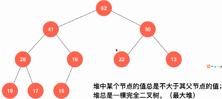

使用数组存储二叉堆：

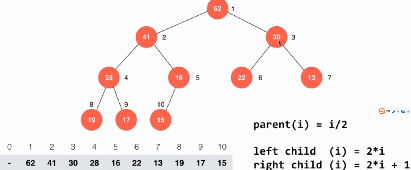

```c++
class MaxHeap{
private:
    Item *data;
    int count;  //当前元素个数
    int capacity; 
    void shiftUp(int k){
        while( k > 1 && data[k/2] < data[k] ){ //如果父亲节点 < 当前节点
            swap( data[k/2], data[k] );　　　　　//交换父亲节点和当前节点
            k /= 2;                             //继续判断父亲节点上面是否满足
        }
    }
    void shiftDown(int k){
        while( 2*k <= count ){  //如果有左孩子
            int j = 2*k; // 在此轮循环中,data[k]和data[j]交换位置　记录左孩子位置
            if( j+1 <= count && data[j+1] > data[j] ) //如果有右孩子，并且右孩子大
                j ++;
            // data[j] 是 data[2*k]和data[2*k+1]中的最大值

            if( data[k] >= data[j] ) break;   //已满足条件
            swap( data[k] , data[j] );
            k = j;   //继续比较
        }
    }
public:
  
  
    // 构造函数, 构造一个空堆, 可容纳capacity个元素
    MaxHeap(int capacity){
        data = new Item[capacity+1];
        count = 0;
        this->capacity = capacity;
    }

    ~MaxHeap(){
        delete[] data;
    }

    // 返回堆中的元素个数
    int size(){
        return count;
    }

    // 返回一个布尔值, 表示堆中是否为空
    bool isEmpty(){
        return count == 0;
    }

    // 像最大堆中插入一个新的元素 item
    void insert(Item item){
        assert( count + 1 <= capacity );
        data[count+1] = item;
        shiftUp(count+1);  //在最后一个位置插入，并使其满足条件：看其是否小于父亲节点
        count ++;
    }

    // 从最大堆中取出堆顶元素, 即堆中所存储的最大数据
    Item extractMax(){
        assert( count > 0 );
        Item ret = data[1];

        swap( data[1] , data[count] ); //取出第一个元素，即最大；然后将最后一个元素放到第一位置
        count --;
        shiftDown(1); //看根节点是否大于其孩子，否则选择最大的孩子交换，然后继续看其交换的孩子

        return ret;
    }

    // 获取最大堆中的堆顶元素
    Item getMax(){
        assert( count > 0 );
        return data[1];
    }
};
```

###　b.堆排序 

额外使用一个堆：

```c++
// heapSort1, 将所有的元素依次添加到堆中, 在将所有元素从堆中依次取出来, 即完成了排序
// 无论是创建堆的过程, 还是从堆中依次取出元素的过程, 时间复杂度均为O(nlogn)
// 整个堆排序的整体时间复杂度为O(nlogn)
void heapSort1(T arr[], int n){
    MaxHeap<T> maxheap = MaxHeap<T>(n);
    for( int i = 0 ; i < n ; i ++ )
        maxheap.insert(arr[i]);
    for( int i = n-1 ; i >= 0 ; i-- )
        arr[i] = maxheap.extractMax();
}
```

Heapify 将数组转为堆： O(n)

　　从后往前，每一个叶子节点当做一个堆，然后从最后一个非叶子节点(n/2)开始依次进行调整，在每个节点上进行shutDown操作即可，保证了已有节点满足堆的性质。

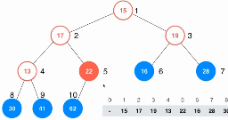 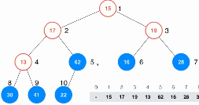 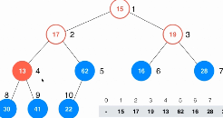

```c++
public:
		MaxHeap(Item arr[], int n){
  			data = new Item[n+1];
      	capacity = n;
      	for( int i=0; i<n; i++ )
          	data[i+1] = arr[i];
      	for( int i = count/2; i >= 1; i-- ) //上述过程
          	shiftDown(i);
		}
```

```c++
// heapSort2, 借助我们的heapify过程创建堆
// 此时, 创建堆的过程时间复杂度为O(n), 将所有元素依次从堆中取出来, 实践复杂度为O(nlogn)
// 堆排序的总体时间复杂度依然是O(nlogn), 但是比上述heapSort1性能更优, 因为创建堆的性能更优
void heapSort2(T arr[], int n){
    MaxHeap<T> maxheap = MaxHeap<T>(arr,n);
    for( int i = n-1 ; i >= 0 ; i-- )
        arr[i] = maxheap.extractMax();
}
```

原地堆排序：将第一个元素(堆中最大的)放到末尾，然后对前面的元素进行shiftDown操作，重新形成堆;重复以上步骤即可。


此时，需要从0开始索引，最后一个非叶子节点：(count-1)/2,另外：

```c++
void __shiftDown(T arr[], int n, int k){
    while( 2*k+1 < n ){
        int j = 2*k+1;
        if( j+1 < n && arr[j+1] > arr[j] )
            j += 1;
        if( arr[k] >= arr[j] )break;
        swap( arr[k] , arr[j] );
        k = j;
    }
}
// 不使用一个额外的最大堆, 直接在原数组上进行原地的堆排序
void heapSort(T arr[], int n){
    // 注意，此时我们的堆是从0开始索引的
    // 从(最后一个元素的索引-1)/2开始
    // 最后一个元素的索引 = n-1
    for( int i = (n-1-1)/2 ; i >= 0 ; i -- )
        __shiftDown2(arr, n, i);

    for( int i = n-1; i > 0 ; i-- ){
        swap( arr[0] , arr[i] );
        __shiftDown2(arr, i, 0);
    }
}
```

shitfDown的优化：

```c++
// 优化的shiftDown过程, 使用赋值的方式取代不断的swap,
// 该优化思想和我们之前对插入排序进行优化的思路是一致的
void __shiftDown2(T arr[], int n, int k){
    T e = arr[k];
    while( 2*k+1 < n ){
        int j = 2*k+1;
        if( j+1 < n && arr[j+1] > arr[j] )
            j += 1;
        if( e >= arr[j] ) break;
        arr[k] = arr[j];
        k = j;
    }
    arr[k] = e;
}

```


##　总结

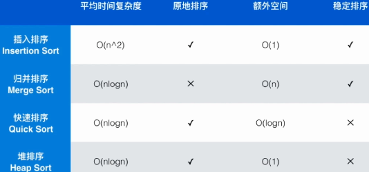


