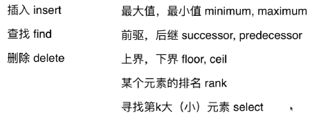
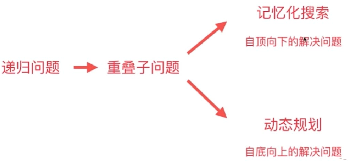

#### 数组问题

双指针：　对撞指针　和　滑动窗口


#### 查找问题

1. 查找有无　set集合
2. 查找对应关系（键值对应）map字典 

数组的有序性　跟　查找通常密不可分。

二分查找：数据必须有序

平衡树：O(logn).可以保证顺序性

哈希表：O(1)　不保证顺序性


####　链表问题

1. 头节点单独处理
2. 使用空的头结点
3. 双指针、滑动窗口、反转链表、反转一部分


#### 栈

可以模仿系统栈，转换递归函数


####　队列

队列的基本应用：广度优先搜索

- 树：　层序遍历
- 图：无权图的最短路径

优先队列：底层实现为堆。需要白板编程。C++默认为最大堆，从大到小排序。


#### 递归

一个递归程序主要包括设计：

1. 递归终止条件(仔细，设计指针操作，要判断是否为NULL)
2. 递归过程


#### 二分搜索树

每个节点的值>左孩子，　<右孩子。左右子书仍然为二分搜索树。基本操作：




#### 递归与回溯

递归：自上向下的解决问题

转为树形问题


回溯算法应用：处理排列问题、组合问题

回溯法是经典人工智能的基础。


#### 动态规划

在递归(搜索)的基础上添加记忆化搜索－自上向下地解决问题。

```c++
vector<int> memo;
int fib(int n){
  if(0 == n)
    return 0;
  if(1 == n)
    return 1;
  if(-1 == memo[n])
    memo[n] = fib(n-1) + fib(n-2);
  return memo[n];
}
```

动态规划－自下向上地解决问题。先解决小数据量的问题，再推广到大数据量

```c++
int fib(int n){
  vector<int> memo(n+1, -1);
  memo[0] = 0;
  memo[1] = 1;
  for( int i=2; i<=n; i++ )
    memo[i] = memo[i-1] + memo[i-1];
  return memo[n];
}
```

什么是动态规划？　将原问题拆解成若干自问题，同时保存自问题的答案，使得每个子问题只求解一次，最终获得原问题的答案。



可以先用自顶向下先去思考问题，最后转变为自低向上问题。


#### 贪心

将最大的饼干分给最贪心的小朋友。

贪心往往设计最大值，最小值，故需要排序。


#### 线段树

1. 如果问题带有区间操作，或者可以转化成区间操作，可以尝试往线段树方向考虑

- 从面试官给的题目中抽象问题，将问题转化成一列区间操作，注意这步很关键

2. 当我们分析出问题是一些列区间操作的时候

- 对区间的一个点的值进行修改
- 对区间的一段值进行统一的修改
- 询问区间的和
- 询问区间的最大值、最小值
  我们都可以采用线段树来解决这个问题


### 二分搜索树

可以高效查找、插入、删除数据。方便min,max,floor,ceil,rank,select

性质：

1. 左孩子节点　< 节点 <　右孩子节点
2. 不一定是完全二叉树，所以不能用数组。　堆为完全二叉树，可以用数组存储。


