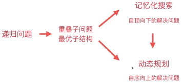

### 70. Climbing Stairs

[Description](https://leetcode.com/problems/climbing-stairs/description/)[Hints](https://leetcode.com/problems/climbing-stairs/hints/)[Submissions](https://leetcode.com/problems/climbing-stairs/submissions/)[Discuss](https://leetcode.com/problems/climbing-stairs/discuss/)[Solution](https://leetcode.com/problems/climbing-stairs/solution/)

[Pick One](https://leetcode.com/problems/random-one-question/)

------

You are climbing a stair case. It takes *n* steps to reach to the top.

Each time you can either climb 1 or 2 steps. In how many distinct ways can you climb to the top?

**Note:** Given *n* will be a positive integer.

**Example 1:**

```
Input: 2
Output:  2
Explanation:  There are two ways to climb to the top.

1. 1 step + 1 step
2. 2 steps
```

**Example 2:**

```
Input: 3
Output:  3
Explanation:  There are three ways to climb to the top.

1. 1 step + 1 step + 1 step
2. 1 step + 2 steps
3. 2 steps + 1 step
```


自顶向下分析：


递归求解：

缺点：大量重复子问题。

```c++
class Solution {
private:
    int calcWays(int n){
        if( 1 == n ) //只有一个台阶，只能一步
            return 1;
        if( 2 == n ) //只有两个台阶。要么一步一步，要么两步
            return 2;
        
        return calcWays(n-1) + calcWays(n-2);
    }
public:
    int climbStairs(int n) {
        return calcWays(n);
    }
};
//////////////////////////////////////////或者
private:
    int calcWays(int n){
        if( 1 == n || 0 == n ) //与上面的答案一样。0布台阶需要一步。１个台阶１种，两个台阶２种(来自台阶１和来自台阶０)
            return 1;
        
        return calcWays(n-1) + calcWays(n-2);
    }
```

优化：记忆搜索

```c++
class Solution {
private:
    vector<int> memo;
    
    int calcWays(int n){
        if( 1 == n )
            return 1;
        if( 2 == n )
            return 2;
        if( -1 == memo[n] )
            memo[n] = calcWays(n-1) + calcWays(n-2);
        return memo[n];
    }
public:
    int climbStairs(int n) {
        memo = vector<int>(n+1,-1);
        return calcWays(n);
    }
};
```

优化：动态规划

```c++
class Solution {
public:
    int climbStairs(int n) {
        vector<int> memo(n+1,-1);
        memo[0] = 1;
        memo[1] = 1;
        for(int i=2; i<=n; i++)
            memo[i] = memo[i-1] + memo[i-2];
        return memo[n];
    }
};
```

120: Triangle 三角阵列，找出自顶向下的数字和最小。

64:Minimun Path Sum 矩阵中，找到左上角到右下脚的数字和最小。


### 343. Integer Break

[Description](https://leetcode.com/problems/integer-break/description/)[Hints](https://leetcode.com/problems/integer-break/hints/)[Submissions](https://leetcode.com/problems/integer-break/submissions/)[Discuss](https://leetcode.com/problems/integer-break/discuss/)[Solution](https://leetcode.com/problems/integer-break/solution/)

[Pick One](https://leetcode.com/problems/random-one-question/)

------

Given a positive integer *n*, break it into the sum of **at least** two positive integers and maximize the product of those integers. Return the maximum product you can get.

For example, given *n* = 2, return 1 (2 = 1 + 1); given *n* = 10, return 36 (10 = 3 + 3 + 4).

**Note**: You may assume that *n* is not less than 2 and not larger than 58.


暴力解法：回溯遍历　将一个树做分割的所有可能性。O(2^n)


可以通过记忆话搜索来避免大量子问题的重复计算。

**最优子结构**：通过求子问题的最优解，来获得原问题的最优解



```c++
class Solution {
private:
    int max3(int a, int b, int c){
        return max(a, max(b,c));
    }
    //将n进行分割（至少两部分），可以获得的最大乘积
    int breakInteger(int n){
        if(1 == n)
            return 1;
        int res = -1;
        for( int i = 1; i<= n-1; i++ )
          	// 原来的res，　不继续分割，　继续分割　三者中取最大
            res = max3( res, i*(n-i), i*breakInteger(n-i) );
        return res;
    }
public:
    int integerBreak(int n) {
        return breakInteger(n);
    }
};
```

优化1：记忆话搜索

```c++
class Solution {
private:
    vector<int> memo; 
    int max3(int a, int b, int c){
        return max(a, max(b,c));
    }
    
    int breakInteger(int n){
        if(1 == n)
            return 1; 
      
        if( memo[n] != -1 )
            return memo[n];
      
        int res = -1;
        for( int i = 1; i<= n-1; i++ )
            res = max3( res, i*(n-i), i*breakInteger(n-i) );
        memo[n] = res;
        return res;
    }
public:
    int integerBreak(int n) {
        memo = vector<int>(n+1, -1);
        return breakInteger(n);
    }
};
```

优化2：动态规划，自底向上。O(n^2)

```c++
class Solution {
private:
    int max3(int a, int b, int c){
        return max(a, max(b,c));
    }

public:
    int integerBreak(int n) {
      	//memo[i]表示将数字i分割（至少分割两部分）后得到的最大乘积
        vector<int> memo = vector<int>(n+1, -1);
        
        memo[1] = 1;
        for( int i=2; i<=n; i++ )
          	//求解memo[i] 遍历[1...i-1]
            for(int j=1; j<=i-1; j++)
              	// 原来的res，　不继续分割，　继续分割　三者中取最大
                memo[i] = max3( memo[i], j*(i-j), j*memo[i-j] );
        
        return memo[n];
    }
};
```

279:Perfect Squares 寻找最少的完全平方数和为n

91:Decode Ways　解析数字字符串

62:Unique Paths　从左上角走到右下脚

63:Unique Paths Two　设置障碍物


### 198. House Robber

[Description](https://leetcode.com/problems/house-robber/description/)[Hints](https://leetcode.com/problems/house-robber/hints/)[Submissions](https://leetcode.com/problems/house-robber/submissions/)[Discuss](https://leetcode.com/problems/house-robber/discuss/)[Solution](https://leetcode.com/problems/house-robber/solution/)

[Pick One](https://leetcode.com/problems/random-one-question/)

------

You are a professional robber planning to rob houses along a street. Each house has a certain amount of money stashed, the only constraint stopping you from robbing each of them is that adjacent houses have security system connected and **it will automatically contact the police if two adjacent houses were broken into on the same night**.

Given a list of non-negative integers representing the amount of money of each house, determine the maximum amount of money you can rob tonight **without alerting the police**.　

**暴力解法**：检查所有房子的组合，对每一个组合，检查是否有相邻的房子，如果没有，记录其价值。找最大值。O((2^n)*n)


**动态规划**：

- 状态：定义了函数在做什么
- 状态转移：定义了函数该怎么做


递归：

```c++
class Solution {
private:
  	//考虑抢劫nums[index...nums.size())这个范围的所有房子
    int tryRob( vector<int> &nums, int index ){
        if( index >= nums.size() )
            return 0;
        int res = 0;
        for( int i=index; i<nums.size(); i++ )
            res = max( res, nums[i] + tryRob(nums, i+2) );
        return res;
    }
public:
    int rob(vector<int>& nums) {
        return tryRob( nums, 0 );
    }
};
```

记忆化搜索：

```c++
class Solution {
private:
  	//考虑抢劫nums[index...nums.size())这个范围的所有房子的最大收益
    vector<int> memo;
  	//考虑抢劫nums[index...nums.size())这个范围的所有房子
    int tryRob( vector<int> &nums, int index ){
        if( index >= nums.size() )
            return 0;
        
        if( memo[index] != -1 )
            return memo[index];
        
        int res = 0;
        for( int i=index; i<nums.size(); i++ )
            res = max( res, nums[i] + tryRob(nums, i+2) );
        memo[index] = res;
        return res;
    }
public:
    int rob(vector<int>& nums) {
        memo = vector<int>(nums.size(), -1);
        return tryRob( nums, 0 );
    }
};
```

动态规划：

```c++
class Solution {

public:
    int rob(vector<int>& nums) {
        int n = nums.size();
        if( 0 == n )
            return 0;
      	//memo[i]表示考虑抢劫 nums[i...n-1]所能获得的最大收益
        vector<int> memo(n, -1);
        memo[n-1] = nums[n-1];
        for( int i=n-2; i>=0; i-- )
          	//计算memo[i]
            for( int j=i; j<n; j++ )
                memo[i] = max( memo[i], nums[j] + (j+2 < n ? memo[j+2] : 0) );
        
        return memo[0];
    }
};
```


213:House Robber Two 环形街道

337:House Robber Three　在小区（二叉树）中

309:Best Time to Buy and Sell Stock with Cooldown　交易股票的方式


