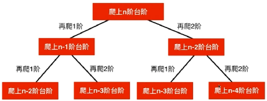
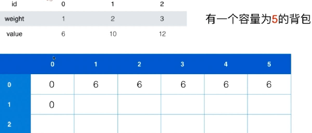
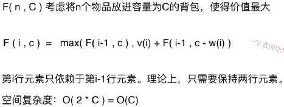

###　动态规划

### 70. Climbing Stairs

[Description](https://leetcode.com/problems/climbing-stairs/description/)[Hints](https://leetcode.com/problems/climbing-stairs/hints/)[Submissions](https://leetcode.com/problems/climbing-stairs/submissions/)[Discuss](https://leetcode.com/problems/climbing-stairs/discuss/)[Solution](https://leetcode.com/problems/climbing-stairs/solution/)

[Pick One](https://leetcode.com/problems/random-one-question/)

------

You are climbing a stair case. It takes *n* steps to reach to the top.

Each time you can either climb 1 or 2 steps. In how many distinct ways can you climb to the top?

**Note:** Given *n* will be a positive integer.

**Example 1:**

```
Input: 2
Output:  2
Explanation:  There are two ways to climb to the top.
1. 1 step + 1 step
2. 2 steps
```

**Example 2:**

```
Input: 3
Output:  3
Explanation:  There are three ways to climb to the top.

1. 1 step + 1 step + 1 step
2. 1 step + 2 steps
3. 2 steps + 1 step
```


自顶向下分析：



递归求解：

缺点：大量重复子问题。

```c++
class Solution {
private:
    int calcWays(int n){
        if( 1 == n ) //只有一个台阶，只能一步
            return 1;
        if( 2 == n ) //只有两个台阶。要么一步一步，要么两步
            return 2;
        
        return calcWays(n-1) + calcWays(n-2);
    }
public:
    int climbStairs(int n) {
        return calcWays(n);
    }
};
//////////////////////////////////////////或者
private:
    int calcWays(int n){
        if( 1 == n || 0 == n ) //与上面的答案一样。0布台阶需要一步。１个台阶１种，两个台阶２种(来自台阶１和来自台阶０)
            return 1;
        
        return calcWays(n-1) + calcWays(n-2);
    }
```

优化：记忆搜索

```c++
class Solution {
private:
    vector<int> memo;
    
    int calcWays(int n){
        if( 1 == n )
            return 1;
        if( 2 == n )
            return 2;
        if( -1 == memo[n] )
            memo[n] = calcWays(n-1) + calcWays(n-2);
        return memo[n];
    }
public:
    int climbStairs(int n) {
        memo = vector<int>(n+1,-1);
        return calcWays(n);
    }
};
```

优化：动态规划

```c++
class Solution {
public:
    int climbStairs(int n) {
        vector<int> memo(n+1,-1);
        memo[0] = 1;
        memo[1] = 1;
        for(int i=2; i<=n; i++)
            memo[i] = memo[i-1] + memo[i-2];
        return memo[n];
    }
};
```

120: Triangle 三角阵列，找出自顶向下的数字和最小。

64:Minimun Path Sum 矩阵中，找到左上角到右下脚的数字和最小。


### 343. Integer Break

[Description](https://leetcode.com/problems/integer-break/description/)[Hints](https://leetcode.com/problems/integer-break/hints/)[Submissions](https://leetcode.com/problems/integer-break/submissions/)[Discuss](https://leetcode.com/problems/integer-break/discuss/)[Solution](https://leetcode.com/problems/integer-break/solution/)

[Pick One](https://leetcode.com/problems/random-one-question/)

------

Given a positive integer *n*, break it into the sum of **at least** two positive integers and maximize the product of those integers. Return the maximum product you can get.

For example, given *n* = 2, return 1 (2 = 1 + 1); given *n* = 10, return 36 (10 = 3 + 3 + 4).

**Note**: You may assume that *n* is not less than 2 and not larger than 58.


暴力解法：回溯遍历　将一个树做分割的所有可能性。O(2^n)


可以通过记忆话搜索来避免大量子问题的重复计算。

**最优子结构**：通过求子问题的最优解，来获得原问题的最优解


```c++
class Solution {
private:
    int max3(int a, int b, int c){
        return max(a, max(b,c));
    }
    //将n进行分割（至少两部分），可以获得的最大乘积
    int breakInteger(int n){
        if(1 == n)
            return 1;
        int res = -1;
        for( int i = 1; i<= n-1; i++ )
          	// 原来的res，　不继续分割，　继续分割　三者中取最大
            res = max3( res, i*(n-i), i*breakInteger(n-i) );
        return res;
    }
public:
    int integerBreak(int n) {
        return breakInteger(n);
    }
};
```

优化1：记忆话搜索

```c++
class Solution {
private:
    vector<int> memo; 
    int max3(int a, int b, int c){
        return max(a, max(b,c));
    }
    
    int breakInteger(int n){
        if(1 == n)
            return 1; 
      
        if( memo[n] != -1 )
            return memo[n];
      
        int res = -1;
        for( int i = 1; i<= n-1; i++ )
            res = max3( res, i*(n-i), i*breakInteger(n-i) );
        memo[n] = res;
        return res;
    }
public:
    int integerBreak(int n) {
        memo = vector<int>(n+1, -1);
        return breakInteger(n);
    }
};
```

优化2：动态规划，自底向上。O(n^2)

```c++
class Solution {
private:
    int max3(int a, int b, int c){
        return max(a, max(b,c));
    }

public:
    int integerBreak(int n) {
      	//memo[i]表示将数字i分割（至少分割两部分）后得到的最大乘积
        vector<int> memo = vector<int>(n+1, -1);
        
        memo[1] = 1;
        for( int i=2; i<=n; i++ )
          	//求解memo[i] 遍历[1...i-1]
            for(int j=1; j<=i-1; j++)
              	// 原来的res，　不继续分割，　继续分割　三者中取最大
                memo[i] = max3( memo[i], j*(i-j), j*memo[i-j] );
        
        return memo[n];
    }
};
```

279:Perfect Squares 寻找最少的完全平方数和为n

91:Decode Ways　解析数字字符串

62:Unique Paths　从左上角走到右下脚

63:Unique Paths Two　设置障碍物


### 198. House Robber

[Description](https://leetcode.com/problems/house-robber/description/)[Hints](https://leetcode.com/problems/house-robber/hints/)[Submissions](https://leetcode.com/problems/house-robber/submissions/)[Discuss](https://leetcode.com/problems/house-robber/discuss/)[Solution](https://leetcode.com/problems/house-robber/solution/)

[Pick One](https://leetcode.com/problems/random-one-question/)

------

You are a professional robber planning to rob houses along a street. Each house has a certain amount of money stashed, the only constraint stopping you from robbing each of them is that adjacent houses have security system connected and **it will automatically contact the police if two adjacent houses were broken into on the same night**.

Given a list of non-negative integers representing the amount of money of each house, determine the maximum amount of money you can rob tonight **without alerting the police**.　

**暴力解法**：检查所有房子的组合，对每一个组合，检查是否有相邻的房子，如果没有，记录其价值。找最大值。O((2^n)*n)


**动态规划**：

- 状态：定义了函数在做什么
- 状态转移：定义了函数该怎么做


递归：

```c++
class Solution {
private:
  
  
  	//考虑抢劫nums[index...nums.size())这个范围的所有房子
    int tryRob( vector<int> &nums, int index ){
        if( index >= nums.size() )
            return 0;
        int res = 0;
        for( int i=index; i<nums.size(); i++ )
            res = max( res, nums[i] + tryRob(nums, i+2) );
        return res;
    }
public:
    int rob(vector<int>& nums) {
        return tryRob( nums, 0 );
    }
};
```

记忆化搜索：

```c++
class Solution {
private:
  	//考虑抢劫nums[index...nums.size())这个范围的所有房子的最大收益
    vector<int> memo;
  	//考虑抢劫nums[index...nums.size())这个范围的所有房子
    int tryRob( vector<int> &nums, int index ){
        if( index >= nums.size() )
            return 0;
        
        if( memo[index] != -1 )
            return memo[index];
        
        int res = 0;
        for( int i=index; i<nums.size(); i++ )
            res = max( res, nums[i] + tryRob(nums, i+2) );
        memo[index] = res;
        return res;
    }
public:
    int rob(vector<int>& nums) {
        memo = vector<int>(nums.size(), -1);
        return tryRob( nums, 0 );
    }
};
```


动态规划：

```c++
class Solution {
public:
  
  
  
  
    int rob(vector<int>& nums) {
        int n = nums.size();
        if( 0 == n )
            return 0;
      	//memo[i]表示考虑抢劫 nums[i...n-1]所能获得的最大收益
        vector<int> memo(n, -1);
        memo[n-1] = nums[n-1];
        for( int i=n-2; i>=0; i-- )
          	//计算memo[i]
            for( int j=i; j<n; j++ )
                memo[i] = max( memo[i], nums[j] + (j+2 < n ? memo[j+2] : 0) );
        return memo[0];
    }
};
```


213:House Robber Two 环形街道

337:House Robber Three　在小区（二叉树）中

309:Best Time to Buy and Sell Stock with Cooldown　交易股票的方式


### 0-1背包问题


**暴力解法**：每一件物品都可以放进背包，也可以不放进背包。　O((2^n)*n)

贪心算法并不能解决这个问题。

**动态规划**：F(n,c)考虑将n个物品放进容量为C的背包，使得价值最大。

$$ F(i,c)=max \begin{cases} F(i-1,c), & \text {不放第i个物品} \\ v(i)+F(i-1,c-w(i)), & \text{放入第i个物品} \end{cases} $$


递归解法：寻在大量重复子结构的计算

```c++
class Knapsack01{
  private:
  //用[0...index]的物品，填充容积为C的背包的最大价值
  int bestValue(const vector<int> &w, const vector<int> v, int index, int c){
    
    if( index < 0 || c <= 0 )
      return 0;
    
    int res = bestValue(w, v, index-1, c);//不放第index个物品
    if( c >= w[index] )//放第index个物品
      res = max(res, v[index] + bestValue(w, v, index-1, c-w[index]));
    
    return res;
  }
 public:
  int knapsack01(const vector<int> &w, const vector<int> &v, int C){
    int n = w.size();
    return bestValue( w, v, n-1, C);
  }
}
```

记忆化搜索：

```c++
class Knapsack01{
  private:
  vector<vector<int>> memo;
  //用[0...index]的物品，填充容积为C的背包的最大价值
  int bestValue(const vector<int> &w, const vector<int> v, int index, int c){
    
    if( index < 0 || c <= 0 )
      return 0;
    
    if( -1 != ,memo[index][c] )
      return memo[index][c];
    
    int res = bestValue(w, v, index-1, c);//不放第index个物品
    if( c >= w[index] )//放第index个物品
      res = max(res, v[index] + bestValue(w, v, index-1, c-w[index]));
    
    memo[index][c] = res;
    return res;
  }
 public:
  int knapsack01(const vector<int> &w, const vector<int> &v, int C){
    int n = w.size();
    memo = vector<vector<int>>(n, vector<int>(C+1, -1))
    return bestValue( w, v, n-1, C);
  }
}
```


自低向上（具体分析）：

在一个容量为５的背包中放入物品id为0,1,2的过程，二维辅助数组中，每一行为第i个物品，每一列为对应物品的背包的剩余容量，值表示第i个物品对于背包容量的最大价值。首先，对于第0个物品，0容量的背包不能放，1容量的背包可以放，故$[0][1]$的最大价值为６.因为只有一个物品，所有后面背包容量大的也只能放一个物品，价值最大都为６.



此时，要计算$[1][3]$的最大价值，这里有两个选项：

1. 不考虑放当前第1个物品，则其价值为原来的$[0][3]$，即６

2. 考虑放入当前第1个物品，此时背包总容量为3,先放入该物品(重２)，还剩１的容量，所以再在前面所有１的容量中选择最大的价值６，故此时最大价值为10＋６=16。注意：在所有容量相等的情况下(每一列)，所放物品越多，价值越大，即每一列的数据总是增加的。故放入当前第i个物品时，只需要看剩余容量中第i-1行即可,即$[i-1][剩余容量]$,此处为$[0][1]$.

   最后选择两者最大值即可。


故最后为： $memo[2][5] = max{ memo[1][5], memo[1][5-3] }$

$[i][j] = max　{ [i-1][j], [i-1][背包容量－当前物品容量] }$


时间：O(n\*c) 空间：O(n\*c)

```c++
class Knapsack01{
  public:
  
  int knapsack01(const vector<int> &w, const vector<int> &v, int C){
    assert( w.size() == v.size() );
    int n = w.size();
    if( 0==n )
      return 0;
    vector<vector<int>> memo(n, vector<int>(C+1, -1));
    for(int i=0; i<=C; i++)    //基础问题，ｉ代表容量。放入第０个物品，放不下则为０
      memo[0][i] = ( i>=w[0] ? v[0] : 0 );
    for(int i=0; i<n; i++)　   // i代表第i个物品
      for(int j=0; j<=C; j++){ // j代表容量
        memo[i][j] = memo[i-1][j];  //不放第i个物品
        if(j>=w[i])            // 如果容量允许，则放入第i个物品
          memo[i][j] = max( memo[i][j], v[i] + memo[i-1][j-w[i]] );
      }
    return memo[n-1][C];
  }
}
```

**空间优化1**：O(2C)=O(C)



i为偶数时，处理第一行；　i为奇数时,处理第二行。

```c++
class Knapsack01{
  public:
  int knapsack01(const vector<int> &w, const vector<int> &v, int C){
    assert( w.size() == v.size() );
    int n = w.size();
    if( 0==n )
      return 0;
    vector<vector<int>> memo(2, vector<int>(C+1, -1));
    for(int i=0; i<=C; i++)           　//基础问题，ｉ代表容量。放入第０个物品，放不下则为０
      memo[0][i] = ( i>=w[0] ? v[0] : 0 );
    for(int i=0; i<n; i++)　          　　　 // i代表第i个物品
      for(int j=0; j<=C; j++){       　　　  // j代表容量
        memo[i%2][j] = memo[(i-1)%2][j];    //不放第i个物品
        if(j>=w[i])                  　　　  // 如果容量允许，则放入第i个物品
          memo[i%2][j] = max( memo[i%2][j], v[i] + memo[(i-1)%2][j-w[i]] );
      }
    return memo[(n-1)%2][C];
  }
}
```

**空间优化2**：O(C)

对于计算每一个值，它只依赖于上面的元素和左边的元素。而与右边的元素无关。


只有一行，如果考虑从右往左计算，每个数字都只依赖其左边的数和它原来本身。而与右边的数无关。从最右边开始：


然后依次往左更新：


```c++
class Knapsack01{
  public:
  int knapsack01(const vector<int> &w, const vector<int> &v, int C){
    assert( w.size() == v.size() );
    int n = w.size();
    if( 0==n )
      return 0;
    vector<int> memo(C+1, -1);
    for(int i=0; i<=C; i++)           　//基础问题，ｉ代表容量。放入第０个物品，放不下则为０
      memo[i] = ( i>=w[0] ? v[0] : 0 );
    for(int i=0; i<n; i++)　          　　　 
      for(int j=C; j>=w[i]; j--){       　//从右变开始，直到当前容量放不下该物品时结束。
          memo[j] = max( memo[j], v[i] + memo[j-w[i]] );
      }
    return memo[C];
  }
} 
```

0-1背包问题更多变种：

1. 完全背包问题：每个物品可以无限使用。　思路：每个物品个数其实是有限的，只是重复了而已
2. 多重背包问题：每个物品限定使用num[i]次
3. 多维费用背包问题：要考虑物品的体积和重量两个纬度　状态多了一个参数，数组多了一维
4. 物品间可以相互排斥、相互依赖


### 300. Longest Increasing Subsequence最长上升子序列

[Description](https://leetcode.com/problems/longest-increasing-subsequence/description/)[Hints](https://leetcode.com/problems/longest-increasing-subsequence/hints/)[Submissions](https://leetcode.com/problems/longest-increasing-subsequence/submissions/)[Discuss](https://leetcode.com/problems/longest-increasing-subsequence/discuss/)[Solution](https://leetcode.com/problems/longest-increasing-subsequence/solution/)

[Pick One](https://leetcode.com/problems/random-one-question/)

------

Given an unsorted array of integers, find the length of longest increasing subsequence.

Given `[10, 9, 2, 5, 3, 7, 101, 18]`,
The longest increasing subsequence is `[2, 3, 7, 101]`, therefore the length is `4`. Note that there may be more than one LIS combination, it is only necessary for you to return the length.

Your algorithm should run in O(*n2*) complexity.

**Follow up:** Could you improve it to O(*n* log *n*) time complexity?

**暴力**：选择所有的子序列进行判断　O((2^n)*n)

**动态规划**：

状态LIS(i)：表示[0...i]的范围内，选择数字nums[i]可以获得的最长上升子序列。以该数字结尾。

状态转换：$LIS(i) = max_{j<i}( 1 + LIS(j) if( nums[i] > nums[j] ))$

初始化：先把每个元素看做只有自己，并且以自己结尾的上升子序列。故长度都为１。


然后依次计算每一个LIS(i)，对于每一个LIS(i),都要遍历一遍其前面的元素，如果前面的元素比当前位置小，则记录当前LIS(i)为前面元素的LIS＋１(元素本身)，最后在LIS(i)中选择一个最大的作为LIS(i)。

10:本身为１

9:前面没有比9小的元素，故为本身1

2:前面没有比９小的元素，故为本身１

5:前面有比5小的元素2,故为1(LIS(2)的值)+1(本身)=2


3:前面有比3小的元素2,故为1(LIS(2)的值)+1(本身)=2

7:前面有比7小的元素2,5,3.故选择max{LIS(2), LIS(5),LIS(3)} + 1(本身)＝３


时间：O(n^2)

```c++
class Solution {
public:
    int lengthOfLIS(vector<int>& nums) {
        if( nums.size() == 0 )
            return 0;
        //memo[i]表示以nums[i]为结尾的最长上升子序列的长度
        vector<int> memo(nums.size(), 1);
        for(int i=1; i<nums.size(); i++)
            for( int j=0; j<i; j++ )
                if( nums[j] < nums[i] )
                    memo[i] =max( memo[i], 1+memo[j] );
        int res = 1;
        for( int i=0; i<nums.size(); i++ )
            res = max( res, memo[i] );
        
        return res;
    }
};
```

反向重构具体解？

LIS问题的O(nlogn)解法，不属于动态规划


376:Wiggle Subsequence　求一个数组的最长一升一降子序列


### 最长公共子序列LCS

给出两个字符串s1,s2，求这两个字符串的最长公共子序列的长度。


**状态**LCS(m,n):S1[0...m]和S2[0...n]的最长公共子序列

**状态转移**：


具体例子（自顶向下）：


１、递归

２、记忆化搜索

３、动态规划(自底向上)

### Dijkstra 单源最短路径算法

**状态**：shortestPath(i):从start到i的最短路径长度

**状态转移**：　shortestPath(x) = min( shortestPath(a) + w(a->x) )　ａ的最短路径＋ａ到达x的路径(对于所有可以到达x的a)。

### 416. Partition Equal Subset Sum

[Description](https://leetcode.com/problems/partition-equal-subset-sum/description/)[Hints](https://leetcode.com/problems/partition-equal-subset-sum/hints/)[Submissions](https://leetcode.com/problems/partition-equal-subset-sum/submissions/)[Discuss](https://leetcode.com/problems/partition-equal-subset-sum/discuss/)[Solution](https://leetcode.com/problems/partition-equal-subset-sum/solution/)

[Pick One](https://leetcode.com/problems/random-one-question/)

------

Given a **non-empty** array containing **only positive integers**, find if the array can be partitioned into two subsets such that the sum of elements in both subsets is equal.

**Note:**

1. Each of the array element will not exceed 100.
2. The array size will not exceed 200.

**Example 1:**

```
Input: [1, 5, 11, 5]       Output: true
Explanation: The array can be partitioned as [1, 5, 5] and [11].
```

**Example 2:**

```
Input: [1, 2, 3, 5]  Output: false
Explanation: The array cannot be partitioned into equal sum subsets.
```

思路：典型的背包问题，在n个物品中选出一定物品，填满sum/2的背包。

**状态**：F(n,c)考虑将n个物品填满容量为c的背包

**状态转移**：F(i,c) = F(i-1,c) || F(i-1, c-w(i)) （不用i填，用i填）

时间复杂度：O(n*sum/2)=O(n\*sum)

递归（自顶向下）：

```c++
class Solution {
private:
  	//使用nums[0...index],是否可以完全填充一个容量为sum的背包
    bool tryPartition( const vector<int> &nums, int index, int sum ){
        if( sum == 0 )//填充好了背包
            return true;
        if( sum<0 || index<0 )//sum<0,填充多了;index<0,没物品了
            return false;
        return tryPartition(nums, index-1, sum) || tryPartition(nums, index-1, sum-nums[index]);
    }
public:
    bool canPartition(vector<int>& nums) {
        int sum = 0;
        for(int i=0; i<nums.size(); i++)
            sum += nums[i];
        if( sum%2 !=0 )
            return false;
        return tryPartition( nums, nums.size()-1, sum/2 );
    }
};
```

记忆化搜索：

```c++
class Solution {
private:
  	//　memo[i][c]表示使用索引为[0...1]的这些元素，是否可以完全填充一个容量为c的背包
  	//　-1表示未计算，0表示不可以填充，1表示可以填充
    vector<vector<int>> memo;
  	//使用nums[0...index],是否可以完全填充一个容量为sum的背包
    bool tryPartition( const vector<int> &nums, int index, int sum ){
        if( sum == 0 )
            return true;
        if( sum<0 || index<0 )
            return false;
        if( memo[index][sum] != -1 )
            return memo[index][sum] == 1;
      
        memo[index][sum] = (tryPartition(nums, index-1, sum) || tryPartition(nums, index-1, sum-nums[index])) ? 1 : 0;
      
        return memo[index][sum] == 1;
    }
public:
    bool canPartition(vector<int>& nums) {
        int sum = 0;
        for(int i=0; i<nums.size(); i++)
            sum += nums[i];
        if( sum%2 !=0 )
            return false;
        memo = vector<vector<int>>( nums.size(), vector<int>(sum/2+1, -1) );
        return tryPartition( nums, nums.size()-1, sum/2 );
    }
};
```

动态规划：

```c++
class Solution {

public:
    bool canPartition(vector<int>& nums) {
        int sum = 0;
        for(int i=0; i<nums.size(); i++)
            sum += nums[i];
        if( sum%2 !=0 )
            return false;
        
        int n = nums.size();
        int C = sum/2;
        vector<bool> memo(C+1, false);
        
        for(int i=0; i<=C; i++)
            memo[i] = ( nums[0] == i );
        
        for( int i=1; i<n; i++ )
            for( int j=C; j>=nums[i]; j-- )
                memo[j] = memo[j] || memo[j-nums[i]];
        
        return memo[C];
    }
};
```


322:Coin Change:求最少需要多少枚硬币凑成指定的金额

377:Combination Sum For 在没有重复元素的数组中，有多少中可能凑成指定的整数target。　可重复使用？　顺序相关？

474:Ones and Zeros　01串

139:Word Break 使用字符串数组中的元素拼接成指定的字符串

494:Target Sum　在数字序列上用+或-连接起来，计算结果为给定的整数S。