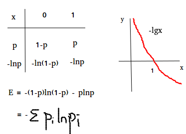

### 决策树与随机森林

决策树最大的**优点**：训练速度快。然后集成这些决策树，得到更优的结果

**熵**：表征一个随机事件的确定度。变量的不确定性越大，熵也就越大，把它搞清楚所需要的信息量也就越大。

图中：x的为概率P(0~1)，所对应的y为相应的确定度。越可能发生的事，越确定，需要搞清楚的信息量越少。

如果一个随机变量 X 的可能取值为 X={x1,x2,…,xn}X={x1,x2,…,xn}，对应的概率为 p(X=xi)p(X=xi)，则离散随机变量 X 的信息熵为：

注意：离散情况下，熵一定是正数。但连续随机变量可能是负数。

**条件熵**：