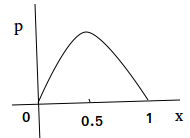
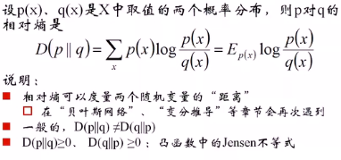
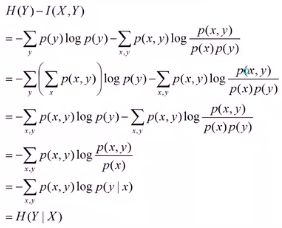
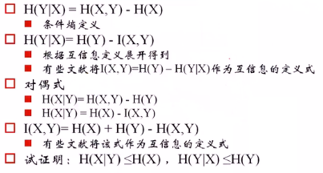
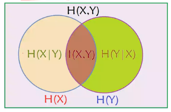
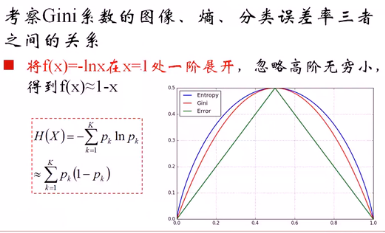
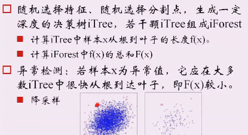
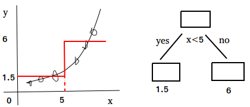

### 决策树与随机森林

#### 一、基本概念

决策树最大的**优点**：训练速度快。然后集成这些决策树，得到更优的结果

**１．熵**：表征一个随机变量的不确定性的度量。变量的不确定性越大，熵也就越大，把它搞清楚所需要的信息量也就越大。

图中：x的为概率P(0~1)，所对应的y为相应的确定度。越可能发生的事，越确定，需要搞清楚的信息量越少。

如果一个随机变量 X 的可能取值为 X={x1,x2,…,xn}X={x1,x2,…,xn}，对应的概率为 p(X=xi)p(X=xi)，则离散随机变量 X 的信息熵为：

注意：

- 熵只依赖于X的分布，而与X的取值无关。

- 离散情况下，熵一定是正数。但连续随机变量可能是负数。

图中：p=1和p=0，即一定发生和一定不发生的熵为０；中间最不确定的时候，熵最大。

**２．条件熵**：H(X,Y) - H(X)  　(X,Y)发生所包含的熵，减去X单独发生包含的熵。即，在X已经确定的前提下(除去X的不确定度)，看看Y的不确定度，即　**H(Y|X)**　＝　H(X,Y) - H(X).公式推导如下：

　　　　

最后得到的公式理解：在x给定的情况下Y的条件概率分布的熵对X的数学期望。(用p(x)作为随机变量的值)

当熵与条件熵中的概率由数据估计(特别是极大似然估计)得到时，所对应的为　经验熵　和　经验条件熵。

**３．交叉熵**：用来衡量在给定的真实分布下，使用非真实分布所指定的策略消除系统的不确定性所需要付出的努力的大小。

　　交叉熵越低，策略越好。最低的交叉熵也就是使用了真实分布所计算出来的信息熵。因此，当q=p时，交叉熵＝信息熵。故在机器学中，最小化交叉熵，就是让我们的策略最接近最优策略。那如何来衡量两个不同策略(不同分布)之间的差异呢？这就用到了相对熵，K-L散度。

　　另外：

- 极大似然估计：估计的真实参数为p，样本为正７次，反３次，则求 $p^7(1-p)^3$的极大值。
- 交叉熵：$-\sum lnq^q = -ln\prod q^p$, 其中q为参数(真实分布)，p为样本。即$\prod q^p$求极大值，与最小化交叉上是类似的。

**４．相对熵**：即K-L散度。相当于对p(x)求期望。相对熵＝某个策略的交叉熵 - 信息熵。

**５．互信息**：两个随机变量X,Y的互信息，定义为X, Y的联合分布和独立分布乘积的相对熵。即X, Y的联合分布和独立分布乘积的距离。如果X, Y独立，p(x,y)=p(x)p(y)，则互信息为０，否则为大于０的某个数。

　　　　　　　　　　　　　　　

另一方面：　熵 - 互信息 = 条件熵

　　　　　　　　　　　　　　　　

整理得到：

　　　　　　　　　　　　　　　　

最后的公式，说明：对于X，在给定Y的条件下，X的信息熵不会增大，可能减小。

强大的Venn图：

#### 二、决策树

　　建立决策树，实际上就是以信息熵为度量构造一颗熵值下降最快的数，采用自顶向下的递归方法。

　　从根节点开始，对结点计算所有可能特征的信息增益，选择信息增益最大的特征作为结点的特征，并由该特征的不同取值构建子节点。递归执行，直到所有特征的信息增益都很小，或者没有特征可选择时为止。

如果最后熵为０，则需要剪枝，否则可能产生过拟合。实际上属于贪心法，在当前节点中找熵下降最快的，总体上不一定是最好的。

　　构造决策树的过程其实就是选择特征的过程，如何选择特征呢？

##### 1. ID3

　　对于每个特征，都计算 $H(x) - H(x|f_i)$ ，这个值就是每个特征让熵值下降的差值，找出差值最大所对应的特征f作为当前决策树的节点即可。其实就是互信息$I(X, f)$。

##### 2. C4.5

　　对于ID3，如果某一个特征的取值较多，即分类数目较多，子节点较多，则叶子节点的比较确定，熵值特别小，甚至$H(x|f_i)＝０$，导致$I(X, f)=H(x)$，其实原因是该特征本身的熵$H(f)$特别大。为避免这种情况，采用$\frac {I(X, f_i)}  {H(x|f_i)}$，即信息增益率。  			

**3. CART**　classification and regression tree

　　$Gini(p) = \sum_k p_k(1-p_k) = 1- \sum_k p_k^2$

​	基尼指数，这个定义下，基尼指数越大，代表越不均衡。

　　cart假设决策树是一个二叉树，通过递归二分每个特征，将特征空间划分为有限个单元，并在这些单元上确定预测的概率分布。

　　对于回归树，采用平方误差最小化准则；对于分类树，采用基尼指数最小化准则。

　　另外：经济学上的基尼指数也可以用在机器学习中。		

决策树的优缺点：

- 优点：
  - 易于理解和解释，甚至比线性回归更直观
  - 与人类做决策的思维习惯契合
  - 模型可通过树的形式进行可视化
  - 可以处理非数值型数据，甚至可以直接处理有缺失值的数据
- 缺点：
  - 处理连续变量不好
  - 不好处理变量之间存在许多错综复杂的关系，如金融数据
  - 决定分类的因素取决于更多变量的复杂组合时
  - 规模性一般

#### 三、模型评价及解决方案

##### 过拟合

　　决策树对训练数据有很好的分类能力，但泛化能力弱，可能发送过拟合现象。树太复杂，需要简化。解决方案：

- 剪枝：预剪枝（一边生成树，一边根据参数进行剪枝。实际上在定义模型的时候就给出参数，最大深度，每个节点最大分类数）、后剪枝（生成树后剪枝，较麻烦，不适合数据规模大，维度高的模型）
- 随机森林：过拟合一般由噪声产生，所以并不是所有的树都在同一个地方产生过拟合(可能在不同的地方产生过拟合)，当用多颗树进行平均时，就可以避免过拟合的现象。不同的树使用不同的数据(重采样).

##### 剪枝

　　一般通过极小化决策树整体的损失函数或代价函数来实现。设树的叶节点个数为|T|，t是树T的叶节点，该节点有$N_t$个样本点，其中k类的样本点有$N_{tk}$个，$k=1,2,3,...,K$，$H_t(T)$为叶节点t上的经验熵，$\alpha>=0$为参数，则决策树学习的损失函数可以定义为：

​	　　　　　　　$$C_{\alpha}(T) = \sum_{t=1}^{|T|}N_tH_t(T) + \alpha |T|$$

​	其中经验熵为：$H_t(T) = - \sum_k \frac {N_{tk}} {N_t} log \frac {N_{tk}} {N_t}​$

​	第一项记为：　$C(T) = - \sum_{t=1}^{|T|} \sum_{k=1}^{K}  N_{tk} log \frac {N_{tk}} {N_t}$

​	得到：　　　　$C_\alpha(T) = C(T) + \alpha |T|$

​	式中，$C(T)$表示模型对训练数据的预测误差，即模型与训练数据的拟合程度。$|T|$表示模型复杂程度，参数$\alpha>=0$控制两者之间的影响。较大时，促使选择较简单的模型；较小时，选择较复杂的模型；为０，表示不考虑模型的复杂度。

　　剪枝，就是当$\alpha$确定时，选择损失函数最小的模型。决策树生成学习局部模型，决策树剪枝学习整体的模型。上式等价于正则化的极大似然估计。所以，利用损失函数最小原则进行剪枝就是用正则化的极大似然估计进行模型选择。

具体的**剪枝算法**：

- 后剪枝

  1. 计算每个节点的经验熵
  2. 递归地从树的叶节点向上回缩，如果回缩之后的$C_\alpha(T) $比回溯之前的更小，则进行剪枝，将父节点变为新的叶节点。该计算可以局部进行，可以采用动态规划实现。
  3. 返回步骤2，直至不能继续为止，得到损失函数最小的子树。

  ​

1. 计算每个节点的经验熵
2. 递归地从树的叶节点向上回缩，如果回缩之后的$C_\alpha(T) $比回溯之前的更小，则进行剪枝，将父节点变为新的叶节点。该计算可以局部进行，可以采用动态规划实现。
3. 返回步骤2，直至不能继续为止，得到损失函数最小的子树。

##### Bagging策略

- Bootstrap：从样本集中重采样选出n个样本。（有的样本有重复，有的样本没选中）。假设每个样本被选中的概率为$\frac 1 N$, 则被选中的概率：$1-(1- \frac 1 N)^N$, 即$1-[(1+ \frac 1 {-N})^{-N}]^{-1}$, 当Ｎ无穷大时，为 $1-e^{-1}$ 大概为63.2%；36.8%的样本未参与本次决策树的生成，可以用于测试这颗决策树的性能，估计误差。有人用实验证明，袋外数据与同训练集一样大小的测试集精度相同，得到的模型参数是无偏估计的。但是，采样的样本数也可以是总样本的一部分(例如70%?)，同时，特征个数也可以是总特征数的一部分(例如50%?)，经过大量的决策树，重要的特征总会显现出来。Random forest：样本和特征都进行随机
- 在所有属性上，对这n个样本建立分类器（ID2, C4.5, CART, SVM, Logistic回归等）。推荐使用决策树(弱分类器)。SVM和Logidtic属于强分类器（过分地依赖于某几个样本）。

##### 随机森林(在bagging基础上做了修改)

1. 从样本集中用Bootstrap采样出n个样本
2. 从所有属性中随机选择k个属性，选择最佳分割属性作为节点建立CART决策树
3. 重复以上两步m次，建立m棵CART决策树
4. 这m棵决策树形成随机森林，通过投票表决结果，决定数据属于哪一类。

另外：如果一颗决策树的正确率在50%以上，并且随机森林足够随机，**理论上**来讲，随机森林中树越多，结果越好。

##### 投票机制

1. 简单的投票机制

   - 一票否决(一致表决)
   - 少数服从多数 (有效多数　加权)
   - 阈值表决

2. 贝叶斯投票机制

3. 另外，如何给电影评分：当人较少时，接近C；当v较多时，接近R。

   

#### 四、应用

#####  1.样本不均衡的常用处理方法

1. 随机欠采样：将多的那一类降采样。效果好于重采用。降采样后的噪声可能没那么多，样本少，训练块　
2. 过采用：将少的那一类重采用。重采样后的噪声可能会加大。
3. 聚类分割：将多的那一类进行聚类，然后从聚类中的每一类中选择有代表的样本，然后与少的那一类进行训练。
4. 插值得到新样本
5. 给少的样本一个大的权值

##### 2.使用RF建立计算样本间相似度

##### 3. 使用随机森林计算特征重要度，即特征选择

在随机森林决策树建立过程中，如果选择某一个特征的次数非常多，则可以认为该特征比较重要，跟结果联系紧密。

##### 4. 异常检测

####　五、决策树用来拟合

　　　　　

如图所示：当只有一个节点来拟合这条曲线时，预测的数据只会得到两个值，1.5是x<5的样本均值，6是x大于5的均值。拟合出来的结果为红色的线。如果树的深度更深，则会得到更多的结果，曲线更加逼近。如右图。右图中，会有斜线部分，这个斜线其实就是直接将两个阈值点连接起来。那么，阈值点是如何选择的呢？

1. 样本中，在max和min中选择一些等间隔的点(点越多，速度越慢，精度越高)，其中能够让MSE最小的点，则选择为阈值点。
2. 样本点的投影已经分为了N-1个区间，同一区间内的点效果都一样，故每个区间选一个点，最多选择N-1个点，就可以分完。
3. 在[min, max]区间的均匀分布中，随机选择x，算MSE值，然后重复这些步骤，然后从这些随机点中选择MSE值最好的点作为阈值。因为加入了随机，所以即使有噪声，即使样本数太多，也可以分出来。(推测SKlearn中的实现)

多输出情况，即Y是m*k维的，每一个样本对应k个输出：$X_{m×n}×W_{n×k}=Y{m×k}$

参考：

[1]. 统计学习方法　李航

[2]. 皱博大神相关资料

