### LDA

LDA可以看成是三层的贝叶斯网络。无监督学习／蒋维

如上图所示：

**正向**：随机变量X，其分布为P。　根据这一分布产生值DiX，然后根据每一个DiX构造变量Z，其分布由Dix决定，然后根据其分布得到一系列的Z值，即000110010.

**逆向**：已经得到了Z的观测值000110010，然后想根据这些观测值推出X的分布P(或者DiX)。

### LDA的应用方向（处理隐变量）

- 信息提取和搜索
  - 语义分析

- 　文档分类／聚类、文章摘要、社区挖掘
- 基于内容的图像聚类、目标识别
  - 以及其它计算机视觉应用
- 生物信息数据的应用

### 数据表示

一共有m片文档D，第m篇文档中有$n_m$个单词。　词袋长度为v。

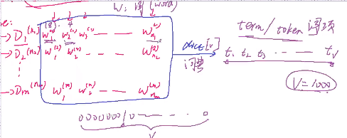

每篇文档的特征都是$n_m * v$维的。要做的就是将左边（词）蒋维到右边（主题）。左边“水杯”这个词对应到右边的爱情的概率为0.2,对应到物体的概率为0.8.

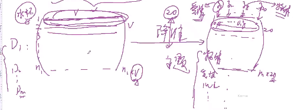

可以将同类的词归为同一类主题；也可以将同一个词归为不同主题（语义不同）。这样就将文档D对应到主题T这个隐变量上。

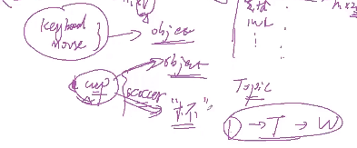

### 推导

#### Beta分布

该函数是阶乘在实数上的推广。只需要知道其结果是一个数就可以了。

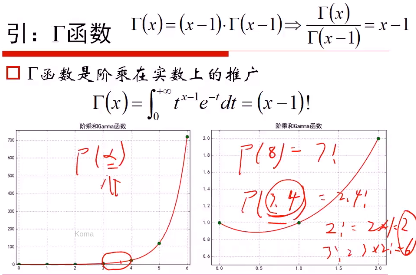

对于形如$x^a*(1-x)^b$这样一个函数，其总过横轴0,1这两点。参数a,b决定了该函数的峰值往哪偏。该函数跟ｘ轴的面积即为S(a,b).a,b为参数。f(x;a,b)即为Beta分布的概率密度函数。

　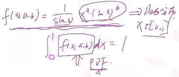

故得到(a记为a-1,b记为b-1)：

　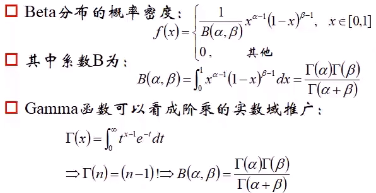　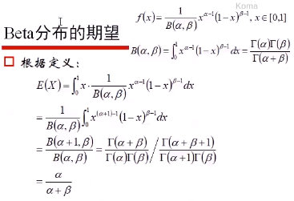

##### Beta分布的作用

  Beta分布可以看作一个概率的概率分布，当我们不知道一个东西的具体概率是多少时，Beta分布可以给出所有概率出现的可能性大小。根据已知的知识，我们可以利用Beta分布将一个东西的具体概率限制在一定范围内。

举例说明：

　　熟悉棒球运动的都知道有一个指标就是棒球击球率(batting average)，就是用一个运动员击中的球数除以击球的总数，我们一般认为0.266是正常水平的击球率，而如果击球率高达0.3就被认为是非常优秀的。现在有一个棒球运动员，我们希望能够预测他在这一赛季中的棒球击球率是多少。你可能就会直接计算棒球击球率，用击中的数除以击球数，但是如果这个棒球运动员只打了一次，而且还命中了，那么他就击球率就是100%了，这显然是不合理的，因为根据棒球的历史信息，我们知道这个击球率应该是0.215到0.36之间才对啊。对于这个问题，我们可以用一个二项分布表示（一系列成功或失败），一个最好的方法来表示这些经验（在统计中称为先验信息）就是用beta分布，这表示在我们没有看到这个运动员打球之前，我们就有了一个大概的范围。beta分布的定义域是(0,1)这就跟概率的范围是一样的。接下来我们将这些先验信息转换为beta分布的参数，我们知道一个击球率应该是平均0.27左右，而他的范围是0.21到0.35，那么根据这个信息，我们可以取α=81,β=219。之所以取这两个参数是因为beta分布的均值是$\frac{\alpha}{\alpha+\beta}=\frac{81}{81+219}=0.27$.即Beta(81,219).所以，击中一次之后为Beta(81+1,219).而击中100,未击中200，此时为Beta(81+100, 219+200),可以得到此时的数学期望为:$\frac{\alpha}{\alpha+\beta}=\frac{82+100}{82+100+219+200}=.303$。我们事实上就是在这个运动员在击球之前可以理解为他已经成功了81次，失败了219次这样一个先验信息。因此，对于一个我们不知道概率是什么，而又有一些合理的猜测时，beta分布能很好的作为一个表示概率的概率分布。

#### 共轭先验分布

- 先验概率$P(\theta)$:未给定任何样本时，参数$\theta$的分布
- 后验概率$P(\theta｜x)$:给定样本x时，参数$\theta$的分布
- 似然概率$P(x|\theta)$:有了参数$\theta$时，计算的x的概率

实际的样本x的分布可以根据实际的场景来选择分布进行建模，例如高斯分布(x为身高，房价)、六点分布（筛子）、泊松分布（数个数）、周期（指数分布）。即先确定了X的分布。**后验概率(Z)＝似然概率(X)×先验概率(Y)**，若得到的Z与Y有相同的分布(X,Y有一定的关系)，则为共轭分布。然后，使用得到的Z作为Y继续乘以X进行迭代，即可更新参数，使模型收敛。　即：先验概率根据样本得到后验概率。

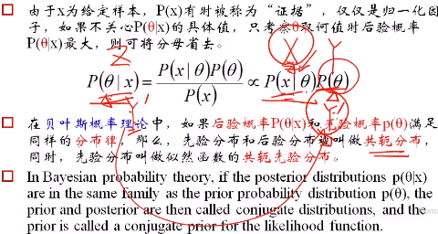

**二项分布/伯努利分布的共轭先验是Beta分布**，证明如下：

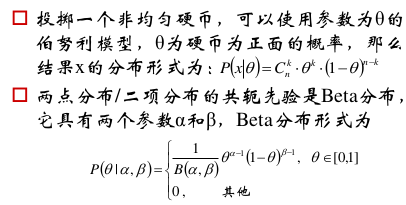

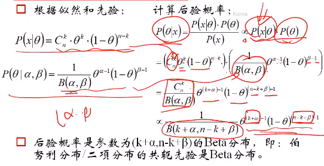

举例：

　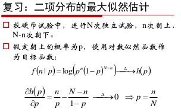　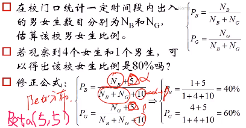

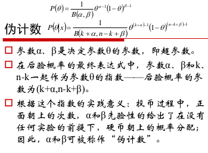

高斯分布的均值的共轭分布还是高斯分布。

高斯分布的方差的共轭分布是伽马分布。

共轭先验的直接推广，从二元到多元：

- 二项分布　->　多项分布
- Beta分布 -> Dirichlet分布

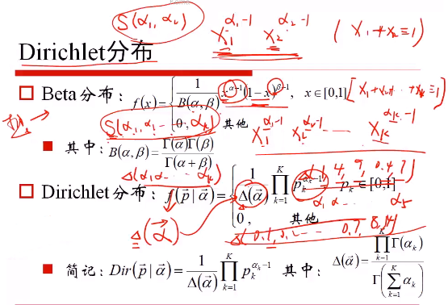

期望：

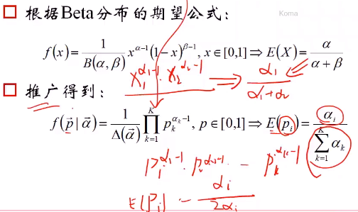

$\alpha_i$参数相同时，为对称Dirivhlet分布。对称Dirichlet分布性质：

- $\alpha=1$时，退化为均匀分布
- $\alpha>1$时，函数向上凸起，P1=p2=...pk的概率增大。　
- $\alpha<1$时，函数向下凹，Pi=1,P非i=0的概率增大。即取边上的角角概率最大。

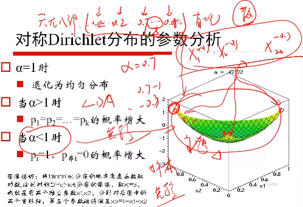

注意调参：LDA，(0,1)为先验值，参数尽量不要太大，这样就可以更多地考虑样本的影响。如果参数过大，则考虑先验的影响交大。

参数$\alpha$对Direchlet分布的影响：

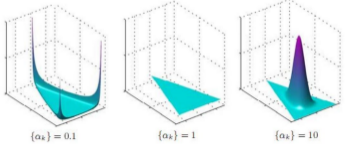

$\alpha$越小，文档之间的主题越鲜明（在每个轴上），主题之间的概率越不均等。　

$\alpha$越大，文档中所涉及的主题越不鲜明（所有主题都可能，即每个主题的概率都相等）。

#### 生成模型

即用该模型生成样本。

1. $\alpha$参数的Dirichlet分布决定了第m篇文章的主题分布（多项分布$\theta_m$）(P1P2...Pk)
2. 从主题分布($\theta_m$)中采样第n个词的主题$Z_{m,n}$
3. $\beta$参数的Dirichlet分布决定了每个主题的词分布$\varphi_k$。共k个主题，则有k个词分布(多项分布)。
4. 从主题$Z_{m,n}$对应的词分布$\varphi_k$中采样最终生成的词$W_{m,n}$。即第m篇文章的第n个词。

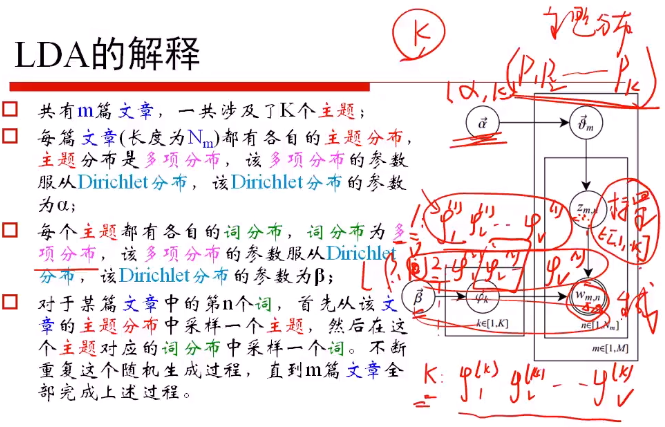

认识事物的方式：

- 生成模型：y -> model -> x　例如：LDA, NB, HMM
- 判别模型：x -> model -> y　例如：LR,DT,RF,SVM,CNN,CRF

##### 参数学习：

给定一个文档集合，$W_{m,n}$是可以观察到的已知变量，$\alpha$和$\beta$是根据经验给定的先验参数，其它的变量$z_{m,n}, \theta, \phi$都是未知的隐变量，需要根据观察到的变量来学习估计。所有变量的联合分布：

**似然概率**：一个词初始化为词t的概率为：

词出现的概率，可以看成每个文档中出现主题K的概率乘以主题k下出现词t的概率，然后枚举所有主题求和得到。整个文档集合的似然函数为：

**联合分布**：

即为：　给定主题下采样词的过程　×　采样主题的过程

- $n_z^{t}$：表示主题z中出现词t的次数
- $n_m^{k}$：表示文档m出现主题k的次数

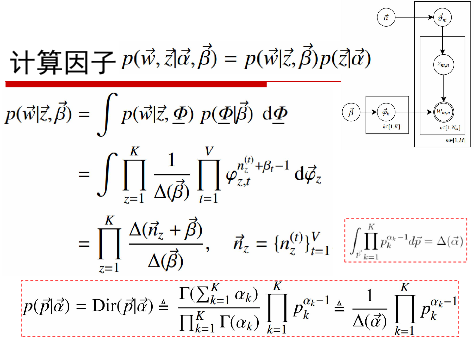

得到词分布和主题分布（用期望来估计）：

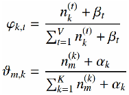

#####　超参数的确定

$\alpha$表达了不同文档间主题是否鲜明，$\beta$度量了有多少近义词能够属于同一个类别。

给定主题数目k,可以使用：$\alpha=50/k ; \beta=0.01$,然后在验证集上看效果。交叉验证。

一种迭代求超参数的方法：

### LDA总结

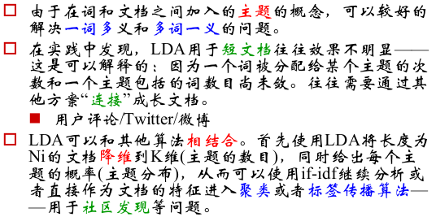

LDA也可以用来处理图像。LDA运算时间很长，每一次的采样，都会发生微妙的变化。

带拒绝的采样

　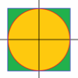

对某概率分布函数进行采样的意义：

根据抽样结果估算该分布函数的参数,从而完成参
数的学习。
 前提:系统已经存在,但参数未知;
 方法:通过采样的方式,获得一定数量的样本,从而学习该系统的参数。
 例:投硬币试验中,进行N次试验,n次朝上,N-n次朝下——可以认为,是进行了N次(独立)抽样。
 假定朝上的概率为p,使用对数似然函数作为目标函数:

一般的说,上述结论可以直接推广:频率的极限为概率: p=n/N
 将上述二项分布扩展成多项分布,如K项分布: pi=ni/N
 从而得到K项分布的参数:Pi
 在主体模型LDA中,每个文档的主题分布和每个主题的词分布都是多项分布,如果能够通过采样的方式获得它们的一定数量的样本,即可估算主题分布和词分布的参数,从而完成参数学习!
 贝叶斯网络的另一种重要参数学习手段是EM算法,参见GMM、pLSA、HMM的推导过程。

