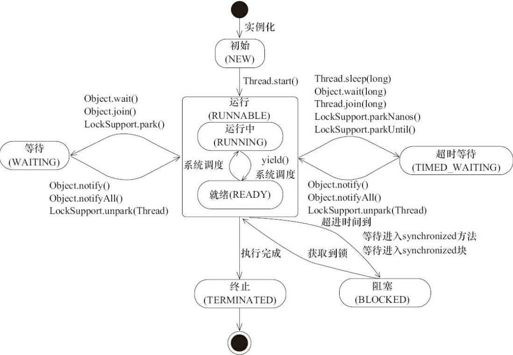
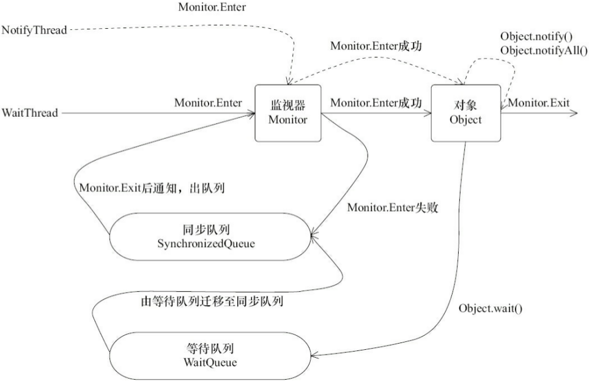
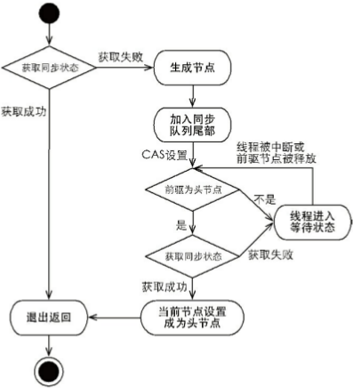

# 并发编程

[TOC]

测试上下文切换次数命令：vmstat 1.结果中的CS(Context switch)就是每秒切换的上下文次数。

如何减少上下文切换：

- 无锁并发编程：尽量避免使用锁。如将数据的id按照hash算法取模分段，不同的线程处理不同段的数据。
- CAS算法。Java的Atomic包使用CAS算法来更新数据，不需要枷锁。
- 使用最少线程。更多的线程意味着更多的切换和等待。
- 协程：在单线程里实现多任务调度，并在单线程里维持多个任务间的切换。

jstack命令dump线程信息。 grep ... awk '{print &1&2}' | sort | uniq -c

避免死锁：

- 避免一个线程同事获取多个锁
- 避免一个线程在锁内同时占用多个资源，尽量保证一个锁只占用一个资源。
- 尝试使用定时锁，lock.tryLock(timeout)
- 对于数据库锁，加锁和解锁必须在一个数据库连接里。


## volatile

- 保证共享变量的可见性
- 不会引起线程上下文切换和调度，比synchronized开销低。

操作系统层面实现原理：

​    如果对volatile变量进行写操作，jvm就会向处理器发送一条Lock前缀的指令（1.将当前处理器缓存行的数据写回到系统内存；2.这个写回内存的操作会使在其它CPU里缓存了该内存地址的数据无效。），将这个变量所在缓存行的数据写回到系统内存。

即两条实现原则：

1. Lock前缀指令会引起处理器缓存回写到内存。LOCK#信号一般不锁总线，因为开销大，而是锁缓存。如果访问的内存区域已经缓存在处理器内部，则不会声言LOCK#信号，而是锁定这块内存区域的缓存并写会到内存，用缓存一致性来确保修改的原子性。
2. 一个处理器的缓存会写到内存会导致其它处理器的缓存无效。Intel 64使用**MESI**(修改-独占-共享-无效)协议去维护内部缓存和其它处理器缓存的一致性。能嗅探其它处理器访问系统内存和它们的内部缓存。例如，如果嗅探一个处理器来检测其他处理器打算写内存地址，而这个地址当前处于共享状态，那么正在嗅探的处理器将使它的缓存行无效，在下次访问相同内存地址时，强制执行缓存行填充。

两种情况下处理器不会使用缓存锁定：

1. 当操作的数据不能被缓存在处理器内部，或操作的数据跨多个缓存行时，会调用总线锁定。
2. 处理器不支持缓存锁定。

**MESI**

参考：https://blog.csdn.net/jjavaboy/article/details/77164474

​   处理器上有一套完整的协议，来保证Cache一致性。比较经典的Cache一致性协议当属MESI协议，奔腾处理器有使用它，很多其他的处理器都是使用它的变种。

单核Cache中每个Cache line有2个标志：dirty和valid标志，它们很好的描述了Cache和Memory(内存)之间的数据关系(数据是否有效，数据是否被修改)，而在多核处理器中，多个核会共享一些数据，MESI协议就包含了描述共享的状态。

   在MESI协议中，每个Cache line有4个状态，可用2个bit表示，它们分别是：

| 状态         | 描述                                                         |
| ------------ | ------------------------------------------------------------ |
| M(Modified)  | 这行数据有效，数据被修改了，和内存中的数据不一致，数据只存在于本Cache中。之后其它的cache line变为Invalid。 |
| E(Exclusive) | 这行数据有效，数据和内存中的数据一致，数据只存在于本Cache中。 |
| S(Shared)    | 这行数据有效，数据和内存中的数据一致，数据存在于很多Cache中。 |
| I(Invalid)   | 这行数据无效。                                               |

​    在MESI协议中，每个Cache的Cache控制器不仅知道自己的读写操作，而且也监听(snoop)其它Cache的读写操作。每个Cache line所处的状态根据本核和其它核的读写操作在4个状态间进行迁移。

​    M(Modified)和E(Exclusive)状态的Cache line，数据是独有的，不同点在于M状态的数据是dirty的(和内存的不一致)，E状态的数据是clean的(和内存的一致)。

​    S(Shared)状态的Cache line，数据和其他Core的Cache共享。只有clean的数据才能被多个Cache共享。

​    I(Invalid)表示这个Cache line无效。

​    Intel的core i7处理器使用从MESI中演化出的MESIF协议，F(Forward)从Share中演化而来，一个Cache line如果是Forward状态，它可以把数据直接传给其它内核的Cache，而Share则不能。


volatile的使用优化

​    在JDK7中，队列集合类LinkedTransferQueue,在使用volatile变量时，用一种追加字节的方式来优化队列出队和入队的性能。将共享变量加到64字节。一个对象的引用占4个字节，追加15个对象(60字节)，再加上父类的value变量，共64字节。对于Intel i7等处理器的L1,L2,L3缓存的高速缓存行是64个字节，不支持部分填充缓存行。而队列的入队和出队操作需要频繁修改，在缓存一致性的作用下，多处理器会将头节点和尾节点读到同一个缓存行，一旦访问了头节点，别的处理器的尾节点就失效，因为在同一个缓存行，降低性能。所以追加到64字节，避免头尾节点出现在同一缓存行。

以下两种场景不应该使用这种方式：

1. 缓存行非64字节宽的处理器。P6 奔腾 L1 L2为32字节
2. 共享变量不会被频繁地写。

这种追加字节的方式在java 7下可能不生效，因为会淘汰或重新排列无用的字段，需要使用其他追加字节的方式（继承？把padding放在基类中）。 java 8原生支持，@Contended注解，必须加上虚拟机参数-XX:-RestrictContended，注解才会生效。


## synchronized

- 普通同步方法：锁是当前实例对象
- 静态同步方法：锁是当前类的Class对象
- 同步方法块：锁是synchronized括号中配置的对象

当一个线程试图访问同步代码块时，必须先得到锁；当退出、抛出异常时，必须释放锁。

参考：http://cmsblogs.com/?p=2071

锁主要存在四中状态，依次是：无锁状态、偏向锁状态、轻量级锁状态、重量级锁状态，他们会随着竞争的激烈而逐渐升级。注意锁可以升级不可降级，这种策略是为了提高获得锁和释放锁的效率。

**自旋锁**

​    线程的阻塞和唤醒需要CPU从用户态转为核心态，频繁的阻塞和唤醒对CPU来说是一件负担很重的工作，势必会给系统的并发性能带来很大的压力。同时我们发现在许多应用上面，对象锁的锁状态只会持续很短一段时间，为了这一段很短的时间频繁地阻塞和唤醒线程是非常不值得的。所以引入自旋锁。
    何谓自旋锁？ 所谓自旋锁，就是让该线程等待一段时间，不会被立即挂起，看持有锁的线程是否会很快释放锁。怎么等待呢？执行一段无意义的循环即可（自旋）。 
自旋等待不能替代阻塞，先不说对处理器数量的要求（多核，貌似现在没有单核的处理器了），虽然它可以避免线程切换带来的开销，但是它占用了处理器的时间。如果持有锁的线程很快就释放了锁，那么自旋的效率就非常好，反之，自旋的线程就会白白消耗掉处理的资源，它不会做任何有意义的工作，典型的占着茅坑不拉屎，这样反而会带来性能上的浪费。所以说，自旋等待的时间（自旋的次数）必须要有一个限度，如果自旋超过了定义的时间仍然没有获取到锁，则应该被挂起。
    自旋锁在JDK 1.4.2中引入，默认关闭，但是可以使用-XX:+UseSpinning开开启，在JDK1.6中默认开启。同时自旋的默认次数为10次，可以通过参数-XX:PreBlockSpin来调整； 如果通过参数-XX:preBlockSpin来调整自旋锁的自旋次数，会带来诸多不便。假如我将参数调整为10，但是系统很多线程都是等你刚刚退出的时候就释放了锁（假如你多自旋一两次就可以获取锁），你是不是很尴尬。于是JDK1.6引入自适应的自旋锁，让虚拟机会变得越来越聪明。

**适应自旋锁**

​    JDK1.6引入了更加聪明的自旋锁，即自适应自旋锁。所谓自适应就意味着自旋的次数不再是固定的，它是由前一次在同一个锁上的自旋时间及锁的拥有者的状态来决定。它怎么做呢？线程如果自旋成功了，那么下次自旋的次数会更加多，因为虚拟机认为既然上次成功了，那么此次自旋也很有可能会再次成功，那么它就会允许自旋等待持续的次数更多。反之，如果对于某个锁，很少有自旋能够成功的，那么在以后要或者这个锁的时候自旋的次数会减少甚至省略掉自旋过程，以免浪费处理器资源。
    有了自适应自旋锁，随着程序运行和性能监控信息的不断完善，虚拟机对程序锁的状况预测会越来越准确，虚拟机会变得越来越聪明。

**锁消除**

​    为了保证数据的完整性，我们在进行操作时需要对这部分操作进行同步控制，但是在有些情况下，JVM检测到不可能存在共享数据竞争，这是JVM会对这些同步锁进行锁消除。锁消除的依据是逃逸分析的数据支持。 
如果不存在竞争，为什么还需要加锁呢？所以锁消除可以节省毫无意义的请求锁的时间。变量是否逃逸，对于虚拟机来说需要使用数据流分析来确定，但是对于我们程序员来说这还不清楚么？我们会在明明知道不存在数据竞争的代码块前加上同步吗？但是有时候程序并不是我们所想的那样？我们虽然没有显示使用锁，但是我们在使用一些JDK的内置API时，如StringBuffer、Vector、HashTable等，这个时候会存在隐形的加锁操作。比如StringBuffer的append()方法，Vector的add()方法：

```
   public void vectorTest(){
        Vector<String> vector = new Vector<String>();
        for(int i = 0 ; i < 10 ; i++){
            vector.add(i + "");
        }
    }
```

在运行这段代码时，JVM可以明显检测到变量vector没有逃逸出方法vectorTest()之外，所以JVM可以大胆地将vector内部的加锁操作消除。

**锁粗化**

我们知道在使用同步锁的时候，需要让同步块的作用范围尽可能小—仅在共享数据的实际作用域中才进行同步，这样做的目的是为了使需要同步的操作数量尽可能缩小，如果存在锁竞争，那么等待锁的线程也能尽快拿到锁。 
在大多数的情况下，上述观点是正确的，LZ也一直坚持着这个观点。但是如果一系列的连续加锁解锁操作，可能会导致不必要的性能损耗，所以引入锁粗话的概念。 
锁粗话概念比较好理解，就是将多个连续的加锁、解锁操作连接在一起，扩展成一个范围更大的锁。如上面实例：vector每次add的时候都需要加锁操作，JVM检测到对同一个对象（vector）连续加锁、解锁操作，会合并一个更大范围的加锁、解锁操作，即加锁解锁操作会移到for循环之外。


JVM规范：基于进入和退出Monitor对象来实现同步。但实现细节不一样。

- 代码块同步：使用monitorenter和monitorexit指令实现。任何一个对象都有一个monitor与之关联，线程执行到monitor指令时，将会尝试获取对象所对应的monitor所有权，即对象锁。
- 方法同步：另一种方式，也可用上面的方案实现。

**对象头**：

参考：https://blog.csdn.net/zqz_zqz/article/details/70246212

https://blog.csdn.net/lihuifeng/article/details/51681146

在HotSpot虚拟机中，对象在内存中存储的布局可以分为3块区域：对象头（Header）、实例数据（Instance Data）和对齐填充（Padding）。

 

对象头内容：

1. markword:用于存储对象自身的运行时数据，哈希吗,GC分代年龄，锁状态标志，线程持有的锁，偏向锁，偏向时间戳等。长度与虚拟机位数一样。
2. klass:klass类型指针，即对象指向它的类元数据的指针，虚拟机通过该指针来确定这个对象是哪个类的实例。像类的方法、常量池这些信息都是存在klass里的，可以认为它是java里面的java.lang.Class对象，记录了类的全部信息；
3. 数组长度，只有数组对象有。

如上图右所示，通过栈帧中的对象引用reference找到Java堆中的对象，再通过对象的instanceOop中的元数据指针klass来找到方法区中的instanceKlass，从而确定该对象的类型。

下面来分析一下，执行new A()的时候，JVM 做了什么工作。首先，如果这个类没有被加载过，JVM就会进行类的加载，并在JVM内部创建一个instanceKlass对象表示这个类的运行时元数据（相当于Java层的Class对象）。初始化对象的时候（执行invokespecial A::），JVM就会创建一个instanceOopDesc对象表示这个对象的实例，然后进行Mark Word的填充，将元数据指针指向Klass对象，并填充实例变量。

元数据—— instanceKlass 对象会存在元空间（方法区），而对象实例—— instanceOopDesc 会存在Java堆。Java虚拟机栈中会存有这个对象实例的引用。

对象起始地址必须是８字节的倍数，所以可能有填充。会优先在类属性中选择一个或多个能够将对象头填充到8字节倍数的类属性放在padding中，如果还填充不满，就加上padding.

对象大小计算：（SizeOfTool.getObjectSize方法计算得到）

- 32位系统：class指针４字节，MardWord为４字节。　对象头为８字节。
- 64位系统：class指针８字节，MardWord为８字节。　对象头１６字节。
- 64位开启指针压缩的情况下，class指针4字节，wordWord为８字节，对象头为１２字节。
- 64位未开启压缩：数组长度4字节＋对象引用8字节＋数组mardword为8字节＋对齐4字节＝24字节
- 64位　开启压缩：数组长度4字节＋对象引用4字节＋数组markdown为4字节＋对齐４字节＝16字节
- 静态属性不算在对象大小内,因为它的引用是在方法区。
- 注意这里的对齐有两种：属性4字节对齐？？，整个对象８字节对齐。

**Monitor**

Monitor 是线程私有的数据结构，每一个线程都有一个可用monitor record列表，同时还有一个全局的可用列表。每一个被锁住的对象都会和一个monitor关联（对象头的MarkWord中的LockWord指向monitor的起始地址），同时monitor中有一个Owner字段存放拥有该锁的线程的唯一标识，表示该锁被这个线程占用。其结构如下： 

**Owner**：初始时为NULL表示当前没有任何线程拥有该monitor record，当线程成功拥有该锁后保存线程唯一标识，当锁被释放时又设置为NULL； 
**EntryQ**:关联一个系统互斥锁（semaphore），阻塞所有试图锁住monitor record失败的线程。 
**RcThis**:表示blocked或waiting在该monitor record上的所有线程的个数。 
**Nest**:用来实现重入锁的计数。 
**HashCode**:保存从对象头拷贝过来的HashCode值（可能还包含GC age）。 
**Candidate**:用来避免不必要的阻塞或等待线程唤醒，因为每一次只有一个线程能够成功拥有锁，如果每次前一个释放锁的线程唤醒所有正在阻塞或等待的线程，会引起不必要的上下文切换（从阻塞到就绪然后因为竞争锁失败又被阻塞）从而导致性能严重下降。Candidate只有两种可能的值0表示没有需要唤醒的线程1表示要唤醒一个继任线程来竞争锁。

java中监视器的实现

- 在JAVA虚拟机中，每个对象(Object和class)通过某种逻辑关联监视器，为了实现监视器的互斥功能，每个对象(Object和class)都关联着一个锁(有时也叫“互斥量”)，这个锁在操作系统书籍中称为“信号量”，互斥(“mutex”)是一个二进制的信号量。
- 如果一个线程拥有了某些数据的锁，其他的线程则无法获得锁，直到这个线程释放了这个锁。在多线程中，如果任何时候都是我们自己来写这个信号量，显然不是很方便，幸运的是，JVM为我们自动实现了这些。
- 为了使数据不被多个线程访问，java 提供了同步块 以及同步方法两种实现，一旦一段代码被嵌入到一个synchronized关键字中，意味着放入了监视区域，JVM在后台会自动为这段代码实现锁的功能。


**成员变量重排序**

为了提高性能，每个对象的起始地址都对齐于8字节，当封装对象的时候为了高效率，对象字段声明的顺序会被重排序成下列基于字节大小的顺序：

1. double (8字节) 和 long (8字节)  
2. int (4字节) 和 float (4字节)
3. short (2字节) 和 char (2字节)：char在java中是2个字节。java采用unicode，2个字节（16位）来表示一个字符。
4. boolean (1字节) 和 byte (1字节)
5. reference引用 (4/8 字节)
6. <子类字段重复上述顺序>


java 6中，锁级别依次是：无锁，偏向锁，轻量级锁，重量级锁。这几个状态会随着竞争情况逐渐升级，锁可以升级但不能降级，目的是为了提高获取锁和释放锁的效率。


**偏向锁**：适合锁总是由同一线程多次获得。

思路：当一个线程访问同步块并获取锁时，会在对象头和栈帧中的锁记录里存储锁偏向的线程ID，以后该线程在进入和退出同步块时，不需要进行CAS操作来加锁和解锁，只需要简单地测试一下对象头的MarkWord里是否存储着指向当前线程的偏向锁。如果**测试成功**，表示线程已经获得了锁；如果**测试失败**，则需要再测试一下MarkWord中偏向锁的标识是否设置成１（表示当前是偏向锁）:如果**没有设置**，则使用CAS竞争锁，如果**设置了**，则尝试使用CAS将对象头的偏向锁指向当前线程。

​    引入偏向锁是为了在无多线程竞争的情况下尽量减少不必要的轻量级锁执行路径，因为轻量级锁的获取及释放依赖多次CAS原子指令，而偏向锁只需要在置换ThreadID的时候依赖一次CAS原子指令（由于一旦出现多线程竞争的情况就必须撤销偏向锁，所以偏向锁的撤销操作的性能损耗必须小于节省下来的CAS原子指令的性能消耗）。

**偏向锁的获取过程（假设开启了偏向锁优化）：**

1. 初始时对象处于biasable状态，并且ThreadID为0即biasable & unbiased状态（这里不讨论epoch和age）
2. 当一个线程试图锁住一个处于biasable & unbiased状态的对象时，通过一个CAS将自己的ThreadID放置到Mark Word中相应的位置，如果CAS操作成功进入第（3）步否则进入（4）步
3. 当进入到这一步时代表当前没有锁竞争，Object继续保持biasable状态，但是这时ThreadID字段被设置成了偏向锁所有者的ID，然后进入到第（6）步
4. 当前线程执行CAS获取偏向锁失败（这一步是偏向锁的关键），表示在该锁对象上存在竞争并且这个时候另外一个线程获得偏向锁所有权。当到达全局安全点（safepoint）时获得偏向锁的线程被挂起，并从偏向锁所有者的私有Monitor Record列表中获取一个空闲的记录，并将Object设置为LightWeight Lock状态并且Mark Word中的LockRecord指向刚才持有偏向锁线程的Monitor record，最后被阻塞在安全点的线程被释放，进入到轻量级锁的执行路径中，同时被撤销偏向锁的线程继续往下执行同步代码。
5. 当一个线程试图锁住一个处于biasable & biased并且ThreadID不等于自己的ID时，这时由于存在锁竞争必须进入到第（4）步来撤销偏向锁。
6. 运行同步代码块

偏向锁获取过程：

​    锁不仅不存在多线程竞争，而且总是由统一线程多次获得，而线程的阻塞和唤醒需要CPU从用户态转为核心态，频繁的阻塞和唤醒对CPU来说是一件负担很重的工作，为了让线程获得锁的代驾更低而引入了偏向锁。偏向锁获得锁的过程分为以下几步：

1. 初始时对象的Mark Word位为1，表示对象处于可偏向的状态，并且ThreadId为0，这是该对象是biasable&unbiased状态，可以加上偏向锁进入2）。如果一个线程试图锁住biasable&biased并且ThreadID不等于自己ID的时候，由于锁竞争应该直接进入4）撤销偏向锁。
2. 线程尝试用CAS将自己的ThreadID放置到Mark Word中相应的位置，如果CAS操作成功进入到3），否则进入4）
3. 进入到这一步代表当前没有锁竞争，Object继续保持biasable状态，但此时ThreadID已经不为0了，对象处于biasable&biased状态
4. 当线程执行CAS失败，表示另一个线程当前正在竞争该对象上的锁。当到达全局安全点时（cpu没有正在执行的字节）获得偏向锁的线程将被挂起，撤销偏向（偏向位置0），如果这个线程已经死了，则把对象恢复到未锁定状态（标志位改为01），如果线程还活着，则把偏向锁置0，变成轻量级锁（标志位改为00），释放被阻塞的线程，进入到轻量级锁的执行路径中，同时被撤销偏向锁的线程继续往下执行。
5. 运行同步代码块

偏向锁的释放：    

​    偏向锁只有遇到其他线程尝试竞争偏向锁时，持有偏向锁的线程才会释放锁，线程不会主动去释放偏向锁。偏向锁的撤销，需要等待全局安全点（在这个时间点上没有字节码正在执行），它会首先暂停拥有偏向锁的线程，然后检查持有偏向锁的线程是否活着，如果线程不处于**活动状态**，则将对象头设置成无锁状态，如果线程仍然活着，拥有偏向锁的栈会被执行，遍历偏向对象的锁记录，栈中的锁记录和对象头的Mark Word要么重新偏向于其他线程，要么恢复到无锁或者标记对象不适合作为偏向锁，最后唤醒暂停的线程。撤销偏向锁后恢复到未锁定（标志位为“01”）或轻量级锁（标志位为“00”）的状态。

偏向锁在java 6和7中默认启用，但在启动几秒之后才激活。可以通过参数关闭延迟：-XX:BiasedLockingStartupDelay=0。如果程序中所有的锁在通常情况下都处于竞争状态，则可以关闭偏向锁。-XX:-UseBiasedLocking=false。


**轻量级锁**

轻量级锁的加锁过程

1. 在代码进入同步块的时候，如果同步对象锁状态为无锁状态（锁标志位为“01”状态，是否为偏向锁为“0”），虚拟机首先将在当前线程的栈帧中建立一个名为锁记录（Lock Record）的空间，用于存储锁对象目前的Mark Word的拷贝，官方称之为 Displaced Mark Word。这时候线程堆栈与对象头的状态如图2.1所示。
2. 拷贝对象头中的Mark Word**复制**到锁记录中。
3. 拷贝成功后，虚拟机将使用CAS操作尝试**将对象的Mark Word更新为指向Lock Record的指针**，并将Lock record里的**owner指针**指向object mark word。如果更新成功，则执行步骤（4），否则执行步骤（5）。
4. 如果这个更新动作成功了，那么这个线程就拥有了该对象的锁，并且对象Mark Word的锁标志位设置为“00”，即表示此对象处于轻量级锁定状态，这时候线程堆栈与对象头的状态如图2.2所示。
5. 如果这个更新操作失败了，虚拟机首先会**检查对象的Mark Word是否指向当前线程的栈帧**，如果是就说明当前线程已经拥有了这个对象的锁，那就可以直接进入同步块继续执行。否则说明多个线程竞争锁，轻量级锁就要膨胀为重量级锁，锁标志的状态值变为“10”，Mark Word中存储的就是指向重量级锁（互斥量）的指针，后面等待锁的线程也要进入阻塞状态。 而当前线程便尝试使用自旋来获取锁，自旋就是为了不让线程阻塞，而采用循环去获取锁的过程。

 


级锁、轻量级锁和偏向锁之间转换：


膨胀总结：

​    一个对象刚开始实例化的时候，没有任何线程来访问它的时候。它是可偏向的，意味着，它现在认为只可能有一个线程来访问它，所以当第一个线程来访问它的时候，它会偏向这个线程，此时，对象持有偏向锁。偏向第一个线程，这个线程在修改对象头成为偏向锁的时候使用CAS操作，并将对象头中的ThreadID改成自己的ID，之后再次访问这个对象时，只需要对比ID，不需要再使用CAS在进行操作。

​    一旦有第二个线程访问这个对象，因为偏向锁不会主动释放，所以第二个线程可以看到对象时偏向状态，这时表明在这个对象上已经存在竞争了，检查原来持有该对象锁的线程是否依然存活，如果挂了，则可以将对象变为无锁状态，然后重新偏向新的线程，如果原来的线程依然存活，则马上执行那个线程的操作栈，检查该对象的使用情况，如果仍然需要持有偏向锁，则偏向锁升级为轻量级锁，（**偏向锁就是这个时候升级为轻量级锁的**）。如果不存在使用了，则可以将对象回复成无锁状态，然后重新偏向。

   轻量级锁认为竞争存在，但是竞争的程度很轻，一般两个线程对于同一个锁的操作都会错开，或者说稍微等待一下（自旋），另一个线程就会释放锁。 但是当自旋超过一定的次数，或者一个线程在持有锁，一个在自旋，又有第三个来访时，轻量级锁膨胀为重量级锁，重量级锁使除了拥有锁的线程以外的线程都阻塞，防止CPU空转。


CAS机制

  CAS机制，需要提供旧值和更新值。问题：

1. ABA问题：解决思路是添加版本号。类AtomicStampedReference来解决ABA问题，该类的compareAndSet方法先检查引用，再检查标志，如果全部相等，则更新。
2. 循环时间长，开销大。pase指令（延迟流水线执行指令，避免在退出循环时因为为共享导致cpu流水线清空）可以提升一定效率。
3. 只能保证一个共享变量的原子操作。使用AtomicReference来保证引用对象之间的原子性，可以把多个变量放入一个对象中进行cas操作。

小结：使用CAS机制来获取锁和释放锁。


## java内存模型

java并发采用的是共享内存模型，java线程之间通信总是隐式的。

**重排序**：

- 编译器优化的重排序：编译器在不改变单线程程序语义的前提下，重排序
- 指令级重排序：采用指令级并行技术实现多条指令重叠执行。如果不存在数据依赖性，就可以改变指令顺序。
- 内存系统重排序：处理器使用缓存和读写缓冲，使得加载和存储操作看上去是在乱序执行。

**内存屏障**：

- LoadLoad 屏障：Load1,Loadload,Load2 确保Load1所要读入的数据能够在被Load2和后续的load指令访问前读入。通常能执行预加载指令或/和支持乱序处理的处理器中需要显式声明Loadload屏障，因为在这些处理器中正在等待的加载指令能够绕过正在等待存储的指令。
- StoreStore 屏障：Store1，StoreStore，Store2 确保Store1的数据在Store2以及后续Store指令操作相关数据之前对其它处理器可见（例如向主存刷新数据）。
- LoadStore 屏障：Load1; LoadStore; Store2 确保Load1的数据在Store2和后续Store指令被刷新之前读取。
- StoreLoad 屏障：Store1; StoreLoad; Load2 确保Store1的数据在被Load2和后续的Load指令读取之前对其他处理器可见。StoreLoad屏障可以防止一个后续的load指令不正确的使用了Store1的数据，而不是另一个处理器在相同内存位置写入一个新数据。正因为如此，所以在下面所讨论的处理器为了在屏障前读取同样内存位置存过的数据，必须使用一个StoreLoad屏障将存储指令和后续的加载指令分开。Storeload屏障在几乎所有的现代多处理器中都需要使用，但通常它的开销也是最昂贵的。它们昂贵的部分原因是它们必须关闭通常的略过缓存直接从写缓冲区读取数据的机制。这可能通过让一个缓冲区全部刷新（flush）到内存。

happens-before:一个操作的结果需要对另一个操作可见（一个或多个线程中）.一个happens规则对应于一个或多个编译器和处理器的重排序规则。

- 程序顺序规则：一个线程中的每个操作，happens-before于该线程中任意后续操作
- 监视器锁规则：对于一个锁的解锁，happens-before于随后对这个锁的加锁
- volatile变量规则：对于一个volatile域的写，happens-before于任意后续对该域的读
- 传递性：A happens-b B, B happens-b C 那么 A happens-b C
- start()规则：线程A的ThreadB.start()操作happens-before线程B中的任意操作
- join()规则：若线程A执行操作ThreadB.join()并成功返回，那么线程B中的任意操作happens-before线程A从ThreadB.join()返回。

注意：

- JMM对程序员的承诺：A happens-bofore B,则A的执行结果将对B可见，前A的执行顺序在B之前
- JMM对编译器和处理器重排序的约束原则：两个操作存在happens-before关系，但执行顺序并不一定。因为如果重排序之后的结果与未重排序的结果一致，则JMM允许这种重排序。但程序员感觉就向顺序执行一样。

单处理器单线程的数据依赖性：两个操作访问同一个变量，且其中至少有一个为写，则存在数据依赖性。

as-if-serial语义：不管如何重排序，不能改变单线程的执行结果。

单线程如果存在控制依赖性，if(flag) i=a*a,会影响指令的并行度，编译器和处理器会猜测执行来客服控制相关性的影响。可提前预读并计算a×a，把结果临时保存到重排序缓冲区中，当条件判断为真时，再写入i中。

从jdk5开始，仅仅允许把一个64位的long/double变量的写操作拆分为两个32位的写操作来执行，任意读操作都必须具有原子性。

一个volatile变量的单个读/写 等同于 使用同一个锁来同步一个普通变量的单个读/写。故volatile变量的特性：

- 可见性：对于读，总能看到任意线程对这个变量最后的写入。
- 原子性：对于单个volatile变量的读/写具有原子性(包括long/double)，但对与volatile++这种符合操作不具有原子性。

从内存语义来说：（可实现线程间的同步）

- volatile写 等同于 锁的释放
- volatile读 等同于 锁的获取

```java
普通读写
StoreStore屏障 //禁止上面的普通写与下面的volatile写重排序
volatile写
StoreLoad屏障 //防止上面的volatile写与下面有可能的volatile读/写重排序；大部分情况下，都是少量地写volatile变量，频繁第读volatile变量。所以放置后面有volatile变量读写，加入该屏障。在x86平台上，只有该屏障。
```

```java
volatile读
LoadLoad屏障  //禁止下面的所有普通读与上面的volatile读重排序
LoadStore屏障 //禁止下面所有的写操作与上面的volatile读重排序
普通读写
```

x86处理器仅仅会对写-读做重排序；不会对读读，读写，写写重排序，所以在x86处理器中会省略掉这3中类型对应的内存屏障。在x86中，jvm仅仅在volatile写后面插入一个storeload屏障即可。即volatile写开销要比读开销大很多。CAS机制判断预期值并更新，在x86上同时具有volatile写和volatile读的内存语义。

​    增强volatile：只要volatile变量与普通变量之间的重排序可能会破坏volatile的内存语义，这种重排序就会被禁止。

​    区别：volatile仅仅保证单个变量的读写具有原子性，锁确保对整个临界区都有原子性；锁的功能更强大，但volatile在伸缩性和执行性能上更有优势。


锁的内存语义：

- 释放锁时：把线程对应的本地内存中的共享变量刷新到主内存中
- 获取锁时：把线程的本地内存置为无效，使得被监视器保护的临界区代码必须从主内存中读取共享变量。

锁的内存语义实现：

- 公平锁在获取锁时，首先读取volatile变量state；在释放锁时写volatile变量state。
- 非公平锁获取锁时，首先用CAS更新volatile变量；在释放锁时写volatile变量state。


final域的内存语义

- 在构造函数内对final的写，与随后把这个被构造对象的引用赋值给一个引用变量，不能重排序
- 初次读一个包含final域的引用，与随后初次读这个final域，不能重排序

​    写final域：构造对象，在对象引用为任意线程可见之前，确保对象的final域已经被正确地初始化，而不同变量没有这个保证。因为对普通变量的写操作可能被重排序到构造函数之外。写final域后加storestore

​    读final域：确保在读对象的final域之前，先读该对象的引用，以确保引用不为null。使用storestore屏障。少部分处理器会优化成先读普通域，再读对象应用，这样就会出错。

​    final域为引用：执行顺序为：在构造函数中对final域的写，对final域的引用对象的成员写，最后把被构造的对象的引用赋值给别的变量。即final域引用不能从构造函数中溢出，即必须保证在使用前已经被正确初始化了。

​    在x86处理器中，final的读写不会插入任何屏障。

增强的final语义：避免程序访问到final初始化之前的默认值，造成final变量会改变的现象。所以保证final在使用之前已经被正确地初始化了。

​    

## 双重检查锁定与延迟初始化

​    当创建一个对象时，a = new AA();可分为三个步骤：1.分配对象内存空间；2.初始化对象；3.设置变量a指向刚分配的内存空间。在这个过程中，第2步和第3部可能会重排序，因为在单线程中执行结果一样，但在多线程中就不一样。如果在多线程中重排序，A线程分配对象空间，设置变量指向内存，此时还没有初始化；B线程判断引用是否为空，不为空，则进行对象的访问，此时B访问的对象还是一个未初始化的对象；之后A才初始化对象。解决方案：

- 不允许重排序
- 允许重排序，但不允许其他线程看到这个重排序。

1.基于volatile的解决方案：静态字段和实例字段都可以

```java
private volatile static Instance instance;
public static Instance getInstance(){
  if( null == instance ){
    synchronized(xxx.class){
      if( null == instance )
        instance = new Instance(); //此时为增强的volatile，不允许重排。
    }
  }
}
```

2.基于类初始化的解决方案：代码更简介，对于静态字段

```java
public class InstanceFactory {
  private static class InstanceHolder {
    public static Instance instance  = new Instance();
  }
  public static Instance getInstance() {
    return InstanceHolder.instance; //这里将导致类InstanceHolder初始化
  }
}
```

一个类或接口在以下情况下会导致立即初始化：

- T是一个类，该类的一个实例被创建
- T是一个类，该类中声明的一个静态方法被调用
- T中声明的一个静态字段被赋值
- T中声明的一个静态字段被使用，而且这个字段不是一个常量字段
- T是一个顶级类，而且一个断言语句嵌套在T内部被执行。

对于每个类或接口，都有一个唯一的初始化锁与之对应。在多线程中初始化一个类时，会通过获取初始化锁来进行同步，并且每个线程至少获取一次锁来确保这个类已经被初始化过了。


thread.serPriority(1~10)，默认5，频繁阻塞的线程高优先级，偏重计算的低优先级1。操作系统可忽略。



​    Java将操作系统中的运行和就绪两个状态合并称为运行状态。阻塞状态是线程阻塞在进入synchronized关键字修饰的方法或代码块(获取锁)时的状态,但是阻塞在java.concurrent包中Lock接口的线程状态却是等待状态,因为java.concurrent包中Lock接口对于阻塞的实现均使用了LockSupport类中的相关方法。

jps得到线程ID， jstack 线程ID查看线程状态。最好在启动线程前命名线程。

​    thread.setDaemon(true)设置为daemon线程。只有daemon线程时会终止，此时并不一定执行finally块中的代码。

​    中断：中断是一种协作机制。当一个线程中断另一个线程时，被中断的线程不一定要立即停止正在做的事情。相反，中断是礼貌地请求另一个线程在它愿意并且方便的时候停止它正在做的事情。有些方法，例如
 Thread.sleep()，很认真地对待这样的请求，但并不是每个方法一定要对中断作出响应。  每个Java线程都有一个与之相关联的 Boolean 属性，该属性用于表示线程的中断状态。

- **interrupt**()中断线程，是唯一能将中断状态设置为true的方法。
- **isInterrupted**() 测试线程是否已经中断，线程的中断状态不受该方法的影响。
- **interrupted**()清楚线程的中断状态。如果连续两次调用该方法，则第二次调用将返回 false（在第一次调用已清除了其中断状态之后，且第二次调用检验完中断状态前，当前线程再次中断的情况除外）。

​    有很多阻塞方法的声明中有抛出InterruptedException异常，这暗示该方法是可中断的，这些方法会检测当前线程是否被中断，如果是，则立刻结束阻塞方法，并抛出InterruptedException异常。如果程序捕获到这些可中断的阻塞方法抛出的InterruptedException或检测到中断后，这些中断信息该如何处理？一般有以下两个通用原则：

- 如果遇到的是可中断的阻塞方法抛出InterruptedException，可以继续向方法调用栈的上层抛出该异常，如果是检测到中断，则可清除中断状态并抛出InterruptedException，使当前方法也成为一个可中断的方法。
- 若有时候不太方便在方法上抛出InterruptedException，比如要实现的某个接口中的方法签名上没有throws InterruptedException，这时就可以捕获可中断方法的InterruptedException并通过Thread.currentThread.interrupt()来重新设置中断状态。如果是检测并清除了中断状态，亦是如此。    

​    一般的代码中，尤其是作为一个基础类库时，绝不应当吞掉中断，即捕获到InterruptedException后在catch里什么也不做，清除中断状态后又不重设中断状态也不抛出InterruptedException等。因为吞掉中断状态会导致方法调用栈的上层得不到这些信息。

​    有些任务拒绝被中断，这使得它们是不可取消的。但是，即使是不可取消的任务也应该尝试保留中断状态，以防在不可取消的任务结束之后，调用栈上更高层的代码需要对中断进行处理。

​    suspend()将携带资源进入睡眠，容易发生死锁。stop()不保证资源正常释放。

通过javap-v Object.class查看class文件。

​    任意线程在获得Object的监视器时，如果失败，线程进入同步队列，线程状态变为BLOCKED。当访问Object的前驱（获得了锁的线程）释放了锁，则该释放操作唤醒阻塞在同步队列中的线程，使其重新尝试对监视器的获取。    

wait()/notify()：等待/通知机制依托于同步机制，保证等待线程wait返回时能感知通知线程对变量的修改

- 只能在同步代码块中使用，即需要先对调用对象进行加锁
- 调用wait()后，放弃锁，线程由状态RUNNING变为WAITING，并将当前线程放置到对象的等待队列中
- 从wait()方法返回的前提是获得了调用对象的锁
- 调用notify()后，等待线程依旧不会从wait()返回，需要调用notify()的线程释放锁之后，等待线程才有机会从wait()返回。
- notify()将等待队列中的一个等待线程从等待队列中移动到同步队列中，而notifyAll()方法是将等待队列中所有的线程全部移到同步队列中；被移动的线程状态由WAITING变为BLOCKED。



   WaitThread首先获取了对象的锁,然后调用对象的wait()方法,从而放弃了锁并进入了对象的等待队列WaitQueue中,进入等待状态。由于WaitThread释放了对象的锁,NotifyThread随后获取了对象的锁,并调用对象的notify()方法,将WaitThread从WaitQueue移到SynchronizedQueue中,此时WaitThread的状态变为阻塞状态。NotifyThread释放了锁之后,WaitThread再次获取到锁并从wait()方法返回继续执行。

​    管道，线程间数据传输，媒介为内存，需要将输入与输出连接。out.connect(in)。

​    thread.join(),等待线程终止，然后返回。线程终止时，会调用线程自身的thread.notifyAll()方法，通知所有等待在该线程对象上的线程。join主要源码：

```java
//加锁当前线程对象
public final synchronized void join() throws InterruptedException{
  //条件不满足，继续等待
  while( isAlive() ){
    wait(0);
  }
  //条件符合，方法返回
}
```

等待/通知的经典范式：

等待/消费方

```java
synchronized(对象){
  while(条件不满足){ 条件不满足，调用wait等待，被通知后仍然要检查条件
    对象.wait()
  }
  满足条件，执行对应的处理逻辑
}
```

通知方：

```java
synchronized(对象){
  改变条件
  对象.notifyAll();
}
```

等待超时模式：

```java
public synchronized Object get(long mills) throws InterruptedException{
  long future = System.currentTimeMillis() + mills;
  long remaining = mills;
  while( (result==null) && remaining > 0 ){
    wait(remaining);
    remaining = future - System.currentTimeMillis();
  }
  return result;
}
```


ThreadLocal**:

参考：https://www.cnblogs.com/jasongj/p/8079718.html

- ThreadLocal 并不解决线程间共享数据的问题
- ThreadLocal 通过隐式的在不同线程内创建独立实例副本避免了实例线程安全的问题
- 每个线程持有一个 Map 并维护了 ThreadLocal 对象与具体实例的映射，该 Map 由于只被持有它的线程访问，故不存在线程安全以及锁的问题
- ThreadLocalMap 的 Entry 对 ThreadLocal 的引用为弱引用，避免了 ThreadLocal 对象无法被回收的问题
- ThreadLocalMap 的 set 方法通过调用 replaceStaleEntry 方法回收键为 null 的 Entry 对象的值（即为具体实例）以及 Entry 对象本身从而防止内存泄漏
- ThreadLocal 适用于变量在线程间隔离且在方法间共享的场景


此处有线程池的实现。


## java中的锁

并发包

```java
void lock();获取锁，获取后返回
void lockInterruptibly() throws InterruptedExpection;在获取锁的过程中可被中断
boolean tryLock();尝试非阻塞获取锁，立即返回，成功返回true
boolean tryLock(long time, TimeUnit unit) throws InterruptedException;超时获取锁，在以下情况中返回：超时时间内获得锁，超时时间内被中断，超时时间结束并返回false
void unlock();释放锁
Condition newCondition();获取等待通知组件，该组件和当前的锁绑定，当前线程只有获得了锁，才能调用该组件的wait方法，而调用后，当前线程将释放锁。
```

```java
Lock lock = new ReentrantLock();
lock.lock();
try {
...
} finally {
  lock.unlock(); //放在finally中，以正确释放
}
```

**队列同步器 AbstractQueuedSynchronizer**

​    子类通过继承同步器并实现它的抽象方法来管理同步状态。同步器面向锁的实现，屏蔽了同步状态管理、线程排队、等待与唤醒等底层操作。子类被推荐定义为自定义同步组件的静态内部类，既可以支持独占式获取同步状态，也支持共享式获取同步状态，以实现不同类型的同步组件（ReentrantLock, ReentrantReadWriteLock, CountDownLatch等）

```java
public abstract class AbstractQueuedSynchronizer extends ... {
  private volatile int state; //同步状态
  protected final int getState(); //获取当前同步状态
  protected final void setState(int newState); //设置当前同步状态
  protected final boolean compareAndSetState(int expect, int update) //原子操作设置同步状态
    return unsafe.compareAndSwapInt(this, stateOffset, ecpect, update);
  
  //可重写的方法
  //独占式获取同步状态，需要查询当前状态并判断是否符合预期，然后进行CAS设置同步状态
  protected boolean tryAcquire(int arg);
  protected boolean tryRelease(int arg);//独占式释放同步状态
  //共享式获取同步状态，返回>=0，表示获取成功，反之失败
  protected boolean tryAcquireShared(int arg);
  protected boolean tryReaseShared(int arg);//共享式释放同步状态
  protected boolean isHeldExclusively();//当前同步器是否在独占模式下被当前线程所占用。
}
```

实现一个自定义的独占锁Mutex

```java
class Mutex implements Lock{
  //静态内部类，自定义同步器
  private static class Sync extends AbstractQueuedSynchronizer{
    protected boolean isHeldExclusively(){ //是否处于占用状态
      return 1 == getState();
    }
    public boolean tryAcquire(int acquires){//当状态为0的时候，获取锁
      if( compareAndSetState(0,1) ){
        setExclusiveOwnerThread(Thread.currentThread());
        return true;
      }
      return false;
    }
    protected boolean tryRelease(int releases){//释放锁，将状态设置为0
      if( 0 == getState() )
        throw new IllegalMonitorStateException();
      setExclusiveOwnerThread(null);
      setState(0);
      return true;
    }
    Condition newCondition() { return new ConditionObject(); }
  }
  private final Sync sync = new Sync();
  public void lock() {sync.acquire(1);}
  public boolean tryLock() {return sync.tryAcquire(1);}
  public void unlock() { sync.release(1); }
  public boolean isLocked() { sync.isHeldExclusively(); }
  ...
}
```

队列同步器的实现分析：

参考：https://blog.csdn.net/sunxianghuang/article/details/52287968

​    同步器依赖内部的同步队列(一个FIFO双向队列)来完成同步状态的管理，当前线程获取同步状态失败时，同步器会将当前线程以及等待状态等信息构造成一个节点并加入同步队列中，同时会阻塞当前线程，当同步状态释放时，会把首节点中的线程唤醒，使其再次尝试获取同步状态。

节点信息：

```java
static final class Node {
  volatile int waitStatus;//一共5个值。
  volatile Node prev;
  volatile Node next;
  volatile Thread thread;
  Node nextWaiter;//等待队列的后继节点
  final boolean isShared() {
      return nextWaiter == SHARED;
  }
}
```

同步器拥有首节点和尾节点，结构如下：


从尾部加入，必须保证线程安全，采用CAS机制，设置成功后，当前节点才与之前的尾节点关联。


首节点是获取同步状态成功的节点，首节点的线程在释放同步状态时,将会唤醒后继节点,而后继节点将会在获取同步状态成功时将自己设置为首节点。由于只有一个线程能够成功获取同步状态，所以设置头结点可不用cas。


独占式同步状态获取与释放

​    acquire()方法，对中断不敏感，失败后进入同步队列，后续对线程中断时，线程不会从同步队列中移除。

```java
public final void acquire(int arg) {
        if (!tryAcquire(arg) &&
            acquireQueued(addWaiter(Node.EXCLUSIVE), arg))
            selfInterrupt();
    }
```

   首先调用自定义同步器实现的tryAcquire(int arg)方法,该方法保证线程安全的获取同步状态,如果同步状态获取失败,则构造同步节点(独占式Node.EXCLUSIVE,同一时刻只能有一个线程成功获取同步状态)并通过addWaiter(Node node)方法将该节点加入到同步队列的尾部,最后调用acquireQueued(Node node,int arg)方法,使得该节点以“死循环”的方式获取同步状态。如果获取不到则阻塞节点中的线程,而被阻塞线程的唤醒主要依靠前驱节点的出队或阻塞线程被中断来实现。

```java
/**
 * Creates and enqueues node for current thread and given mode.
 * @param mode Node.EXCLUSIVE for exclusive, Node.SHARED for shared
 * @return the new node
 */
private Node addWaiter(Node mode) {
    Node node = new Node(Thread.currentThread(), mode);// 构造节点
    //快速尝试在尾部添加
    Node pred = tail;
    if (pred != null) {//同步队列中有节点
        node.prev = pred;//将当前节点的前驱指向当前tail
        if (compareAndSetTail(pred, node)) {//确保线程被安全添加到尾部，尝试将tail设置为node
          //如果成功，则说明没有别的线程来设置tail；只需要将之前tail的后继节点指向node即可。
            pred.next = node;
            return node;
        }
    }
    enq(node);//否则，如果为null，则初始化；不为null，通过死循环来保证节点的正确加入
    return node;
}
```

```java
/**
 * Inserts node into queue, initializing if necessary. See picture above.
 * @param node the node to insert
 * @return node's predecessor
 */
private Node enq(final Node node) {
    for (;;) {
        Node t = tail;
        if (t == null) { // Must initialize tail为null，同步器中没有节点，设置当前节点即可。
            if (compareAndSetHead(new Node()))
                tail = head;
        } else {  //死循环来保证正确添加尾节点
            node.prev = t;
            if (compareAndSetTail(t, node)) {
                t.next = node;
                return t;
            }
        }
    }
}
```

以上方法通过CAS添加尾部节点，如果添加失败，则死循环添加。

```java
/**
 * Acquires in exclusive uninterruptible mode for thread already in
 * queue. Used by condition wait methods as well as acquire.
 *
 * @param node the node
 * @param arg the acquire argument
 * @return {@code true} if interrupted while waiting
 */
final boolean acquireQueued(final Node node, int arg) {
    boolean failed = true;
    try {
        boolean interrupted = false;
        for (;;) {  //无限循环
            final Node p = node.predecessor();
            if (p == head && tryAcquire(arg)) { //前驱节点是首节点，且获取到了同步状态
                setHead(node); //设置为首节点
                p.next = null; // help GC 断开引用。
                failed = false;
                return interrupted; //从自旋中退出
            }
            if (shouldParkAfterFailedAcquire(p, node) &&//获取同步状态失败后判断是否组要阻塞或中断
                parkAndCheckInterrupt())//阻塞当前线程
                interrupted = true;
        }
    } finally {
        if (failed)
            cancelAcquire(node);
    }
}
```

```java
/**Checks and updates status for a node that failed to acquire.
 * Returns true if thread should block. This is the main signal control in all acquire loops.*/
private static boolean shouldParkAfterFailedAcquire(Node pred, Node node) {
    int ws = pred.waitStatus;//获取前驱节点的等待状态
    if (ws == Node.SIGNAL)
    //SIGNAL状态：前驱节点释放同步状态或者被取消，将会通知后继节点。因此，可以放心的阻塞当前线程，返回true。
        return true;
    if (ws > 0) {//前驱节点被取消了，跳过前驱节点并重试
        do {
            node.prev = pred = pred.prev;
        } while (pred.waitStatus > 0);
        pred.next = node;
    } else {//独占模式下，一般情况下这里指前驱节点等待状态为SIGNAL
        /* waitStatus must be 0 or PROPAGATE.  Indicate that we  need a signal, but don't park yet.  Caller will need to
         * retry to make sure it cannot acquire before parking. */
        compareAndSetWaitStatus(pred, ws, Node.SIGNAL);//设置当前节点等待状态为SIGNAL
    }
    return false;
}
```

```java
/** Convenience method to park and then check if interrupted 。return {@code true} if interrupted */
private final boolean parkAndCheckInterrupt() {
    LockSupport.park(this);//阻塞当前线程
    return Thread.interrupted();
}
```


节点进入同步队列之后，就进入一个自旋的过程，每个节点/线程都在自省地观察，当条件满足后，就获取到了同步状态，就可以从这个自旋过程中退出，否则依旧在这个自旋过程中，并会阻塞节点的线程。只有头节点才是成功呢获取到同步状态的节点。





```java
public abstract class AbstractQueuedSynchronizer
    extends AbstractOwnableSynchronizer
    implements java.io.Serializable {
    private static final long serialVersionUID = 7373984972572414691L;
    /**
     * Creates a new {@code AbstractQueuedSynchronizer} instance
     * with initial synchronization state of zero.
     */
    protected AbstractQueuedSynchronizer() { }
    //节点定义
    static final class Node {
        static final Node SHARED = new Node();//表示节点在共享模式下
        static final Node EXCLUSIVE = null;//表示节点在独占模式下
        /** waitStatus value to indicate thread has cancelled */
        static final int CANCELLED =  1;
        /** waitStatus value to indicate successor's thread needs unparking */
        static final int SIGNAL    = -1;
        /** waitStatus value to indicate thread is waiting on condition */
        static final int CONDITION = -2;
        /**
         * waitStatus value to indicate the next acquireShared should
         * unconditionally propagate
         */
        static final int PROPAGATE = -3;
        /**
         * Status field, taking on only the values:
         *   SIGNAL:     The successor of this node is (or will soon be)
         *               blocked (via park), so the current node must
         *               unpark its successor when it releases or
         *               cancels. To avoid races, acquire methods must
         *               first indicate they need a signal,
         *               then retry the atomic acquire, and then,
         *               on failure, block.
         *   CANCELLED:  This node is cancelled due to timeout or interrupt.
         *               Nodes never leave this state. In particular,
         *               a thread with cancelled node never again blocks.
         *   CONDITION:  This node is currently on a condition queue.
         *               It will not be used as a sync queue node
         *               until transferred, at which time the status
         *               will be set to 0. (Use of this value here has
         *               nothing to do with the other uses of the
         *               field, but simplifies mechanics.)
         *   PROPAGATE:  A releaseShared should be propagated to other
         *               nodes. This is set (for head node only) in
         *               doReleaseShared to ensure propagation
         *               continues, even if other operations have
         *               since intervened.
         *   0:          None of the above
         *
         * The values are arranged numerically to simplify use.
         * Non-negative values mean that a node doesn't need to
         * signal. So, most code doesn't need to check for particular
         * values, just for sign.
         *
         * The field is initialized to 0 for normal sync nodes, and
         * CONDITION for condition nodes.  It is modified using CAS
         * (or when possible, unconditional volatile writes).
         */
        volatile int waitStatus;
        /**
         * Link to predecessor node that current node/thread relies on
         * for checking waitStatus. Assigned during enqueuing, and nulled
         * out (for sake of GC) only upon dequeuing.  Also, upon
         * cancellation of a predecessor, we short-circuit while
         * finding a non-cancelled one, which will always exist
         * because the head node is never cancelled: A node becomes
         * head only as a result of successful acquire. A
         * cancelled thread never succeeds in acquiring, and a thread only
         * cancels itself, not any other node.
         */
        volatile Node prev;
        /**
         * Link to the successor node that the current node/thread
         * unparks upon release. Assigned during enqueuing, adjusted
         * when bypassing cancelled predecessors, and nulled out (for
         * sake of GC) when dequeued.  The enq operation does not
         * assign next field of a predecessor until after attachment,
         * so seeing a null next field does not necessarily mean that
         * node is at end of queue. However, if a next field appears
         * to be null, we can scan prev's from the tail to
         * double-check.  The next field of cancelled nodes is set to
         * point to the node itself instead of null, to make life
         * easier for isOnSyncQueue.
         */
        volatile Node next;
        /**The thread that enqueued this node.  Initialized on
         * construction and nulled out after use.*/
        volatile Thread thread;
        /** Link to next node waiting on condition, or the special
         * value SHARED.  Because condition queues are accessed only
         * when holding in exclusive mode, we just need a simple
         * linked queue to hold nodes while they are waiting on
         * conditions. They are then transferred to the queue to
         * re-acquire. And because conditions can only be exclusive,
         * we save a field by using special value to indicate shared
         * mode.*/
        Node nextWaiter;
        /*Returns true if node is waiting in shared mode.*/
        final boolean isShared() {
            return nextWaiter == SHARED;
        }
        /*  Use when predecessor cannot be null.  The null check could
         * be elided, but is present to help the VM.
         * @return the predecessor of this node*/
        final Node predecessor() throws NullPointerException {
            Node p = prev;
            if (p == null)
                throw new NullPointerException();
            else
                return p;
        }
        Node() {    // Used to establish initial head or SHARED marker
        }
        Node(Thread thread, Node mode) {     // Used by addWaiter
            this.nextWaiter = mode;
            this.thread = thread;
        }
        Node(Thread thread, int waitStatus) { // Used by Condition
            this.waitStatus = waitStatus;
            this.thread = thread;
        }
        
        /** Head of the wait queue, lazily initialized.  Except for
         * initialization, it is modified only via method setHead.  Note:
         * If head exists, its waitStatus is guaranteed not to be CANCELLED.*/
        private transient volatile Node head;
        /** Tail of the wait queue, lazily initialized.  Modified only via
         * method enq to add new wait node.*/
        private transient volatile Node tail;
        private volatile int state;//The synchronization state.
        protected final int getState() {
            return state;
        }
        protected final void setState(int newState) {
            state = newState;
        }
        
        protected final boolean compareAndSetState(int expect, int update) {
            return unsafe.compareAndSwapInt(this, stateOffset, expect, update);
        }
        //将节点插入到等待队列的尾部，如果没有初始化，则初始化
        //1. 将node的前驱指向当前tail节点
        //2. 
        @return node's predecessor
        private Node enq(final Node node) {
            for (;;) {
                Node t = tail;
                if (t == null) { //初始化
                    if (compareAndSetHead(new Node()))
                        tail = head;
                } else {
                    node.prev = t;
                    if (compareAndSetTail(t, node)) {
                        t.next = node;
                        return t;
                    }
                }
            }
        }
        
        /**
         * Creates and enqueues node for current thread and given mode.
         * @param mode Node.EXCLUSIVE for exclusive, Node.SHARED for shared
         * @return the new node
         */
        private Node addWaiter(Node mode) {
            Node node = new Node(Thread.currentThread(), mode);
            // Try the fast path of enq; backup to full enq on failure
            Node pred = tail;
            if (pred != null) {
                node.prev = pred;
                if (compareAndSetTail(pred, node)) {
                    pred.next = node;
                    return node;
                }
            }
            enq(node);
            return node;
        }
        
        /**Sets head of queue to be node, thus dequeuing. Called only by acquire methods. */
        private void setHead(Node node) {
            head = node;
            node.thread = null;
            node.prev = null;
        }
   }
```


