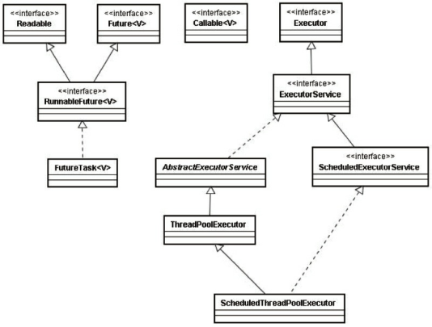
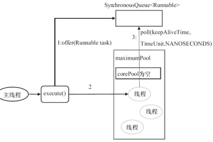
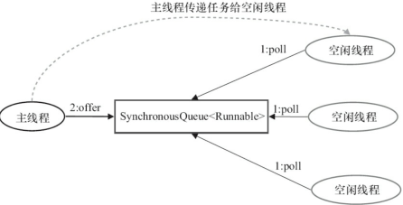
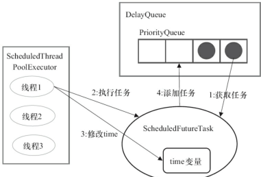

## 线程池

[TOC]

### 一、简介

线程池优点：

1. 降低资源消耗。通过重复利用已创建的线程降低线程创建和销毁造成的消耗。
2. 提高响应速度。当任务到达时,任务可以不需要等到线程创建就能立即执行。
3. 提高线程的可管理性。线程是稀缺资源,如果无限制地创建,不仅会消耗系统资源,还会降低系统的稳定性,使用线程池可以进行统一分配、调优和监控。但是,要做到合理利用线程池,必须对其实现原理了如指掌。


基本概念：

- int corePoolSize：该线程池中核心线程数最大值。默认情况下，核心线程会一直存活在线程中，即使线程没有任务。如果指定ThreadPoolExecutor的 allowCoreThreadTimeOut 这个属性为true，那么核心线程如果不干活(闲置状态)的话，超过一定时间( keepAliveTime)，就会被销毁掉。
- int maximumPoolSize：该线程池中线程总数的最大值。线程总数计算公式 = 核心线程数 + 非核心线程数。
- long keepAliveTime：该线程池中非核心线程闲置超时时长。注意：一个非核心线程，如果不干活(闲置状态)的时长，超过这个参数所设定的时长，就会被销毁掉。但是，如果设置了 allowCoreThreadTimeOut = true，则会作用于核心线程。
- TimeUnit unit：时间单位，枚举类型
- BlockingQueue<Runnable> workQueue： 阻塞队列，该线程池中的任务队列：维护着等待执行的Runnable对象。当所有的核心线程都在干活时，新添加的任务会被添加到这个队列中等待处理，如果队列满了，则新建非核心线程执行任务。队列主要分为一下四种：
  - SynchronousQueue：（同步队列）这个队列接收到任务的时候，会直接提交给线程处理，而不保留它。若所有线程都在工作，SynchronousQueue就会新建一个线程来处理这个任务。所以为了保证不出现（线程数达到了maximumPoolSize而不能新建线程）的错误，使用这个类型队列的时候maximumPoolSize一般指定成Integer.MAX_VALUE，即无限大，去规避这个使用风险。
  - LinkedBlockingQueue（链表阻塞队列）：这个队列接收到任务的时候，如果当前线程数小于核心线程数，则新建线程(核心线程)处理任务；如果当前线程数等于核心线程数，则进入队列等待。由于这个队列没有最大值限制，即所有超过核心线程数的任务都将被添加到队列中，这也就导致了maximumPoolSize的设定失效，因为总线程数永远不会超过corePoolSize。
  - ArrayBlockingQueue（数组阻塞队列）：可以限定队列的长度（既然是数组，那么就限定了大小），接收到任务的时候，如果没有达到corePoolSize的值，则新建线程(核心线程)执行任务，如果达到了，则入队等候，如果队列已满，则新建线程(非核心线程)执行任务，又如果总线程数到了maximumPoolSize，并且队列也满了，则发生错误。
  - DelayQueue（延迟队列）：队列内元素必须实现Delayed接口，这就意味着你传进去的任务必须先实现Delayed接口。这个队列接收到任务时，首先先入队，只有达到了指定的延时时间，才会执行任务。


线程池的实现原理：

当提交一个新的任务时，线程池的处理流程如下：

1. 如果线程数量未达到corePoolSize，则新建一个线程(核心线程)执行任务（需要获取**全局锁**）。
2. 如果线程数量达到了corePools，则将任务移入队列等待BlockingQueue。
3. 如果队列已满，新建线程(非核心线程)执行任务(需要获取**全局锁**)
4. 如果队列已满，总线程数又达到了maximumPoolSize，任务被拒绝，就会调用RejectedExecutionHandler.rejectedExecution()方法。该方法提供以下集中策略：
   1. AbortPolicy:直接抛出异常
   2. CallerRunsPolicy:只用调用者所在线程来运行任务
   3. DiscardOldertPolisy:丢弃队列里最近的一个任务，并执行当前任务。
   4. DiscardPolicy:不处理，丢弃掉

注意：获取全局锁有性能代价，在正常运行后，几乎所有的execute()方法调用都是执行步骤2，加入队列，无需获取全局锁。

ThreadPoolExecutor执行execute()方法的示意图：


核心实现类ThreadPoolExecutor中线程执行方法：

```java
public void execute(Runnable command) {
    if (command == null)
        throw new NullPointerException();
    /*
     * Proceed in 3 steps:
     * 1. If fewer than corePoolSize threads are running, try to
     * start a new thread with the given command as its first
     * task.  The call to addWorker atomically checks runState and
     * workerCount, and so prevents false alarms that would add
     * threads when it shouldn't, by returning false.
     *
     * 2. If a task can be successfully queued, then we still need
     * to double-check whether we should have added a thread
     * (because existing ones died since last checking) or that
     * the pool shut down since entry into this method. So we
     * recheck state and if necessary roll back the enqueuing if
     * stopped, or start a new thread if there are none.
     *
     * 3. If we cannot queue task, then we try to add a new
     * thread.  If it fails, we know we are shut down or saturated
     * and so reject the task.
     */
    int c = ctl.get();
    if (workerCountOf(c) < corePoolSize) {
        if (addWorker(command, true))
            return;
        c = ctl.get();
    }
    if (isRunning(c) && workQueue.offer(command)) {
        int recheck = ctl.get();
        if (! isRunning(recheck) && remove(command))
            reject(command);
        else if (workerCountOf(recheck) == 0)
            addWorker(null, false);
    }
    else if (!addWorker(command, false))
        reject(command);
    }
```

   线程池创建线程时,会将线程封装成工作线程Worker,Worker在执行完任务后,还会循环获取工作队列里的任务来执行。我们可以从Worker类的run()方法里看到这点:

```java
//ThreadPoolExecutor的私有类，实现同步器
private final class Worker
    extends AbstractQueuedSynchronizer
    implements Runnable {
    final Thread thread;//运行任务的线程，可能为null，如果工厂方法失败
    Runnable firstTask;//初始任务，可能为null
    volatile long completedTasks;/** Per-thread task counter */
    Worker(Runnable firstTask) {　//从工厂方法中创建线程，指定初始任务
        setState(-1); // inhibit interrupts until runWorker
        this.firstTask = firstTask;
        this.thread = getThreadFactory().newThread(this);
    }
    public void run() {
        runWorker(this);
    }
    // Lock methods
    // The value 0 represents the unlocked state.
    // The value 1 represents the locked state.
    protected boolean isHeldExclusively() {
        return getState() != 0;
    }
    protected boolean tryAcquire(int unused) {
        if (compareAndSetState(0, 1)) {
            setExclusiveOwnerThread(Thread.currentThread());
            return true;
        }
        return false;
    }
    protected boolean tryRelease(int unused) {
        setExclusiveOwnerThread(null);
        setState(0);
        return true;
    }
    public void lock()        { acquire(1); }
    public boolean tryLock()  { return tryAcquire(1); }
    public void unlock()      { release(1); }
    public boolean isLocked() { return isHeldExclusively(); }
    void interruptIfStarted() {
        Thread t;
        if (getState() >= 0 && (t = thread) != null && !t.isInterrupted()) {
            try {
                t.interrupt();
            } catch (SecurityException ignore) {
            }
        }
    }
}
```

其中的runWorker()方法：

```java
final void runWorker(Worker w) {
    Thread wt = Thread.currentThread();
    Runnable task = w.firstTask;
    w.firstTask = null;
    w.unlock(); // allow interrupts
    boolean completedAbruptly = true;
    try {
        //循环取任务
        while (task != null || (task = getTask()) != null) {
            w.lock();
            // If pool is stopping, ensure thread is interrupted;
            // if not, ensure thread is not interrupted.  This
            // requires a recheck in second case to deal with
            // shutdownNow race while clearing interrupt
            if ((runStateAtLeast(ctl.get(), STOP) ||
                 (Thread.interrupted() &&
                  runStateAtLeast(ctl.get(), STOP))) &&
                !wt.isInterrupted())
                wt.interrupt();
            try {
                beforeExecute(wt, task);
                Throwable thrown = null;
                try {
                    task.run();
                } catch (RuntimeException x) {
                    thrown = x; throw x;
                } catch (Error x) {
                    thrown = x; throw x;
                } catch (Throwable x) {
                    thrown = x; throw new Error(x);
                } finally {
                    afterExecute(task, thrown);
                }
            } finally {
                task = null;
                w.completedTasks++;
                w.unlock();
            }
        }
        completedAbruptly = false;
    } finally {
        processWorkerExit(w, completedAbruptly);
    }
}
```

　　关闭线程池：可以通过调用线程池的shutdown或shutdownNow方法来关闭线程池。它们的原理是遍历线程池中的工作线程,然后逐个调用线程的interrupt方法来中断线程,所以无法响应中断的任务可能永远无法终止。但是它们存在一定的区别,shutdownNow首先将线程池的状态设置成STOP,然后尝试停止所有的正在执行或暂停任务的线程,并返回等待执行任务的列表,而shutdown只是将线程池的状态设置成SHUTDOWN状态,然后中断所有没有正在执行任务的线程。
　　只要调用了这两个关闭方法中的任意一个,isShutdown方法就会返回true。当所有的任务都已关闭后,才表示线程池关闭成功,这时调用isTerminaed方法会返回true。至于应该调用哪一种方法来关闭线程池,应该由提交到线程池的任务特性决定,通常调用shutdown方法来关闭线程池,如果任务不一定要执行完,则可以调用shutdownNow方法。

　　如何分配线程池：

- CPU密集型：配置尽可能小的线程池
- IO密集型：尽可能多的线程，因为这些线程不是一直都在执行任务。
- 优先级不同的任务可以使用优先级队列PriorityBlockingQueue来处理。它可以让优先级高的任务先执行。
- 执行时间不同的任务可以交给不同规模的线程池来处理,或者可以使用优先级队列,让执行时间短的任务先执行
- 依赖数据库连接池的任务,因为线程提交SQL后需要等待数据库返回结果,等待的时间越长,则CPU空闲时间就越长,那么线程数应该设置得越大,这样才能更好地利用CPU。

　　建议使用有界队列。有界队列能增加系统的稳定性和预警能力,可以根据需要设大一点儿,比如几千。有一次,我们系统里后台任务线程池的队列和线程池全满了,不断抛出抛弃任务的异常,通过排查发现是数据库出现了问题,导致执行SQL变得非常缓慢,因为后台任务线程池里的任务全是需要向数据库查询和插入数据的,所以导致线程池里的工作线程全部阻塞,任务积压在线程池里。如果当时我们设置成无界队列,那么线程池的队列就会越来越多,有可能会撑满内存,导致整个系统不可用,而不只是后台任务出现问题。当然,我们的系统所有的任务是用单独的服务器部署的,我们使用不同规模的线程池完成不同类型的任务,但是出现这样问题时也会影响到其他任务。

　　监控线程池的属性：

- askCount:线程池需要执行的任务数量。
- completedTaskCount:线程池在运行过程中已完成的任务数量,小于或等于taskCount
- largestPoolSize:线程池里曾经创建过的最大线程数量。通过这个数据可以知道线程池是否曾经满过。如该数值等于线程池的最大大小,则表示线程池曾经满过。
- getPoolSize:线程池的线程数量。如果线程池不销毁的话,线程池里的线程不会自动销毁,所以这个大小只增不减。
- getActiveCount:获取活动的线程数。

　　通过扩展线程池进行监控。可以通过继承线程池来自定义线程池,重写线程池的beforeExecute、afterExecute和terminated方法,也可以在任务执行前、执行后和线程池关闭前执行一些代码来进行监控。例如,监控任务的平均执行时间、最大执行时间和最小执行时间等。这几个方法在线程池里是空方法。


Executors提供了常用的四种线程池：

1. newFixedThreadPool 创建一个定长线程池，可控制线程最大并发数，超出的线程会在队列中等待。


```java
public interface Executor {
    /**Executes the given command at some time in the future.  The command
     * may execute in a new thread, in a pooled thread, or in the calling
     * thread, at the discretion of the {@code Executor} implementation.
     * @param command the runnable task
     * @throws RejectedExecutionException if this task cannot be accepted for execution
     * @throws NullPointerException if command is null*/
    void execute(Runnable command);
}
```

```java
public interface ExecutorService extends Executor {
  void shutdown();
  List<Runnable> shutdownNow();
  boolean isShutdown();
  boolean isTerminated();
  boolean awaitTermination(long timeout, TimeUnit unit)
        throws InterruptedException;
  <T> Future<T> submit(Callable<T> task);
  <T> Future<T> submit(Runnable task, T result);
  Future<?> submit(Runnable task);
  <T> List<Future<T>> invokeAll(Collection<? extends Callable<T>> tasks)
        throws InterruptedException;
  <T> List<Future<T>> invokeAll(Collection<? extends Callable<T>> tasks,
                                  long timeout, TimeUnit unit)
        throws InterruptedException;
  <T> T invokeAny(Collection<? extends Callable<T>> tasks)
        throws InterruptedException, ExecutionException;
  <T> T invokeAny(Collection<? extends Callable<T>> tasks,
                    long timeout, TimeUnit unit)
        throws InterruptedException, ExecutionException, TimeoutException;
}
```

```java
public abstract class AbstractExecutorService implements ExecutorService {
  
```


### 二、Executor框架


框架主要包括：

- 任务target。包括被执行任务需要实现的接口：Runnable接口或Callabel接口。
- 任务的执行。任务执行的核心接口Executor，以及子接口ExecutorService接口。该框架有连个关键类实现了该接口：ThreadPoolExecutor和ScheduledPoolExecutor。
- 异步计算的结果。包括接口Future和实现Future接口的FutureTask类。

接口和类简介：

- Executor接口：框架的基础，将任务的提交与执行分离开。
- ThreadPoolExecutor实现类：核心实现类，用来执行被提交的任务。
- ScheduledThreadPoolExecutor实现类，可以在给定的延迟后运行命令，或者定期执行命令。比Timer更灵活，更强大。
- Future接口和实现该接口的FutureTask类，代表异步计算结果。
- Runnable接口和Callable接口的实现类，都可以被ThreadPoolExecutor或者ScheduledThreadPoolExecutor执行。




Callable与Runnable相似，但是Runnable不能**返回结果**，不能**throw a checked exception**，但Callable可以。

源码：

```java
public interface Callable<V> {
    /**Computes a result, or throws an exception if unable to do so.
     * @return computed result
     * @throws Exception if unable to compute a result*/
    V call() throws Exception;
}
```

上层接口：

```java
public interface Future<V> {
  boolean cancel(boolean mayInterruptIfRunning);//取消任务，如果已经执行玩，则失败
  boolean isCancelled();
  boolean isDone();
  V get() throws InterruptedException, ExecutionException;//返回结果，若中断、取消，则异常
  V get(long timeout, TimeUnit unit)//在指定时间内返回结果
        throws InterruptedException, ExecutionException, TimeoutException;
}
```

```java
public interface RunnableFuture<V> extends Runnable, Future<V> {
    /* Sets this Future to the result of its computation
     * unless it has been cancelled. */
    void run();
}
```

FutureTask 实现了Runnable和Future组合的接口RunnableFuture。FutureTask可以交给Executor执行,也可以由调用线程直接执行(FutureTask.run())。根据FutureTask.run()方法被执行的时机,FutureTask可以处于下面3种状态。

```java
public class FutureTask<V> implements RunnableFuture<V> {
    //1.构造函数，传入Callabel对象
    public FutureTask(Callable<V> callable) {
        if (callable == null)
            throw new NullPointerException();
        this.callable = callable;
        this.state = NEW;       // ensure visibility of callable
    }//2.构造函数，传入Runnable对象，通过Executors工具类转为Callable对象
    public FutureTask(Runnable runnable, V result) {
        this.callable = Executors.callable(runnable, result);
        this.state = NEW;       // ensure visibility of callable
    }
    
    
```

创建ThreadPoolExecutor的工厂类Executors源码：

```java
//工具类
public class Executors {
    // 以下是获取ThreadPoolExecutor
    //1.创建使用固定线程数的FixedThreadPool
    //应用场景：需要满足资源管理，限制当前线程数，适用于负载比较重的服务器。
    public static ExecutorService newFixedThreadPool(int nThreads) {
        return new ThreadPoolExecutor(nThreads, nThreads,
                                      0L, TimeUnit.MILLISECONDS,
                                      new LinkedBlockingQueue<Runnable>());
    }
    public static ExecutorService newFixedThreadPool(int nThreads, ThreadFactory threadFactory) {
        return new ThreadPoolExecutor(nThreads, nThreads,
                                      0L, TimeUnit.MILLISECONDS,
                                      new LinkedBlockingQueue<Runnable>(),
                                      threadFactory);
    }
    //2.创建单个线程
    //应用场景：需要保证顺序地执行各个任务，并不会有多个线程活动的场景
    public static ExecutorService newSingleThreadExecutor() {
        return new FinalizableDelegatedExecutorService
            (new ThreadPoolExecutor(1, 1,
                                    0L, TimeUnit.MILLISECONDS,
                                    new LinkedBlockingQueue<Runnable>()));
    }
    public static ExecutorService newSingleThreadExecutor(ThreadFactory threadFactory) {
        return new FinalizableDelegatedExecutorService
            (new ThreadPoolExecutor(1, 1,
                                    0L, TimeUnit.MILLISECONDS,
                                    new LinkedBlockingQueue<Runnable>(),
                                    threadFactory));
    }
    //3.根据需要创建新线程的CacaedThreadPool，是大小无界的线程池
    //应用场景：适用很多短期执行的小任务，或者负载较轻的服务器
    public static ExecutorService newCachedThreadPool() {
        return new ThreadPoolExecutor(0, Integer.MAX_VALUE,
                                      60L, TimeUnit.SECONDS,
                                      new SynchronousQueue<Runnable>());
    }
    public static ExecutorService newCachedThreadPool(ThreadFactory threadFactory) {
        return new ThreadPoolExecutor(0, Integer.MAX_VALUE,
                                      60L, TimeUnit.SECONDS,
                                      new SynchronousQueue<Runnable>(),
                                      threadFactory);
    }
    ...
    // 以下是获取 SheduledThreadPoolExecutor
    //(1) 创建一个线程的ScheduledExecutorService
    //应用场景：单个后台线程执行周期任务，并保证顺序
    public static ScheduledExecutorService newSingleThreadScheduledExecutor() {
        return new DelegatedScheduledExecutorService
            (new ScheduledThreadPoolExecutor(1));
    }
    public static ScheduledExecutorService newSingleThreadScheduledExecutor(ThreadFactory threadFactory) {
        return new DelegatedScheduledExecutorService
            (new ScheduledThreadPoolExecutor(1, threadFactory));
    }
    //(2) 创建多个线程的ScheduledExecutorService
    //应用场景：需要多个后台执行周期任务，并根据资源管理来限制后台线程数量
    public static ScheduledExecutorService newScheduledThreadPool(int corePoolSize) {
        return new ScheduledThreadPoolExecutor(corePoolSize);
    }
    public static ScheduledExecutorService newScheduledThreadPool(
            int corePoolSize, ThreadFactory threadFactory) {
        return new ScheduledThreadPoolExecutor(corePoolSize, threadFactory);
    }
    ...
    //将Runnable包装为一个Callable
    public static Callable<Object> callable(Runnable task) {
        if (task == null)
            throw new NullPointerException();
        return new RunnableAdapter<Object>(task, null);
    }
    //将Runnable保证为一个带返回值的Callable
    public static <T> Callable<T> callable(Runnable task, T result) {
        if (task == null)
            throw new NullPointerException();
        return new RunnableAdapter<T>(task, result);
    }
```

以下详细介绍上面工具类的实现：

线程池的核心实现类：

```java
//线程池的核心实现类，由工具类Executors来创建
public class ThreadPoolExecutor extends AbstractExecutorService {
    /** Tracks largest attained pool size. Accessed only under mainLock.*/
    private int largestPoolSize;
    //接口ThreadFactory只有一个方法Thread newThread(Runnable r);
    private volatile ThreadFactory threadFactory;//创建线程的工厂类
    
    private volatile RejectedExecutionHandler handler;//线程饱和或关闭时调用
    private volatile long keepAliveTime;//非核心线程空闲时间，超过则销毁
    private volatile boolean allowCoreThreadTimeOut;//true，核心线程使用keepAliveTime
    private volatile int corePoolSize;//核心线程
    private volatile int maximumPoolSize;//最大
    private final BlockingQueue<Runnable> workQueue;//保存任务的工作队列
    private static final RejectedExecutionHandler defaultHandler =
        new AbortPolicy();//default rejected execution handler
    ...
    private final class Worker
        extends AbstractQueuedSynchronizer //继承同步器
        implements Runnable
    {
        
    }
    ...
    //构造器(主要的构造器)，设置必要的参数，如果没有，则用默认的
    public ThreadPoolExecutor(int corePoolSize,
                              int maximumPoolSize,
                              long keepAliveTime,
                              TimeUnit unit,
                              BlockingQueue<Runnable> workQueue,
                              ThreadFactory threadFactory,
                              RejectedExecutionHandler handler) {
        if (corePoolSize < 0 || maximumPoolSize <= 0 ||
            maximumPoolSize < corePoolSize || keepAliveTime < 0)
            throw new IllegalArgumentException();
        if (workQueue == null || threadFactory == null || handler == null)
            throw new NullPointerException();
        this.acc = System.getSecurityManager() == null?null : AccessController.getContext();
        this.corePoolSize = corePoolSize;
        this.maximumPoolSize = maximumPoolSize;
        this.workQueue = workQueue;
        this.keepAliveTime = unit.toNanos(keepAliveTime);
        this.threadFactory = threadFactory;
        this.handler = handler;
    }
    
    
    
    
    
    
```

##### 1. ThreadPoolExecutor

###### 1.1 FixedThreadPool

- corePoolSize == maximumPoolSize。
- keepAliveTime==0L，表示非核心完成任务立即销毁。
- LinkedBlockingQueue使用无界队列，队列的容量为Integer.MAX_VALUE，使用无界队列的影响：
  - 线程数达到corePoolSize后，新任务将在无界队列中等待，因此线程数不会超过corePoolSize。
  - 使用无界队列时maximumPoolSize将是一个无效参数。
  - 使用无界队列时keepAliveTime将是一个无效参数。
  - 由于使用无界队列，运行中的FixedThreadPool（未执行方法shutdown()或shutdownNow()）不会拒绝任务（不会调用RejectedExecutionHandler.rejectedExecution方法）。

```java
ThreadPoolExecutor(int corePoolSize,int maximumPoolSize,
                              long keepAliveTime,
                              TimeUnit unit,
                              BlockingQueue<Runnable> workQueue,
                              ThreadFactory threadFactory,
                              RejectedExecutionHandler handler)
ThreadPoolExecutor(nThreads, nThreads,0L, TimeUnit.MILLISECONDS,
                                      new LinkedBlockingQueue<Runnable>());
```

流程如下：

1. 线程数少于corePoolSize，则创建新线程来执行任务
2. 在线程池完成预热之后（当前运行的线程数等于corePoolSize），将任务加入LinkedBlockingQueue。
3. 线程执行完1中的任务后，会在循环中反复从LinkedBlockingQueue获取任务来执行。


###### 1.2  SingleThreadExecutor

- corePoolSize == maximumPoolSize==1
- LinkedBlockingQueue使用无界队列，只有一个线程反复地从该队列中取工作任务

```java
public static ExecutorService newSingleThreadExecutor() {
        return new FinalizableDelegatedExecutorService
            (new ThreadPoolExecutor(1, 1,
                                    0L, TimeUnit.MILLISECONDS,
                                    new LinkedBlockingQueue<Runnable>()));
    }
```

###### 1.3 CachedThreadPool

- corePoolSize==0
- MaximumPoolSize==Integer.MAX_VALUE
- keepAliveTime==60L,即空闲线程等待新任务的最长时间为60秒，超过60秒会被终止
- ​

```java
public static ExecutorService newCachedThreadPool() {
        return new ThreadPoolExecutor(0, Integer.MAX_VALUE,
                                      60L, TimeUnit.SECONDS,
                                      new SynchronousQueue<Runnable>());
    }
```

流程图如下：



- 首先执行SynchronousQueue.offer（Runnable task），此时分两种情况：
  - 1. 如果当前maximumPool中有空闲线程正在执行SynchronousQueue.poll（keepAliveTime，TimeUnit.NANOSECONDS），那么主线程执行offer操作与空闲线程执行的poll操作配对成功，主线程把任务交给空闲线程执行，execute()方法执行完成；否则执行下面的步骤2）。
    2. 如果当初始maximumPool为空，或者maximumPool中当前没有空闲线程时，将没有线程执行SynchronousQueue.poll（keepAliveTime，TimeUnit.NANOSECONDS）。这种情况下，offer操作将失败。此时CachedThreadPool会创建一个新线程执行任务，execute()方法执行完成。
- 线程将任务执行完后：
  - 3. 线程将任务执行完后，会执行SynchronousQueue.poll（keepAliveTime，TimeUnit.NANOSECONDS）。这个poll操作会让空闲线程最多在SynchronousQueue中等待60秒钟。如果60秒钟内主线程提交了一个新任务（主线程执行步骤1）），那么这个空闲线程将执行主线程提交的新任务；否则，这个空闲线程将终止。由于空闲60秒的空闲线程会被终止，因此长时间保持空闲的CachedThreadPool不会使用任何资源。

​    SynchronousQueue是一个没有容量的阻塞队列。每个插入操作必须等待另一个线程的对应移除操作，反之亦然。CachedThreadPool使用SynchronousQueue，把主线程提交的任务传递给空闲线程执行。CachedThreadPool中任务传递的示意图如图：



**注意**：如果主线程提交任务的速度高于maximumPool中线程处理任务的速度时，CachedThreadPool会不断创建新线程。极端情况下，CachedThreadPool会因为创建过多线程而耗尽CPU和内存资源。

### 三、ScheduledThreadPoolExecutor

​    ScheduledThreadPoolExecutor继承ThreadPoolExecutor，并实现ScheduledExecutorService。它主要用来在给定的延迟之后运行任务，或者定期执行任务。ScheduledThreadPoolExecutor的功能与Timer类似，但ScheduledThreadPoolExecutor功能更强大、更灵活。Timer对应的是单个后台线程，而ScheduledThreadPoolExecutor可以在构造函数中指定多个对应的后台线程数。

ScheduledThreadPoolExecutor为了实现周期性的执行任务，对ThreadPoolExecutor做了如下的修改：

- 使用DelayQueue作为任务队列
- 获取任务的方式不同（后文会说明）
- 执行周期任务后，增加了额外的处理（后文会说明）

其执行机制主要分为两大部分：

1. 当调用ScheduledThreadPoolExecutor的scheduleAtFixedRate()方法或者scheduleWith-
   FixedDelay()方法时，会向ScheduledThreadPoolExecutor的DelayQueue添加一个实现了
   RunnableScheduledFutur接口的ScheduledFutureTask。
2. 线程池中的线程从DelayQueue中获取ScheduledFutureTask，然后执行任务。


源码：

```java
public interface Comparable<T> {
    public int compareTo(T o);//负数：小于o;0等于；正数：大于o
}
public interface Delayed extends Comparable<Delayed> {
    long getDelay(TimeUnit unit);//返货还需要延迟的时间
}
public interface ScheduledFuture<V> extends Delayed, Future<V> {}//空接口
```


```java
public interface ScheduledExecutorService extends ExecutorService {
    /* Creates and executes a one-shot action that becomes enabled after the given delay.
     * @return a ScheduledFuture representing pending completion of the task and whose {@code get()} method will return {@code null} upon completion  */
    public ScheduledFuture<?> schedule(Runnable command,long delay, TimeUnit unit);
    public <V> ScheduledFuture<V> schedule(Callable<V> callable,long delay, TimeUnit unit);
    public ScheduledFuture<?> scheduleAtFixedRate(Runnable command, long initialDelay,
                                                  long period, TimeUnit unit);
    //创建周期性任务，参数包括:初始延迟，周期延迟
    public ScheduledFuture<?> scheduleWithFixedDelay(Runnable command, long initialDelay,
                                                     long delay, TimeUnit unit);

}
```

​    DelayQueue封装了一个PriorityQueue，这个PriorityQueue会对队列中的Scheduled-FutureTask进行排序。排序时，time小的排在前面（时间早的任务将被先执行）。如果两个ScheduledFutureTask的time相同，就比较sequenceNumber，sequenceNumber小的排在前面（也就是说，如果两个任务的执行时间相同，那么先提交的任务将被先执行）。流程如下：

1. 线程1从DelayQueue中获取已到期的ScheduledFutureTask（DelayQueue.take()）。到期任务是指ScheduledFutureTask的time大于等于当前时间。
2. 线程1执行这个ScheduledFutureTask。
3. 线程1修改ScheduledFutureTask的time变量为下次将要被执行的时间。
4. 线程1把这个修改time之后的ScheduledFutureTask放回DelayQueue中（Delay-Queue.add()）。




```java
public class ScheduledThreadPoolExecutor extends ThreadPoolExecutor
implements ScheduledExecutorService {
  ...
  private class ScheduledFutureTask<V> extends FutureTask<V> 
  		implements RunnableScheduledFuture<V> {
        private final long sequenceNumber;//添加到ScheduledThreadPoolExecutor的序列号
        private long time;//任务要被执行的具体时间

        /** Period in nanoseconds for repeating tasks.  A positive
         * value indicates fixed-rate execution.  A negative value
         * indicates fixed-delay execution.  A value of 0 indicates a
         * non-repeating task.*/
        private final long period;//任务执行的间隔周期

        /** The actual task to be re-enqueued by reExecutePeriodic */
        RunnableScheduledFuture<V> outerTask = this;

        /**
         * Index into delay queue, to support faster cancellation.
         */
        int heapIndex;

        /**
         * Creates a one-shot action with given nanoTime-based trigger time.
         */
        ScheduledFutureTask(Runnable r, V result, long ns) {
            super(r, result);
            this.time = ns;
            this.period = 0;
            this.sequenceNumber = sequencer.getAndIncrement();
        }

        /**
         * Creates a periodic action with given nano time and period.
         */
        ScheduledFutureTask(Runnable r, V result, long ns, long period) {
            super(r, result);
            this.time = ns;
            this.period = period;
            this.sequenceNumber = sequencer.getAndIncrement();
        }

        /**
         * Creates a one-shot action with given nanoTime-based trigger time.
         */
        ScheduledFutureTask(Callable<V> callable, long ns) {
            super(callable);
            this.time = ns;
            this.period = 0;
            this.sequenceNumber = sequencer.getAndIncrement();
        }

        public long getDelay(TimeUnit unit) {
            return unit.convert(time - now(), NANOSECONDS);
        }

        public int compareTo(Delayed other) {
            if (other == this) // compare zero if same object
                return 0;
            if (other instanceof ScheduledFutureTask) {
                ScheduledFutureTask<?> x = (ScheduledFutureTask<?>)other;
                long diff = time - x.time;
                if (diff < 0)
                    return -1;
                else if (diff > 0)
                    return 1;
                else if (sequenceNumber < x.sequenceNumber)
                    return -1;
                else
                    return 1;
            }
            long diff = getDelay(NANOSECONDS) - other.getDelay(NANOSECONDS);
            return (diff < 0) ? -1 : (diff > 0) ? 1 : 0;
        }

        /**
         * Returns {@code true} if this is a periodic (not a one-shot) action.
         *
         * @return {@code true} if periodic
         */
        public boolean isPeriodic() {
            return period != 0;
        }

        /**
         * Sets the next time to run for a periodic task.
         */
        private void setNextRunTime() {
            long p = period;
            if (p > 0)
                time += p;
            else
                time = triggerTime(-p);
        }

        public boolean cancel(boolean mayInterruptIfRunning) {
            boolean cancelled = super.cancel(mayInterruptIfRunning);
            if (cancelled && removeOnCancel && heapIndex >= 0)
                remove(this);
            return cancelled;
        }

        /**
         * Overrides FutureTask version so as to reset/requeue if periodic.
         */
        public void run() {
            boolean periodic = isPeriodic();
            if (!canRunInCurrentRunState(periodic))
                cancel(false);
            else if (!periodic)
                ScheduledFutureTask.super.run();
            else if (ScheduledFutureTask.super.runAndReset()) {
                setNextRunTime();
                reExecutePeriodic(outerTask);
            }
        }
    }

        
        
```


```java
public interface Queue<E> extends Collection<E> {
    boolean add(E e);
    boolean offer(E e);
    E remove();
    E poll();
    E element();
    E peek();
}
```

```java
public interface BlockingQueue<E> extends Queue<E> {
    boolean add(E e);
    boolean offer(E e);
    void put(E e) throws InterruptedException;
    boolean offer(E e, long timeout, TimeUnit unit) throws InterruptedException;
    E take() throws InterruptedException;
    boolean remove(Object o);
}
```


### 四、FutureTask

​    Future接口和实现Future接口的FutureTask类，代表异步计算的结果。

​    FutureTask除了实现Future接口外，还实现了Runnable接口。因此，FutureTask可以交给Executor执行，也可以由调用线程直接执行（FutureTask.run()）。根据FutureTask.run()方法被执行的时机，FutureTask可以处于下面3种状态。

1. 未启动。FutureTask.run()方法还没有被执行之前，FutureTask处于未启动状态。
2. 已启动。FutureTask.run()方法被执行的过程中，FutureTask处于已启动状态。
3. 已完成。FutureTask.run()方法执行完后正常结束，或被取消（FutureTask.cancel（…）），或执行FutureTask.run()方法时抛出异常而异常结束，FutureTask处于已完成状态。


​    当FutureTask处于已完成状态时，执行FutureTask.get()方法将导致调用线程立即返回结果或抛出异常。当FutureTask处于未启动状态时，执行FutureTask.cancel()方法将导致此任务永远不会被执行；当FutureTask处于已启动状态时，执行FutureTask.cancel（true）方法将以中断执行此任务线程的方式来试图停止任务；当FutureTask处于已启动状态时，执行FutureTask.cancel（false）方法将不会对正在执行此任务的线程产生影响（让正在执行的任务运行完成）；当FutureTask处于已完成状态时，执行FutureTask.cancel（…）方法将返回false。


​    可以把FutureTask交给Executor执行；也可以通过ExecutorService.submit（…）方法返回一个
FutureTask，然后执行FutureTask.get()方法或FutureTask.cancel（…）方法。除此以外，还可以单独
使用FutureTask。


​    FutureTask的实现：基于AbstractQueuedSynchronizer。

​    每一个基于AQS实现的同步器都会包含两种类型的操作，如下。

- 至少一个acquire操作。这个操作阻塞调用线程，除非/直到AQS的状态允许这个线程继续执行。FutureTask的acquire操作为get()/get（long timeout，TimeUnit unit）方法调用。

- 至少一个release操作。这个操作改变AQS的状态，改变后的状态可允许一个或多个阻塞线程被解除阻塞。FutureTask的release操作包括run()方法和cancel（…）方法。

​    基于“复合优先于继承”的原则，FutureTask声明了一个内部私有的继承于AQS的子类Sync，对FutureTask所有公有方法的调用都会委托给这个内部子类。

​   AQS被作为“模板方法模式”的基础类提供给FutureTask的内部子类Sync，这个内部子类只需要实现状态检查和状态更新的方法即可，这些方法将控制FutureTask的获取和释放操作。具体来说，Sync实现了AQS的tryAcquireShared（int）方法和tryReleaseShared（int）方法，Sync通过这两个方法来检查和更新同步状态。


​   如图所示，Sync是FutureTask的内部私有类，它继承自AQS。创建FutureTask时会创建内部私有的成员对象Sync，FutureTask所有的的公有方法都直接委托给了内部私有的Sync。

​   FutureTask.get()方法会调用AQS.acquireSharedInterruptibly（int arg）方法，这个方法的执行过程如下：

1. 调用AQS.acquireSharedInterruptibly（int arg）方法，这个方法首先会回调在子类Sync中实
   现的tryAcquireShared()方法来判断acquire操作是否可以成功。acquire操作可以成功的条件为：
   state为执行完成状态RAN或已取消状态CANCELLED，且runner不为null。
2. 如果成功则get()方法立即返回。如果失败则到线程等待队列中去等待其他线程执行
   release操作。
3. 当其他线程执行release操作（比如FutureTask.run()或FutureTask.cancel（…））唤醒当前线
   程后，当前线程再次执行tryAcquireShared()将返回正值1，当前线程将离开线程等待队列并唤
   醒它的后继线程（这里会产生级联唤醒的效果，后面会介绍）。
4. 最后返回计算的结果或抛出异常。

  FutureTask.run()的执行过程如下：

1. 执行在构造函数中指定的任务（Callable.call()）
2. 以原子方式来更新同步状态（调用AQS.compareAndSetState（int expect，int update），设置
   state为执行完成状态RAN）。如果这个原子操作成功，就设置代表计算结果的变量result的值为
   Callable.call()的返回值，然后调用AQS.releaseShared（int arg）。
3. AQS.releaseShared（int arg）首先会回调在子类Sync中实现的tryReleaseShared（arg）来执
   行release操作（设置运行任务的线程runner为null，然会返回true）；AQS.releaseShared（int arg），然后唤醒线程等待队列中的第一个线程。
4. 调用FutureTask.done()

​   当执行FutureTask.get()方法时，如果FutureTask不是处于执行完成状态RAN或已取消状态
CANCELLED，当前执行线程将到AQS的线程等待队列中等待（见下图的线程A、B、C和D）。当
某个线程执行FutureTask.run()方法或FutureTask.cancel（...）方法时，会唤醒线程等待队列的第一
个线程（见图10-16所示的线程E唤醒线程A）。


​   假设开始时FutureTask处于未启动状态或已启动状态，等待队列中已经有3个线程（A、B和C）在等待。此时，线程D执行get()方法将导致线程D也到等待队列中去等待。
   当线程E执行run()方法时，会唤醒队列中的第一个线程A。线程A被唤醒后，首先把自己从队列中删除，然后唤醒它的后继线程B，最后线程A从get()方法返回。线程B、C和D重复A线程的处理流程。最终，在队列中等待的所有线程都被级联唤醒并从get()方法返回。


框架类图：


其中，工具类Executors就是通过new　ThreadPoolExecutor来实现不同的线程池。


