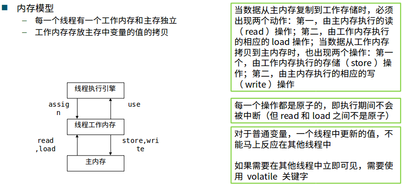
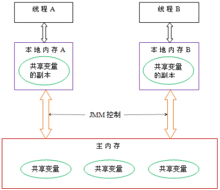
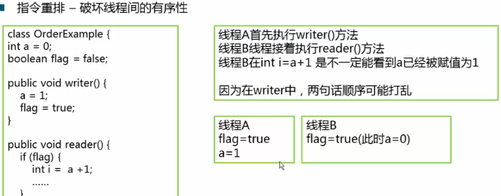

jvm主要定义了二进制class文件和JVM指令集。

java语言和jvm相对独立。例如： Groovy, Clojure, Scala

jvm规范：

- class文件格式
- 数据的内部表示和存储
  - Byte -128 to 127
- returnAddress数据类型定义
  - 指向操作码的指针。不对应java数据类型，不能在运行时修改。Finallly实现需要。
- 定义PC
- 堆
- 栈
- 方法区

整数的表达：（用补码表示）

- 原码：第一位为符号位(0:正数，1：负数)
- 反码：符号位不动，原码取反
- 正数补码：和原码相同
- 负数补码：符号位不动，反码加１

```java
-6
 原码：10000110
 反码：11111001
 补码：11111010
```

为什么要用补码：０的补码为全０；

如果有负数，直接将补码相加，符号位参与运算即可。

```java
-3 + 5
  11111101
 +00000101
 =00000010
```

Float的表示与定义：

小数：

小数的二进制算法和整数的大致相反，就是不断的拿小数部分乘以2取积的整数部分，然后正序排列。比如求0.9的二进制： 
0.9*2=1.8 取 1 
0.8*2=1.6 取 1 
0.6*2=1.2 取 1 
0.2*2=0.4 取 0 
0.4*2=0.8 取 0 
0.8*2=1.6 取 1 
… … 
如此循环下去。因此我么得到的二进制小数也是无限循环的：0.11100110011... 


指数部分减去127，因为一半用来表示比较大的数字，一半用来表示比较小的数字(例:0.000021)

　

总结一下，实数转二进制float类型的方法：

A. 分别将实数的整数和小数转换为二进制
B. 左移或者右移小数点到第一个有效数字之后
C. 从小数点后第一位开始数出23位填充到尾数部分 
D. 把小数点移动的位数，左移为正，右移为负，加上偏移量127，将所得的和转换为二进制填充到指数部分
E. 根据实数的正负来填充符号位，0为正，1为负

指数全为0:

- 尾数全０：表示０
- 尾数不全为０：非规格化的数

指数全为１：

- 尾数全０：根据符号分为正无穷、负无穷
- 尾数不全为０：NaN(QNaN(不确定), SNaN(非法))

VM指令集合：

- 类型转化：l2i
- 出栈、入栈：aload, astore
- 运算：iadd, isub
- 流程控制：ifeq ifne
- 函数调用：invokevirtual invokeinterface invokespecial invokestatic

JVM需要对Java Library提供以下支持：

- 反射　java.lang.reflect
- ClassLoader
- 初始化class和interface
- 安全相关java.security
- 多线程
- 弱引用

JVM的编译：源码到JVM指令的对应格式 javap JVM反汇编格式：

```java
<index> <opcode> [<operand1> [<operand2> ...}] [<comment>]
```


启动流程：


- PC寄存器：
  - 每个线程拥有一个PC寄存器
  - 在线程创建时创建
  - 指向下一条指令的地址
  - 执行本地方法时，PC的值为undefined
- 方法区
  - 保存装载的类信息
    - 类型的常量池
    - 字段，方法信息
    - 方法字节码
  - 通常和永久区Perm关联在一起
  - 变动：
    - jdk6:String等常量信息在方法区，jdk7则移动到堆。
- Java堆
  - 所有线程共享
  - 对分代GC来说，堆也是分代的。GC的主要工作区间。
  - 
- Java栈
  - 线程私有
  - 由一系列帧组成（栈帧）
  - 帧保存一个方法的局部变量、操作数栈、常量池指针
  - 每一次方法调用创建一个帧，并压栈


- Java栈上分配
  - 小对象(一般几十个bytes)，在没有逃逸的情况下，可以直接分配在栈上
  - 直接分配在栈上，可以自动回收，减轻GC压力
  - 大对象或者逃逸对象无法在栈上分配






volatile 不能代替锁,一般认为volatile 比锁性能好（不绝对）

选择使用volatile的条件是：语义是否满足应用

**可见性**：一个线程修改了变量，其它线程可以立即知道。保证可见性的方法：

- volatile
- synchronized，同步，即保证串行化顺序。unlock之前，写变量值回主存。
- final 一旦初始化完成，其它线程就可见

**有序性**：

- 在本线程内，操作都是有序的
- 在线程外观察，操作都是无序的。（指令重排、主内存同步延时）

**指令重排**：

- 线程内串行语义

  - 写后读	a = 1;b = a;	写一个变量之后，再读这个位置。
  - 写后写	a = 1;a = 2;	写一个变量之后，再写这个变量。
  - 读后写	a = b;b = 1;	读一个变量之后，再写这个变量。
  - 以上语句不可重排
  - 编译器不考虑多线程间的语义
  - 可重排： a=1;b=2

  

  通过同步来保证有序性：此时线程A和线程B串行化，就算一个线程内指令乱序，但对于线程B来说，线程A先执行完，才执行线程B，避免了指令重排导致的结果。

  

指令重排的基本原则：

- 程序顺序原则：一个线程内保证语义的串行性。a=4; b=a+4;
- volatile规则：volatile变量的写，先发生于读
- 锁规则：解锁(unlock)必然发生在随后的加锁(lock)前
- 传递性：A先于B，B先于C 那么A必然先于C
- 线程的start方法先于它的每一个动作
- 线程的所有操作先于线程的终结（Thread.join()）
- 线程的中断（interrupt()）先于被中断线程的代码
- 对象的构造函数执行结束先于finalize()方法

JVM中字节码的两种执行方式：

- 解释运行

  - 解释执行以解释方式运行字节码
  - 解释执行的意思是：读一句执行一句

- 编译运行（JIT）

  - 将字节码编译成机器码
  - 直接执行机器码
  - 运行时编译
  - 编译后性能有数量级的提升

  ​