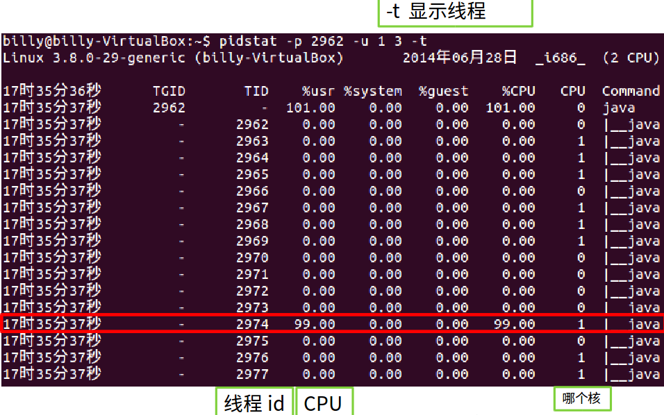

uptime: 中端连接数，1,5,15分钟的平均负载。

vmstat:统计cpu,内存，swap,io等情况.

pidstat:需要安装，细致观察进程（CPU, IO, MEM）

java自带的工具：

jps：列出java进程，类似于ps命令

- 参数-q可以指定jps只输出进程ID ，不输出类的短名称
- 参数-m可以用于输出传递给Java进程（主函数）的参数
- 参数-l可以用于输出主函数的完整路径
- 参数-v可以显示传递给JVM的参数

jinfo：可以用来查看正在运行的Java应用程序的扩展参数，甚至支持在运行时，修改部分参数

- -flag <name>：打印指定JVM的参数值
- -flag [+|-]<name>：设置指定JVM参数的布尔值
- -flag <name>=<value>：设置指定JVM参数的值

jmap：生成Java应用程序的堆快照和对象的统计信息

- jmap -histo 2972 >c:\s.txt

- jmap -dump:format=b,file=c:\heap.hprof 2972 (dump堆)

jstack:打印线程dump

- -l 打印锁信息
- -m 打印java和native的帧信息
- -F 强制dump，当jstack没有响应时使用

