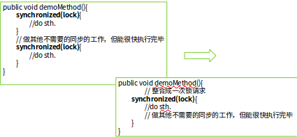
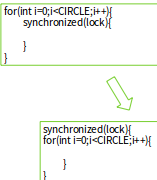

## 锁

目的：多个线程访问统一资源的串行化。


对象头 Mark

Mark Word，对象头的标记，32位
描述对象的hash、锁信息，垃圾回收标记，年龄

- 指向锁记录的指针
- 指向monitor的指针
- GC标记
- 偏向锁线程ID

**偏向锁**：

- 大部分情况是没有竞争的，所以可以通过偏向来提高性能
- 所谓的偏向，就是偏心，即锁会偏向于当前已经占有锁的线程
- 将对象头Mark的标记设置为偏向，并将线程ID写入对象头Mark
- 只要没有竞争，获得偏向锁的线程，在将来进入同步块，不需要做同步
- 当其他线程请求相同的锁时，偏向模式结束
- -XX:+UseBiasedLocking
- 默认启用
- 在竞争激烈的场合，偏向锁会增加系统负担

例子：

```java
public static List<Integer> numberList =new Vector<Integer>();
public static void main(String[] args) throws InterruptedException {
	long begin=System.currentTimeMillis();
	int count=0;
	int startnum=0;
	while(count<10000000){
		numberList.add(startnum);
		startnum+=2;
		count++;
	}
	long end=System.currentTimeMillis();
	System.out.println(end-begin);
}
```

```
-XX:+UseBiasedLocking -XX:BiasedLockingStartupDelay=0
-XX:-UseBiasedLocking
```

使用偏向锁能提高5%的性能。


**轻量级锁**：嵌入在线程栈中的对象。


- 普通的锁处理性能不够理想，轻量级锁是一种快速的锁定方法。
- 如果对象没有被锁定
  - 将对象头的Mark指针保存到锁对象中
  - 将对象头设置为指向锁的指针（在线程栈空间中）
- 如果轻量级锁失败，表示存在竞争，升级为重量级锁（常规锁）
- 在没有锁竞争的前提下，减少传统锁使用OS互斥量产生的性能损耗
- 在竞争激烈时，轻量级锁会多做很多额外操作(竞争失败)，导致性能下降


**自旋锁**：

- 当竞争存在时，如果线程可以很快获得锁，那么可以不在OS层挂起线程，让线程做几个空操作（自旋）
- JDK1.6中-XX:+UseSpinning开启
- JDK1.7中，去掉此参数，改为内置实现
- 如果同步块很长，自旋失败，会降低系统性能（即，占CPU资源，但没做任何操作）
- 如果同步块很短，自旋成功，节省线程挂起切换时间，提升系统性能


小结：

- 不是Java语言层面的锁优化方法
- 内置于JVM中的获取锁的优化方法和获取锁的步骤
  - 偏向锁可用会先尝试偏向锁
  - 轻量级锁可用会先尝试轻量级锁
  - 以上都失败，尝试自旋锁
  - 再失败，尝试普通锁，使用OS互斥量在操作系统层挂起


优化：

1. 减小锁持有时间，只对需要同步的代码进行同步。
2. 减小锁粒度：将大对象，拆成小对象，大大增加并行度，降低锁竞争
   - 偏向锁，轻量级锁成功率提高
   - ConcurrentHashMap	
     - 若干个Segment ：Segment<K,V>[] segments
     - Segment中维护HashEntry<K,V>
     - put操作时，先定位到Segment，锁定一个Segment，执行put
     - 在减小锁粒度后， ConcurrentHashMap允许若干个线程同时进入
3. 锁分离：
   - 根据功能进行锁分离，ReadWriteLock。只有读锁是并发的。
   - 读写分离思想可以延伸，只要操作互不影响，锁就可以分离
     - LinkedBlockingQueue
     - 队列
     - 链表
     - 
4. 锁粗化：通常情况下，为了保证多线程间的有效并发，会要求每个线程持有锁的时间尽量短，即在使用完公共资源后，应该立即释放锁。只有这样，等待在这个锁上的其他线程才能尽早的获得资源执行任务。但是，凡事都有一个度，如果对同一个锁不停的进行请求、同步和释放，其本身也会消耗系统宝贵的资源，反而不利于性能的优化

 

5. 锁消除：在即时编译器时，如果发现不可能被共享的对象，则可以消除这些对象的锁操作。


6. 无锁：

   - 锁是悲观的操作
   - 无锁是乐观的操作
   - 无锁的一种实现方式：（如果结果是期望的结果，则正确操作，否则有竞争关系）
     - CAS(Compare And Swap)
     - 非阻塞的同步
     - CAS(V,E,N)
   - 在应用层面判断多线程的干扰，如果有干扰，则通知线程重试

   

   ​