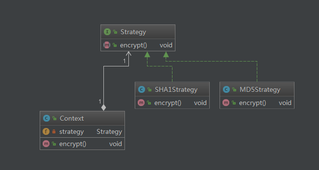

## 策略模式

### 简介

Strategy模式也叫策略模式是行为模式之一，它对一系列的算法加以封装，为所有算法定义一个抽象的算法接口，并通过继承该抽象算法接口对所有的算法加以封装和实现，具体的算法选择交由客户端决定（策略）。Strategy模式主要用来平滑地处理算法的切换 。


- 封装类：也叫上下文，对策略进行二次封装，目的是避免高层模块对策略的直接调用。
- 抽象策略：通常情况下为一个接口，当各个实现类中存在着重复的逻辑时，则使用抽象类来封装这部分公共的代码，此时，策略模式看上去更像是模版方法模式。
- 具体策略：具体策略角色通常由一组封装了算法的类来担任，这些类之间可以根据需要自由替换。

优点：

- 策略模式提供了可以替换继承关系的办法。
- 使用策略模式可以避免使用多重条件转移语句。

缺点：

- 客户端必须知道所有的策略类，并自行决定使用哪一个策略类。这就意味着客户端必须理解这些算法的区别，以便适时选择恰当的算法类。换言之，策略模式只适用于客户端知道所有的算法或行为的情况。

- 策略模式造成很多的策略类。有时候可以通过把依赖于环境的状态保存到客户端里面，而将策略类设计成可共享的，这样策略类实例可以被不同客户端使用。换言之，可以使用享元模式来减少对象的数量。

### 实现

抽象策略

```java
public interface Strategy {
    //加密
    public void encrypt();
}
```

具体策略

```java
public class MD5Strategy implements Strategy{

    public void encrypt() {
        System.out.println("执行MD5加密");
    }
}

public class SHA1Strategy implements Strategy{

    public void encrypt() {
        System.out.println("执行SHA1加密");
    }
}
```

封装类

```java
public class Context {
    private Strategy strategy;
    public Context(Strategy strategy) {
        this.strategy = strategy;
    }
    
    public void encrypt() {
        this.strategy.encrypt();
    }
}
```

客户端调用：

```java
public class MainClass {
    public static void main(String[] args) {
//      Strategy stra = new SHA1Strategy();
//      stra.encrypt();
        Context context = new Context(new MD5Strategy());
        context.encrypt();
    }
}
```

UML:



https://www.cnblogs.com/realshijing/p/8688025.html