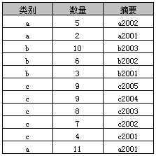

## MySql关键词

[TOC]

### 1.union

union:联合的意思，即把两次或多次查询结果合并起来。
要求：两次查询的列数必须一致
推荐：列的类型可以不一样，但推荐查询的每一列，想对应的类型以一样
可以来自多张表的数据：多次sql语句取出的列名可以不一致，此时以第一个sql语句的列名为准。
如果不同的语句中取出的行，有完全相同(这里表示的是每个列的值都相同)，那么union会将相同的行合并，最终只保留一行。也可以这样理解，union会去掉重复的行。
如果不想去掉重复的行，可以使用union all。
如果子句中有[order by](http://www.itxm.net/),limit，需用括号()包起来。推荐放到所有子句之后，即对最终合并的结果来排序或筛选。
如：
sql脚本代码如下:

```mysql
`(``select` `* ``from` `a ``order` `by` `id) ``union` `(``select` `* ``from` `b ``order` `id);`
```

### 2.删除表中所有数据

- delete from student
- truncate table student
  - 不能与where配合使用
  - 自动编号恢复到初始值
  - 效率比delete更高，因为记录日志记的比delete少(只记录页的释放)，使用的锁更少
  - 不会出发delete触发器
  - 有主外键关系时删不了
  - 其实是drop and re-create the table

### 3.alter

```mysql
alter table student drop column Address; 删除列
alter table student add Address varchar(100);增加列（add默认对column操作）
alter table student alter column Address varchar(200);修改列的数据类型
alter table student add constraint PK_constraint_name primary key(s_id); 在s_id列上增加主键约束
alter table student add constraint UQ_constraint_name unique(Address);在Address上增加唯一约束
alter table student add constraint DF_constraint_name default("男") for gender;在gender列上加默认约束
alter table student add constraint CK_constraint_name check(gender='男' or gender='女');为gender增加检查约束，只能为男、女
alter table student alter column Adderss varchar(200) not null;为Address增加非空约束(修改列)
为studnet表在courseId列上增加外键约束，引用cource表的id
alter table student add constraint FK_constraint_name foreign key(courseId) references course(id);
alter table student drop constraint CK_constraint_name, DF_constraint_name；；删除约束
一次增加多个约束：
alter table student add
constraint ...
constraint ...
```

建表时创建约束：

```mysql
create table student
(
	id int auto_increment,
    name varchar(50) not null unique check(len(name)>2),
    gender char(2) default('男'),
    age int check(age>=0 and age<=120),
    email varchar(50) unique,
    courseId int foreign key references Course(id) on delete cascade
    primary key('id')
) engine=innodb default charset=utf8 auto_incresement=2;
```

外键：

```
ON DELETE、ON UPDATE表示事件触发限制，可设参数：
RESTRICT（限制外表中的外键改动）
CASCADE（跟随外键改动），即course表中的改动会反应到student表中。
SET NULL（设空值）
SET DEFAULT（设默认值）
NO ACTION（无动作，默认的）
```

自增id，Myisam存储在文件中，不会丢失。但innodb存在内存中，重启后为数据最大id+1.

### 4. group by



示例

```
select 类别, sum(数量) as 数量之和
from A
group by 类别
```

返回结果如下表，实际上就是**分类汇总**。


Having与Where的区别

- where 子句的作用是在对查询结果进行分组前，将不符合where条件的行去掉，即在**分组之前过滤数据**，where条件中不能包含聚组函数，使用where条件过滤出特定的行。
- having 子句的作用是筛选满足条件的组，即在**分组之后过滤特定的组**，条件中经常包含聚组函数，使用having 条件过滤出特定的组，也可以使用多个分组标准进行分组。

示例

```
select 类别, sum(数量) as 数量之和 from A
group by 类别
having sum(数量) > 18
```

