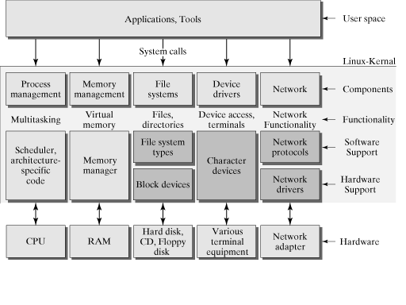

一、 **Unix/Linux的体系架构**


内核:：从本质上看是一种软件——控制计算机的硬件资源，并提供上层应用程序运行的环境。

用户态：即上层应用程序的活动空间，应用程序的执行必须依托于内核提供的资源，包括CPU资源、存储资源、I/O资源等。为了使上层应用能够访问到这些资源，内核必须为上层应用提供访问的接口：即系统调用。

　　系统调用是操作系统的最小功能单位，这些系统调用根据不同的应用场景可以进行扩展和裁剪，现在各种版本的Unix实现都提供了不同数量的系统调用，如Linux的不同版本提供了240-260个系统调用，FreeBSD大约提供了320个（reference：UNIX环境高级编程）。我们可以把系统调用看成是一种不能再化简的操作（类似于原子操作，但是不同概念），有人把它比作一个汉字的一个“笔画”，而一个“汉字”就代表一个上层应用，我觉得这个比喻非常贴切。因此，有时候如果要实现一个完整的汉字（给某个变量分配内存空间），就必须调用很多的系统调用。如果从实现者（程序员）的角度来看，这势必会加重程序员的负担，良好的程序设计方法是：重视上层的业务逻辑操作，而尽可能避免底层复杂的实现细节。库函数正是为了将程序员从复杂的细节中解脱出来而提出的一种有效方法。它实现对系统调用的封装，将简单的业务逻辑接口呈现给用户，方便用户调用，从这个角度上看，库函数就像是组成汉字的“偏旁”。这样的一种组成方式极大增强了程序设计的灵活性，对于简单的操作，我们可以直接调用系统调用来访问资源，如“人”，对于复杂操作，我们借助于库函数来实现，如“仁”。显然，这样的库函数依据不同的标准也可以有不同的实现版本，如ISO C 标准库，POSIX标准库等。

　　Shell是一个特殊的应用程序，俗称命令行，本质上是一个命令解释器，它下通系统调用，上通各种应用，通常充当着一种“胶水”的角色，来连接各个小功能程序，让不同程序能够以一个清晰的接口协同工作，从而增强各个程序的功能。同时，Shell是可编程的，它可以执行符合Shell语法的文本，这样的文本称为Shell脚本，通常短短的几行Shell脚本就可以实现一个非常大的功能，原因就是这些Shell语句通常都对系统调用做了一层封装。为了方便用户和系统交互，一般，一个Shell对应一个终端，终端是一个硬件设备，呈现给用户的是一个图形化窗口。我们可以通过这个窗口输入或者输出文本。这个文本直接传递给shell进行分析解释，然后执行。

　　总结一下，用户态的应用程序可以通过三种方式来访问内核态的资源：

1）系统调用

2）库函数

3）Shell脚本

　　内核主要表现为：向下控制硬件资源，向内管理操作系统资源：包括进程的调度和管理、内存的管理、文件系统的管理、设备驱动程序的管理以及网络资源的管理，向上则向应用程序提供系统调用的接口。

​	用户态和内核态，这种分层的架构极大地提高了资源管理的可扩展性和灵活性，而且方便用户对资源的调用和集中式的管理，带来一定的安全性。



**二、用户态和内核态的切换**

　　因为操作系统的资源是有限的，如果访问资源的操作过多，必然会消耗过多的资源，而且如果不对这些操作加以区分，很可能造成资源访问的冲突。所以，为了减少有限资源的访问和使用冲突，Unix/Linux的设计哲学之一就是：对不同的操作赋予不同的执行等级，就是所谓特权的概念。简单说就是有多大能力做多大的事，与系统相关的一些特别关键的操作必须由最高特权的程序来完成。Intel的X86架构的CPU提供了0到3四个特权级，数字越小，特权越高，Linux操作系统中主要采用了0和3两个特权级，分别对应的就是内核态和用户态。运行于用户态的进程可以执行的操作和访问的资源都会受到极大的限制，而运行在内核态的进程则可以执行任何操作并且在资源的使用上没有限制。很多程序开始时运行于用户态，但在执行的过程中，一些操作需要在内核权限下才能执行，这就涉及到一个从用户态切换到内核态的过程。比如C函数库中的内存分配函数malloc()，它具体是使用sbrk()系统调用来分配内存，当malloc调用sbrk()的时候就涉及一次从用户态到内核态的切换，类似的函数还有printf()，调用的是wirte()系统调用来输出字符串，等等。


　　到底在什么情况下会发生从用户态到内核态的切换，一般存在以下三种情况：

1）当然就是系统调用：原因如上的分析。

2）异常事件： 当CPU正在执行运行在用户态的程序时，突然发生某些预先不可知的异常事件，这个时候就会触发从当前用户态执行的进程转向内核态执行相关的异常事件，典型的如缺页异常。

3）外围设备的中断：当外围设备完成用户的请求操作后，会像CPU发出中断信号，此时，CPU就会暂停执行下一条即将要执行的指令，转而去执行中断信号对应的处理程序，如果先前执行的指令是在用户态下，则自然就发生从用户态到内核态的转换。

　　注意：系统调用的本质其实也是中断，相对于外围设备的硬中断，这种中断称为软中断，这是操作系统为用户特别开放的一种中断，如Linux int 80h中断。所以，从触发方式和效果上来看，这三种切换方式是完全一样的，都相当于是执行了一个中断响应的过程。但是从触发的对象来看，系统调用是进程主动请求切换的，而异常和硬中断则是被动的。

**三、总结**

　　用户态和内核态之间的切换也会消耗大量资源。关于实现的细节，目前学艺不精不敢乱说，等日后补上。但知道了这一点，我相信对很多问题也就很容易理解了，比如说基于缓冲区的IO和无缓冲的IO，用户进程和内核进程之间的切换，IO复用中的读写内核事件表。


**内核态:** CPU可以访问内存所有数据, 包括外围设备, 例如硬盘, 网卡. CPU也可以将自己从一个程序切换到另一个程序

**用户态:** 只能受限的访问内存, 且不允许访问外围设备. 占用CPU的能力被剥夺, CPU资源可以被其他程序获取

### 为什么要有用户态和内核态

由于需要限制不同的程序之间的访问能力, 防止他们获取别的程序的内存数据, 或者获取外围设备的数据, 并发送到网络, CPU划分出两个权限等级 -- **用户态** 和 **内核态**

# **用户态与内核态的切换**

所有用户程序都是运行在用户态的, 但是有时候程序确实需要做一些内核态的事情, 例如从硬盘读取数据, 或者从键盘获取输入等. 而唯一可以做这些事情的就是操作系统, 所以此时程序就需要先操作系统请求以程序的名义来执行这些操作.

这时需要一个这样的机制: 用户态程序切换到内核态, 但是不能控制在内核态中执行的指令。

这种机制叫**系统调用**, 在CPU中的实现称之为**陷阱指令**(Trap Instruction)

他们的工作流程如下:

1. 用户态程序将一些数据值放在寄存器中, 或者使用参数创建一个堆栈(stack frame), 以此表明需要操作系统提供的服务.

2. 用户态程序执行陷阱指令

3. CPU切换到内核态, 并跳到位于内存指定位置的指令, 这些指令是操作系统的一部分, 他们具有内存保护, 不可被用户态程序访问

4. 这些指令称之为陷阱(trap)或者系统调用处理器(system call handler). 他们会读取程序放入内存的数据参数, 并执行程序请求的服务

5. 系统调用完成后, 操作系统会重置CPU为用户态并返回系统调用的结果

   ​

参考：https://www.cnblogs.com/bakari/p/5520860.html

参考：https://www.cnblogs.com/zemliu/p/3695503.html


用户态 -> 内核态： 中断、异常、陷入机制(接口)

内核态 -> 用户态：设置程序状态子PSW


# 中断/异常机制

操作系统是由中断驱动的。为了支持CPU和设备之间的并行工作，处理指令错误。

过程：保存现场，执行终端/异常(硬件自动完成)，返回断电。

中断(外中断)：I/O中断、时钟中断、硬件故障

异常(内终端)：系统调用、页故障、保护性故障、断电指令、程序异常 


保存PC程序计数器和PSW寄存器中的值，然后在中断向量根据向量代号查中断程序入口地址(段地址+偏移地址)。系统调用中断码128。软件提前设置好中断，然后硬件执行。

系统调用机制的必要概念：

- 中断/异常机制支持系统调用服务的实现
- 通过陷入指令 引发异常，完成用户态到内核态的切换。陷入指令： int $0x80（该指令前面是参数保存工作）
- 系统调用号和参数：陷入指令自带，内存开辟专用堆栈，通过通用寄存器传参（使用）。
- 系统调用表：存放系统调用服务程度的入口地址

系统执行 int $0x80，用户态->内核态转变过程：

- CPU从任务状态段TSS中装入新的栈指针，执行内核栈。并将用户栈等信息压栈。

# 进程/线程模型

#### 进程

- process进程：程序的一次执行过程，对CPU的抽象，系统分配资源的最小单位(内存、文件、地址空间)。操作系统通过调度将CPU给进程。系统资源的拥有者。

##### 进程控制块PCB Process Control Block

​	操作系统用于管理控制进程的一个专门数据结构 ，记录了进程的属性，描述进程的动态变化过程，是系统感知进程的唯一标识。

​	进程表：所有进程的PCB集合。

PCB内容：

 - 描述信息：ID，用户，名字，进程组
 - 控制信息：当前状态、优先级、代码执行入口地址、磁盘地址、同步和通信、消息队列指针、执行时间、页面调度
 - 资源和使用情况：打开的文件列表、虚拟地址空间的状况
 - CPU现场信息(进程不运行时)：指向该进程页表的指针，寄存器值(通用寄存器、程序计数器PC、程序状态字PSW、栈指针)
 - 


进程状态的转换：本质就是进程的PCB从一个状态队列(阻塞)进入到另一个状态队列(就绪)。 

##### 进程控制

完成进程各个状态之间的转换，由具有特定功能的原语完成(原语的执行必须是连续的，不可中断的)：进程创建原语、撤销、阻塞、唤醒、挂起、激活、改变优先级 等。

- 创建fork-exec：初始化、分配地址，设置队列指针。exec用新代码覆盖原来的地址空间实现进程执行代码的转换
- 撤销exit：收回占有资源：文件、网络连接、内存等，撤销PCB。
- 阻塞wait：由进程自己执行阻塞原语。初级进程同步操作。
- fork：子进程返回0，父进程返回子进程的pid。linux采用**写时复制**，拷贝时，只拷贝指针，指向父进程的空间，只有在进程真正写入数据时，才分配新的地址。

##### 进程分类

- 系统进程优先级比用户进程高
- init为根进程，进程家族树

##### 进程地址空间


#### 线程

线程的开销小，有自己的栈和栈指针，共享进程地址空间和资源。但内核只看到进程，故进程的两个线程不能同时运行在两个处理器上。线程阻塞即进程阻塞。


### 内存


### 堆、栈

一个程序的组成部分：栈区、堆区、全局静态区、文字常量区、程序代码区

**栈内存**：由系统自动分配，用来存储函数内部（包括main）的局部变脸，方法调用和函数参数值。速度较快。存储地址是连续的且存在有限栈容量，会出现栈溢出现象。函数参数由右往左入栈，然后是局部变量。

**堆内存**：手动分配释放(或os释放)。new 出来的对象(成员变量，局部类变量，局部变量)都存储在堆中，但指针(引用)本身存在栈中，一般速度较慢；存储地址是链式的（链表），由低地址向高地址扩展，内存较大(受限于虚拟内存)不会溢出。

### CPU调度

按照一定的调度算法 从就绪队列中选择一个进程，把CPU的使用权交给被选中的进程。如果没有就绪进程，就会安排一个空闲进程。

**调度时机**：(内核对中断/异常/系统调用处理后， 返回到用户态时)

- 进程 正常/错误 终止
- 新进程创建 或 一个等待进程变为就绪
- 一个进程从运行态 -> 阻塞态 / 就绪态

**调度过程**：

- 1、切换全局页目录以加载一个新的地址空间
- 2、切换内核栈和硬件上下文（新进程的信息）
- 例如： 保存A的上下文环境，更新A的PCB并加入到合适的队里；将B设置为运行态，从B的PCB中恢复上下文
- 上下文切换开销：保存和恢复寄存器、切换地址空间(昂贵)、高速缓存和缓冲区缓存失效

**调度算法**：

I/O密集型(友好)、CPU密集型、抢占/非抢占式，如何选择时间片 

时间片大小：10ms ~ 100ms

### 同步互斥机制

- 并发：进程的执行是间断性的，相对执行速度不可预测
- 共享：进程/线程之间的制约性，（锁）
- 不确定性：执行结果与其执行的相对速度有关

#### 互斥

基本概念：

- 进程互斥：各个进程之间竞争使用资源
- 临界资源：互斥资源、共享变量
- 临界区（互斥区）：各个进程中对某个临界资源实施操作的程序片段

解决办法：

1. 软件方法：一个变量设置为锁
2. 硬件方法：开关中断指令
3. 小结：
   1. 忙等待，在获取临界区之前，持续测试而不做其它事情。避免在单cpu上使用。多cpu：自旋锁spin lock

#### 同步

概念：多个进程中发生的事件存在某种时序关系。

生产者/消费者问题

#### 信号量

概念：一个特殊的变量。维护一个进程队列。只能初始化(非负整数)、P和V操作（原子操作，不允许被中断）。只要mutex为负，就在进程队列中拿出一个进程上CPU。

##### A、用信号量解决进程间互斥问题

1. 分析并发进程的关键活动，划定临界区
2. 设置信号量mutex，初值为1
3. 在临界区前实施P(mutex) (减一)
4. 在临界区后实施V(mutex) (加一)

##### B、用信号量解决生产者/消费者问题

empty: 空缓冲区个数N； full：满缓冲区个数0； mutex=1互斥信号量

生产者：

```c
P(&empty)
    互斥信号量操作...以及数据操作
V(&full)
```

消费者：P(&full) ; P(&mutex)...V(&mutex), V(&empty)

##### C、用信号量解决读者/写者问题

读者优先：只要有一个读者在读，则后面的读者都可以读，写者必须等待。故：rc记录了当前有几个读者，第一个读者做P操作，最后一个读者做V操作，然后写者才能访问。

```c
P(mutex);
rc = rc + 1;
if(1 == rc)  P(W);
V(mutex);
...读操作...
P(mutex);
rc = rc - 1;
if(0 == rc)  V(W);
V(mutex);
```

写： P(W) ...写... V(W)

### 通信机制

管程：一种高级同步机制。由关于共享资源的数据结构及在其上操作的过程组成。

互斥：管程的互斥由编译器负责保证

同步：设置条件变量及等待/唤醒操作，条件变量(wait/notify)负责监控缓冲区空/满。 

java利用管程实现生产者/消费者模型：

对共享变量的访问都是通过管程来完成，管程的方法是sychronized的，同时只能有一个线程执行该方法。

Java程序设计语言中，每个对象都可以作为一个管程。

``` java
public class ProducerConsumer {  
    static final int N = 100;// 定义缓冲区大小的常量  
    static Producer p = new Producer();// 初始化一个新的生产者线程  
    static Consumer c = new Consumer();// 初始化一个新的消费者线程  
    static Our_monitor mon = new Our_monitor();// 初始化一个新的管程  
  
    public static void main(String[] args) {  
        p.start();// 生产者启动  
        c.start();// 消费者启动  
    }  
  
    static class Producer extends Thread {  
        public void run() {// 线程运行主代码  
            int item;  
            while (true) {// 生产者循环  
                item = produce_item();  
                mon.insert(item);  
            }  
        }  
  
        private int produce_item() {  
            System.out.println("生产了1个");  
            return 1;  
        }// 实际生产  
    }  
  
    static class Consumer extends Thread {  
        public void run() {// 线程运行主代码  
            int item;  
            while (true) {// 消费者循环  
                item = mon.remove();  
                consume_item(item);  
            }  
        }  
  
        private void consume_item(int item) {  
            System.out.println("消费了1个");  
        }// 实际消费  
    }  
  
    static class Our_monitor {// 管程  
        private int buffer[] = new int[N];  
        private int count = 0, lo = 0, hi = 0;// 计数器和索引  
  
        public synchronized void insert(int val) {  
            if (count == N)  
                go_to_sleep();// 若缓冲区满，则进入睡眠  
            buffer[hi] = val;// 向缓冲区中插入一个新的数据项  
            hi = (hi + 1) % N;// 设置下一个数据项的槽  
            count = count + 1;// 缓冲区的数据项又多了一项  
            if (count == 1)  
                notify();// 如果消费者在休眠，则将其唤醒  
        }  
  
        public synchronized int remove() {  
            int val;  
            if (count == 0)  
                go_to_sleep();// 如果缓冲区空，进入休眠  
            val = buffer[lo];// 从缓冲区中取出一个数据项  
            lo = (lo + 1) % N;// 设置待取数据项的槽  
            count = count - 1;// 缓冲区的数据数目减少1  
            if (count == N - 1)  
                notify();// 如果生产者正在休眠，则将其唤醒  
            return val;  
        }  
  
        private void go_to_sleep() {  
            try {wait();} catch (InterruptedException exc) {};  
        }  
    }  
}  

```


pthread中的同步机制：

- 通过互斥量来保护临界区
- 通过条件变量和方法来解决同步问题

信号量和管程不能传递大量数据，管程不适用于多处理器。所以需要进行间通信机制：消息传递

用户基本通信方式：

- 消息传递：发送 - >陷入内核 -> 接收进程的PCB中消息队列指针
- 共享内存：将同一块物理内存空间映射到两个不同的进程中
- 管道：利用内存或者文件作为缓冲传输介质，字符流方式写入和读出。注意 互斥、同步、判断对方进程是否存在。
- 套接字
- 远程过程调用

内核同步机制：

- 原子操作：在完成之前不被中断，常用语实现资源的引用计数
- 自旋锁
- 读写锁
- 信号量
- 屏障/栅栏(barrier)：用于对一组线程进程协调。一组线程协同完成一项任务，需要所有线程都到达一个汇合点之后再一起向前推进。例如：矩阵运算。


# 虚拟存储技术

**虚存**：把内存与磁盘有机地结合起来使用，从而得到一个容量很大的“内存”

虚存是对内存的抽象，构建在存储体系之上，由操作系统协调各个存储器的使用。虚存提供了一个比物理内存大很多的地址空间。

虚存大小：寻址范围：32位：2^32次方；64位：2^64次方

地址保护：确保每个进程有独立的地址空间，确保地址范围合法，确保进程的操作合法（在权限内）

##### 虚拟页式存储： 虚拟存储技术 +　页式存储管理方案

进程开始前，只装入０个或一个页面，之后根据需要动态装入其他页面。当空间满时，就需要置换。

页表表项设计：

- 页框号：内存块号、物理页面号、页帧号
- 有效位：表示该页在内存还是在磁盘
- 访问位：引用位
- 修改位：此页在内存中是否修改过
- 保护位：读/可读写


参考：

[1].https://www.cnblogs.com/edisonchou/p/5094066.html