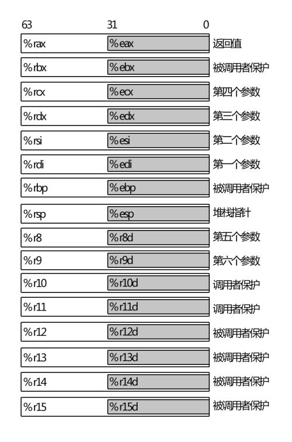
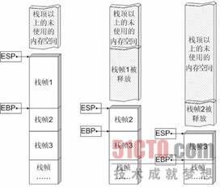
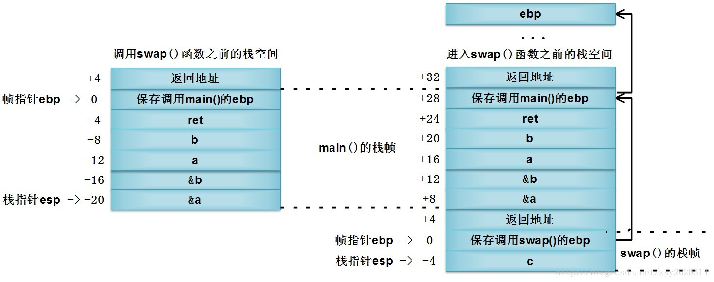

### 寄存器




- %rax 作为函数返回值使用。
- %rsp 栈指针寄存器，指向栈顶
- %rdi，%rsi，%rdx，%rcx，%r8，%r9 用作函数参数，依次对应第1参数，第2参数。。。
- %rbx，%rbp，%r12，%r13，%14，%15 用作数据存储，遵循被调用者使用规则，简单说就是随便用，调用子函数之前要备份它，以防他被修改


- %r10，%r11 用作数据存储，遵循调用者使用规则，简单说就是使用之前要先保存原值

gcc -S -masm=intel demo.c -O4


函数栈帧：

（1）ESP：栈指针寄存器(extended stack pointer)，其内存放着一个指针，该指针永远指向系统栈最上面一个栈帧的栈顶。

（2）EBP：基址指针寄存器(extended base pointer)，其内存放着一个指针，该指针永远指向系统栈最上面一个栈帧的底部。

 


调用栈时的内存布局：

 


访问函数的局部变量和访问函数参数的**区别:**（间接寻址）

　　局部变量总是通过**将ebp减去偏移量**来访问，函数参数总是通过**将ebp加上偏移量**来访问。对于32位变量而言，第一个局部变量位于ebp-4，第二个位于ebp-8，以此类推，32位局部变量在栈中形成一个逆序数组；第一个函数参数位于ebp+8，第二个位于ebp+12，以此类推，32位函数参数在栈中形成一个正序数组。

```c++
void swap(int *a,int *b)  
{  
   int c;  
   c = *a;   
   *a = *b;  
   *b = c;  
}  
int main(void)  
{  
   int a ;  
   int b ;  
   int ret;  
   a =16;  
   b = 64;  
   ret = 0;  
   swap(&a,&b);  
   ret = a - b;  
   return ret;  
}
```



比较重要的是对esp的栈对齐操作，esp是16字节对齐的。

通过 -8(%ebp)来访问函数中的局部变量，所以开始必须要给函数中所有的局部变量留够空间。故，一开始，就有： sub $0x10, %esp　来保证局部变量在这个范围内.


参考：

https://blog.csdn.net/zsy2020314/article/details/9429707

http://www.cnblogs.com/endv/p/4110798.html